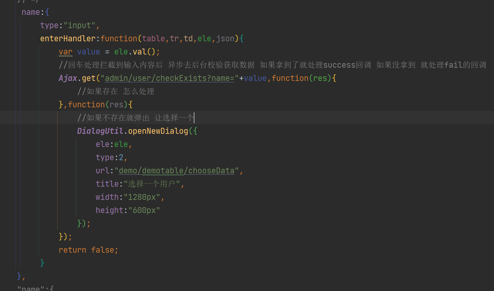
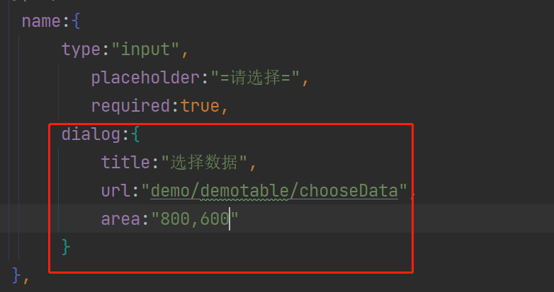
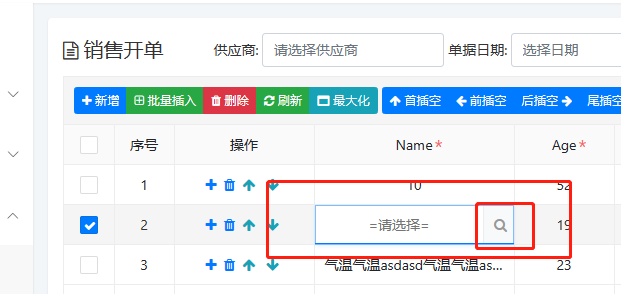
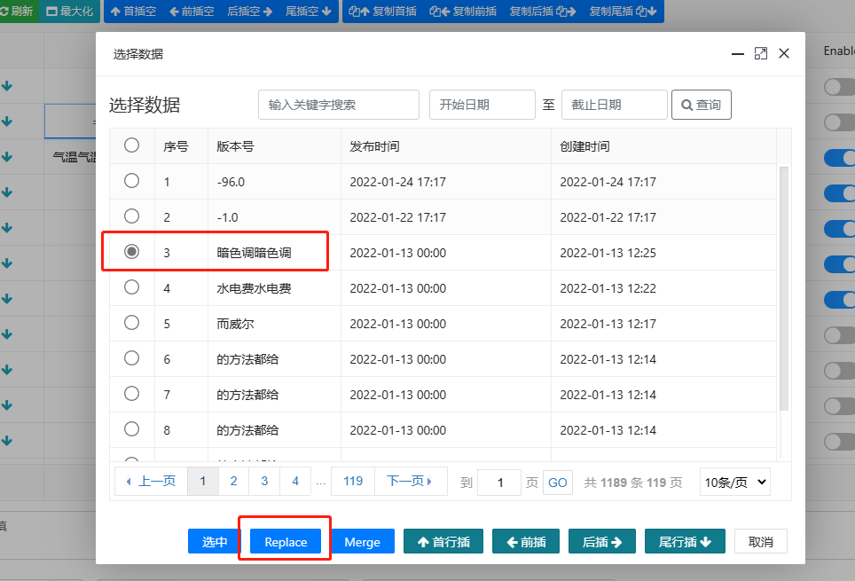
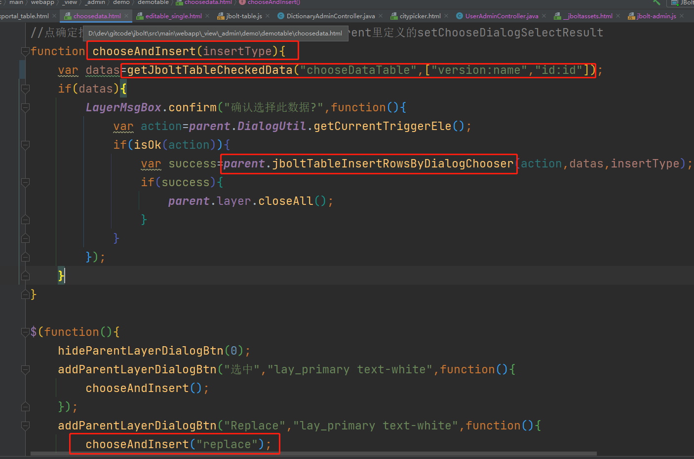
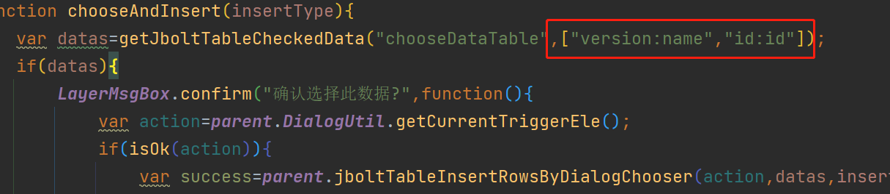
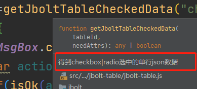
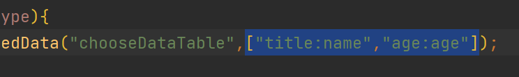
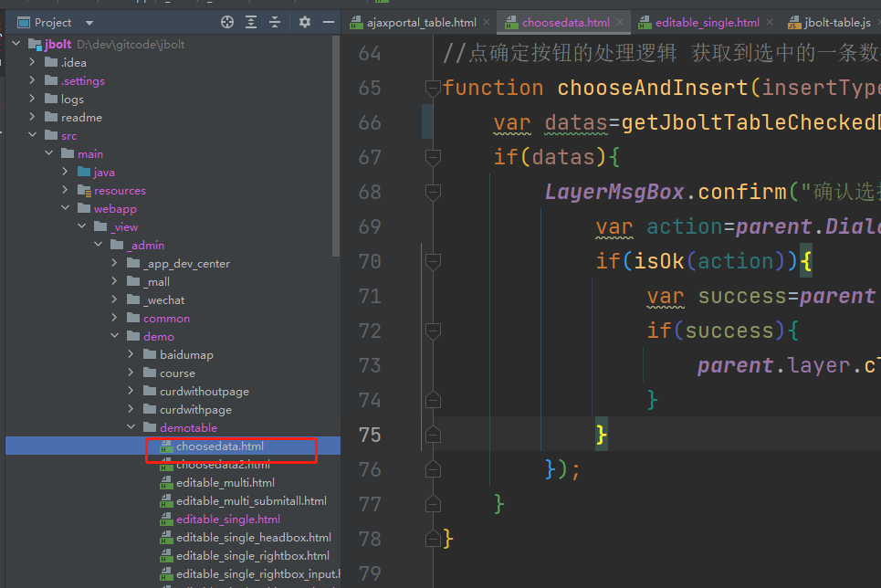

在可编辑表格中，设置了使用dialog弹出选择数据，例如在第2节将enterHandler的时候，弹出Dialog选择数据。

或者cols设置input带着dialog选择数据：

界面效果如下：

点击弹出的选择器：

选择数据后 替换当前行数据按钮点击，执行数据替换。

这个数据替换是在dialog加载的页面里实现的：

直接复制过去代码就可以使用，唯一需要自己设置的就是这里：

这个函数是获取当前table选中行的json数据，如果传了第二个参数 就是自定义数据结构了。
例如你拿到的数据json是{id:1,name:"xxx",age:2} 但是你想返回的数据格式是{title:"xxx",age:2}
那么这几个方法的第二个参数是个数组 就可以自定义他的属性换算结构：
[替换为什么属性:用什么属性替换,替换为什么属性:用什么属性替换]

{id:1,name:"xxx",age:2} 转 {title:"xxx",age:2} 怎么转？

["title:name","age:age"]

意思是title属性 使用选中的数据中的name属性值
age使用选中数据中的age属性值

这样最终datas就是{title:"xxx",age:2}这样的数据

可编辑表格里只要配置了列有title和age
点击下方按钮，就可以完成覆盖。

---

function chooseAndInsert(insertType){
	var datas=getJboltTableCheckedData("chooseDataTable",["title:name","age:age"]);
	if(datas){
		LayerMsgBox.confirm("确认选择此数据?",function(){
			var action=parent.DialogUtil.getCurrentTriggerEle();
			if(isOk(action)){
				var success=parent.jboltTableInsertRowsByDialogChooser(action,datas,insertType);
				if(success){
					parent.layer.closeAll();
				}
			}
		});
	}
}

