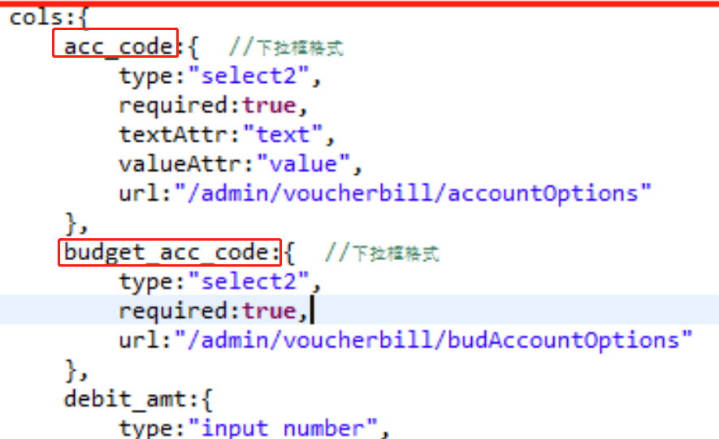
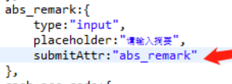

可编辑表格的json配置中 默认使用的是数据库中字段名进行配置的：

在数据提交后台的时候 会自动转为Model所用的驼峰格式，这是默认行为 默认你后台是getJBoltTable之后 转Model去存和更新的。
那么如果你前端显示读取和后端提交接收 都用Db+record默认的话 就需要前后操作的属性始终保持和数据库里的字段名称一致。

所以就需要在cols的json配置中增加指定submitAttr:xxx 这个属性配置，强制使用指定的属性名提交
