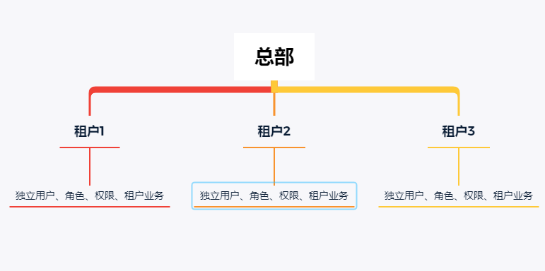
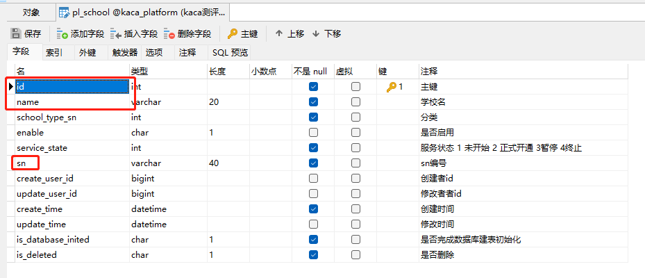
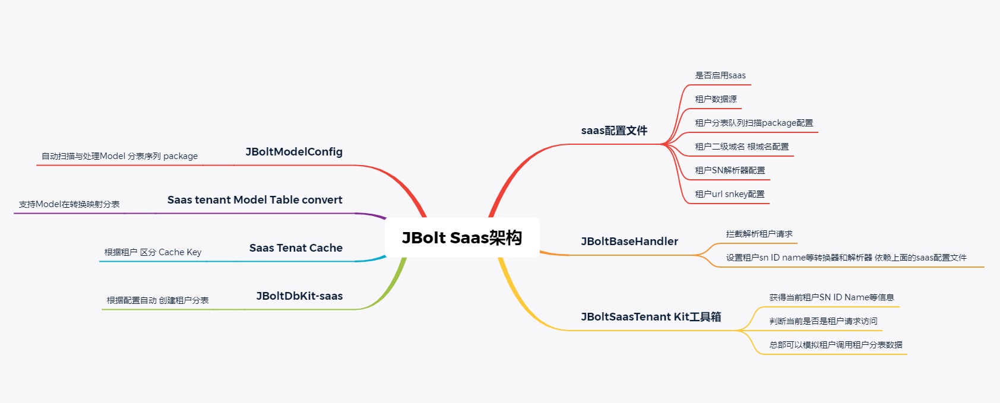
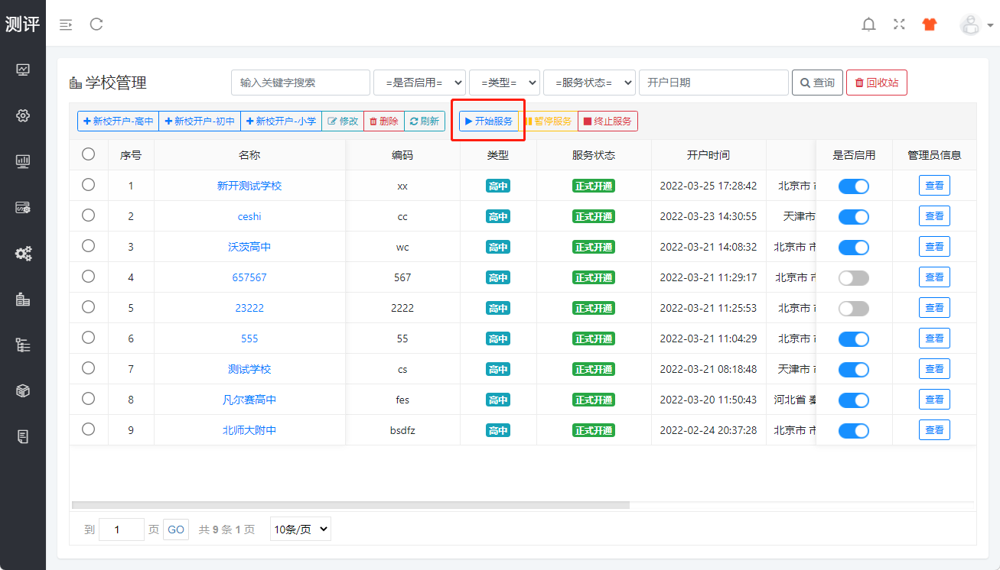
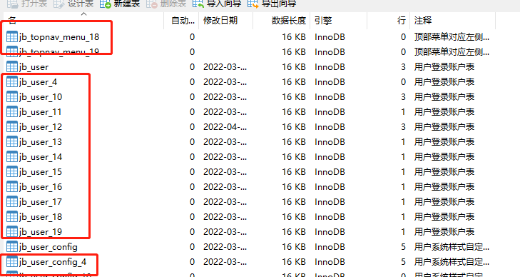
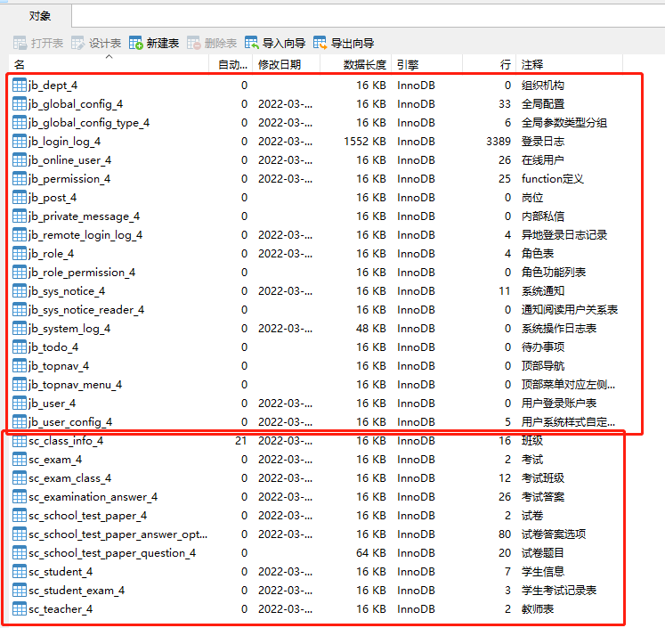
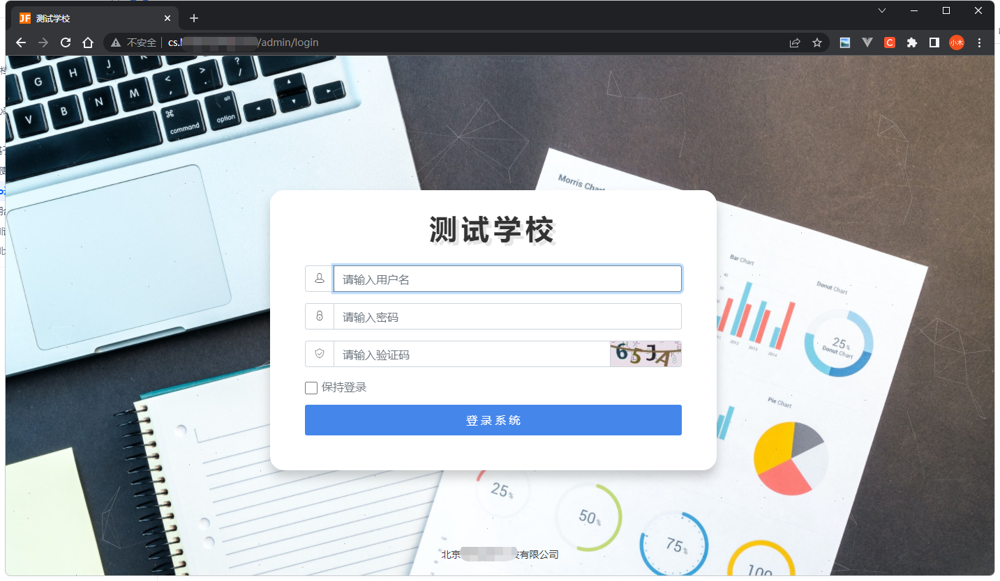
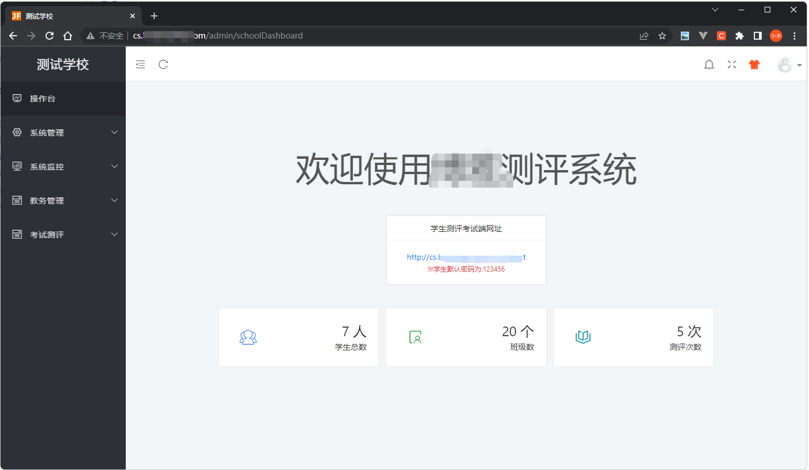

JBolt Pro里实现了租户分表隔离模式，可以轻松开发租户系统。


# 一、JBolt Saas架构
saas多租户系统，租户表JBolt不提供，不内置，需要自己根据自己的业务，去开发总部管理维护的一个租户表。
举个例子：
我们现在开发的saas版 题库考试系统里，每一个学校用户就是一个租户，所以在测评系统里 school表就是平台的租户表。

### 注意事项：
#### 租户表必须有的字段：
**id**:主键
**sn**:编码 编号
**name**:名称

#### 对应测评系统案例中的学校表：pl_school表

**id**:主键
**sn**:系统为学校提供的系统里的唯一编码 
例如清大大学就是qh 北大附中就是bdfz 可以使用拼音首字母 
这样会给租户分配一个二级域名 http://sn.jbolt.cn 这样的域名
**name**:学校名
其他字段可以参照这个pl_school表创建。

## 我们来看一下JBoltSaas架构图



## 大致流程 以测评系统为例
### 1、总部给租户（学校）开户
开户过程，首先完成租户（学校）信息的创建入库，然后选择新添加的学校，点击开始服务；


点击【开始服务】的按钮，去为这个租户生成他的租户业务使用的所有分表。

```
@Inject
private JBoltSaasTenantService jboltSaasTenantService;
/**
	 * 创建租户相关的分表
	 *
	 * @param school
	 * @return
	 */
	public Ret createSchoolSeparateTables(School school) {
		try {
                        //执行租户后台核心表的分表生成 生成后 租户就有完整的用户 角色 权限 部门 岗位 通知 代办 全局参数配置 租户用户个性化配置等
			boolean success = jboltSaasTenantService.creatTenantSeparateCoreTableAndInitDatas(dataSourceConfigName(), String.valueOf(school.getId()),school.getName(),school.getSn());
			if(!success) {
				return fail("创建学校初始数据库失败:2");
			}
		} catch (Exception e) {
			LOG.error(e.getMessage());
			e.printStackTrace();
			return fail("创建学校初始数据库失败:1");
		}
                //创建分表创建到哪个数据源
		JBoltDatasource toJboltDatasource = JBoltDataSourceUtil.me.getJBoltDatasource(JBoltConfig.SAAS_TENANT_DATASOURCE_CONFIG_NAME);
                //获取到当前模板表所在的数据源
		JBoltDatasource fromJboltDatasource = JBoltDataSourceUtil.me.getJBoltDatasource(dataSourceConfigName());
		//创建本项目的saas配置中需要加入生成分表队列中的model的分表
		JBoltDbKit.createProjectTenantSeparateTableFromSaasConfig(fromJboltDatasource, toJboltDatasource, String.valueOf(school.getId()));
		return SUCCESS;
	}
```
这个代码都是固定写法复制粘贴即可。

去数据库里看一下，执行完租户全套表结构的生成。


### 分表的名称是 jb_user_[租户ID]这种形式。
JBoltDbKit.createProjectTenantSeparateTableFromSaasConfig(fromJboltDatasource, toJboltDatasource, String.valueOf(school.getId()));
因为最后一个参数传进去的就是ID
需要注意的是，这里租户的ID主键策略最好设置为AUTO 自增 int类型，这样生成的分表名称看着好一点。

jb_前缀开头的都是JBolt核心表，每个租户生成独立的一套，用来驱动每个租户后台的使用。
sc_开头的表是租户的核心业务表 同样也生成了分表


有了jb_前缀的表 租户就可以使用自动初始化生成的账号密码去登录，然后去使用sc_开头的业务功能 如果开发完了的话。

### 2、租户登录
租户分表生成处理业务中，会自动为租户的jb_user_[租户ID]分表中创建第一个超级管理员：
**账号**：[租户sn]_admin
**密码**：[租户sn]_123456

同时为租户生成二级域名:http://租户sn.域名 例如http://qh.jbolt.cn



租户拿到这个登录网址与账号密码，就可以登录到自己的租户管理后台了。


