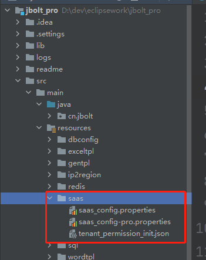
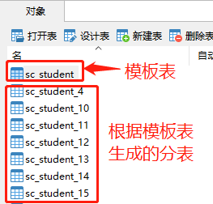

JBolt平台默认是不启用Saas支持模式的，有专门的配置开关。

配置文件在src/main/resources
# 一、saas_config.properties
Saas模式主配置文件

```
#是否开启saas模式
saas_enable = false

#租户域名 例如 jbolt.cn
saas_tenant_domain = localhost

#租户sn解析方式 不填就是default  推荐domain
#可选 domain:二级域名解析sn default:默认域名参数里jbtenantsn header:从请求的header中获取jbtenantsn
saas_tenant_sn_parser = domain

#saas_tenant_sn_parser设置为default和header时有效 自定义url和header中使用的传递sn的key名称
saas_tenant_sn_key = jbtenantsn

#租户数据源配置名 main 或者在 extend_datasource.setting等文件配置的configName
#主要用来规定租户分表生成位置 是哪个数据源里 一般都在一个mysql里多个数据库之间可以配置
saas_tenant_datasource_config_name = main

#扫描哪个java package下的带TableBind注解的model 多个用逗号隔开
#格式举例 packageName:true,packageName,pakcageName:false
#格式说明 packageName是包名 冒号后面的是是否强制必须tableBind注解中的separate必须为true 不写就是false
separate_model_package = xxxxxx
```
## 1、saas_enable 
saas_enable 为rtrue 开启saas模式，其他配置才会被JBolt加载和使用生效。

## 2、saas_tenant_domain
给租户专门配置一个域名 例如总平台使用www.jbolt.cn访问 租户使用 http://租户SN.jbolt.cn访问
那么saas_tenant_domain就设置为
saas_tenant_domain = jbolt.cn

## 3、saas_tenant_sn_parser

设置租户sn解析器是什么
domain:二级域名解析sn
default:默认域名参数里jbtenantsn
header:从请求的header中获取jbtenantsn

## 4、saas_tenant_sn_key
saas_tenant_sn_parser设置为default和header时有效
自定义url和header中使用的传递租户sn的key名称
**默认值**：jbtenantsn
如果saas_tenant_sn_parser 设置为default 那必须访问租户后台和接口 url里带着 例如http://api.jbolt.cn/user?jbtenantsn=qh
如果saas_tenant_sn_parser 设置为header 那必须访问租户业务的接口 请求request的header里带着jbtenantsn=qh
推荐使用二级域名，saas_tenant_sn_parser =domain 这样直接根据请求地址 JBoltbaseHandler拦截解析地址sn即可设置当前客户端访问线程里租户是谁。

## 5、saas_tenant_datasource_config_name 
租户数据源配置名 main 或者在 extend_datasource.setting等文件配置的configName
主要用来规定租户分表生成位置 是哪个数据源里 一般都在一个mysql里多个数据库之间可以配置
默认值main，也就是在一个系统的主数据源里依据平台的基础表 动态生成租户的核心分表。

## 6、separate_model_package 
扫描哪个java package下的带TableBind注解的model 多个用逗号隔开
**格式举例** packageName:true,packageName,pakcageName:false
**格式说明** packageName是包名 冒号后面的是是否强制必须tableBind注解中的separate必须为true 不写就是false
**separate_model_package** = cn.jbolt.school.model
这个意思就是，我们现在要给租户开发一套租户专用的业务，比如测评系统里的教务管理，每个学校管理自己的班级学生教师信息，
涉及到了**Student.java ClassInfo.java Teacher.java**三个model 放在**cn.jbolt.school.mode**l包中
他们在数据库里创建了模板表：


所以**Student**的管理业务是每个租户都有的 需要分表，那就把这个model的package 设置到配置文件里**separate_model_package = cn.jbolt.school.model**
系统在给每一个租户开户 去生成租户分表的时候，都会检测到你配置的者package的model，认为这些都是每个租户都有的分表，就会加入到分表生成队列中生成指定租户分表。


# 二、tenant_permission_init.json
saas租户分表模式下 默认给的权限初始化配置文件
在生成租户分表后，会加载此文件为新开的租户的jb_permission表里插入这些配置权限信息。

