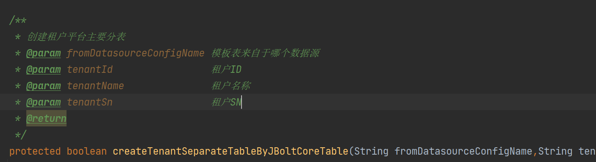
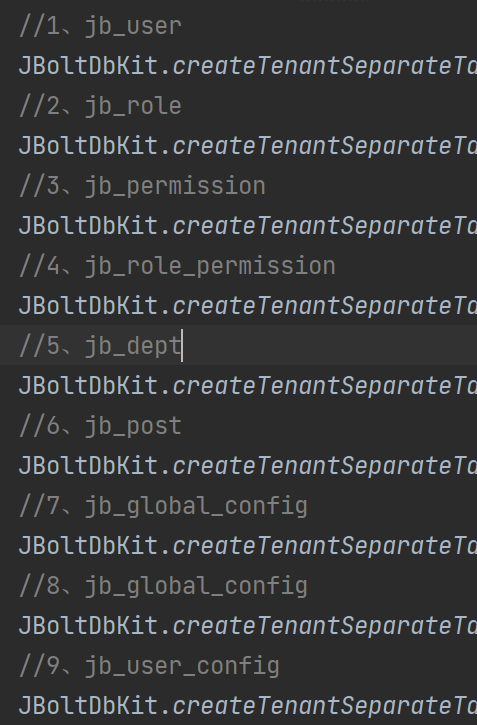
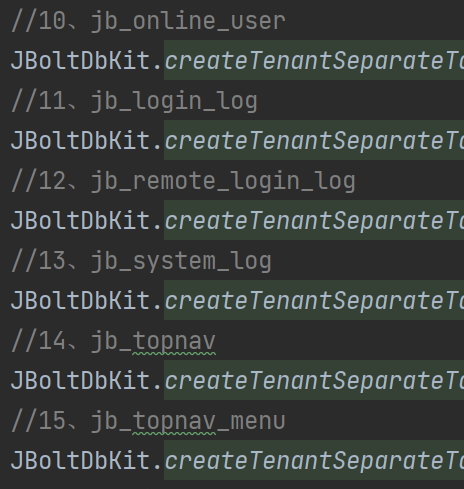
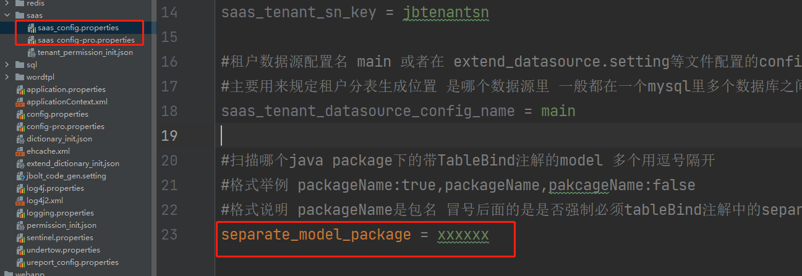
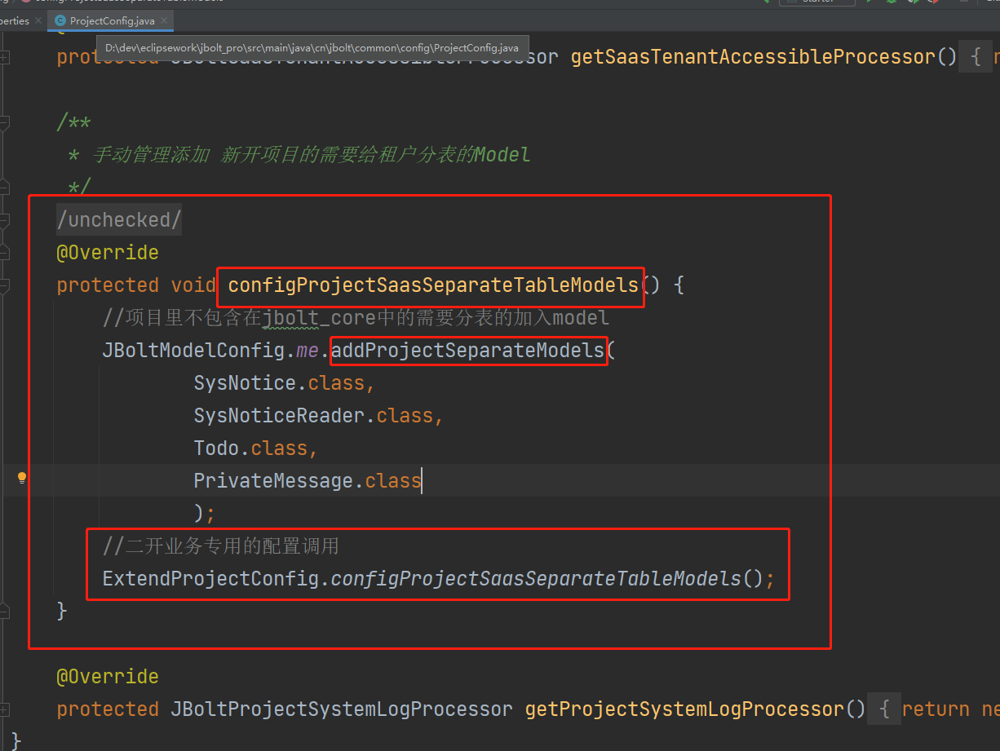

```
@Inject
private JBoltSaasTenantService jboltSaasTenantService;
/**
	 * 创建租户相关的分表
	 *
	 * @param school
	 * @return
	 */
	public Ret createSchoolSeparateTables(School school) {
		try {
                        //执行租户后台核心表的分表生成 生成后 租户就有完整的用户 角色 权限 部门 岗位 通知 代办 全局参数配置 租户用户个性化配置等
			boolean success = jboltSaasTenantService.creatTenantSeparateCoreTableAndInitDatas(dataSourceConfigName(), String.valueOf(school.getId()),school.getName(),school.getSn());
			if(!success) {
				return fail("创建学校初始数据库失败:2");
			}
		} catch (Exception e) {
			LOG.error(e.getMessage());
			e.printStackTrace();
			return fail("创建学校初始数据库失败:1");
		}
                //创建分表创建到哪个数据源
		JBoltDatasource toJboltDatasource = JBoltDataSourceUtil.me.getJBoltDatasource(JBoltConfig.SAAS_TENANT_DATASOURCE_CONFIG_NAME);
                //获取到当前模板表所在的数据源
		JBoltDatasource fromJboltDatasource = JBoltDataSourceUtil.me.getJBoltDatasource(dataSourceConfigName());
		//创建本项目的saas配置中需要加入生成分表队列中的model的分表
		JBoltDbKit.createProjectTenantSeparateTableFromSaasConfig(fromJboltDatasource, toJboltDatasource, String.valueOf(school.getId()));
		return SUCCESS;
	}
```

### 一、生成核心表 
能让租户登录并进入后台所需要的核心表
  //执行租户后台核心表的分表生成 生成后 租户就有完整的用户 角色 权限 部门 岗位 通知 代办 全局参数配置 租户用户个性化配置等
boolean success = jboltSaasTenantService.creatTenantSeparateCoreTableAndInitDatas(dataSourceConfigName(), String.valueOf(school.getId()),school.getName(),school.getSn());

JBoltSaasTenantService 提供的方法


执行后会生成jb_前缀开头的核心分表



### 二、生成租户业务分表
//创建本项目的saas配置中需要加入生成分表队列中的model的分表
JBoltDbKit.createProjectTenantSeparateTableFromSaasConfig(fromJboltDatasource, toJboltDatasource, String.valueOf(school.getId()));

JBoltDbKit提供的这个方法创建二开项目project级别里的saas配置文件中配置的和config配置类中单独配置的可分表Model 生成队列。
在saas配置文件里配置的 分表model所在的package：

系统启动的时候时候，会检测扫描下面的model 加入的JBoltModelConfig里管理起来。
在执行createProjectTenantSeparateTableFromSaasConfig是就用上了
就是去生成你配置的这个package

### 三、无法使用package在配置文件中配置的
ProjectConfig中留着一个配置的地方：


### 四、租户jb_user分表 默认生成管理员

用户名:租户SN_admin
密码:租户SN_123456