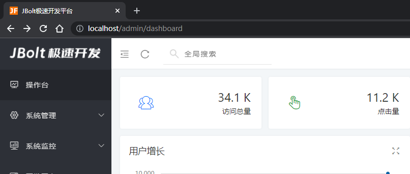
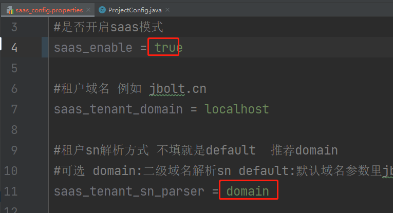
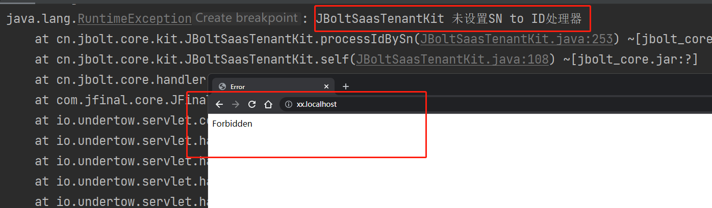
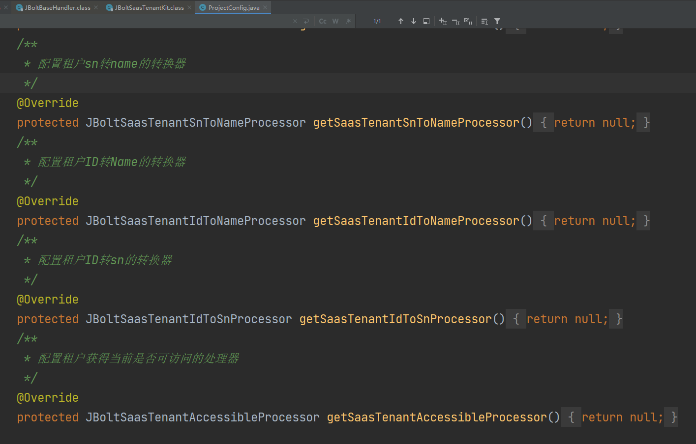
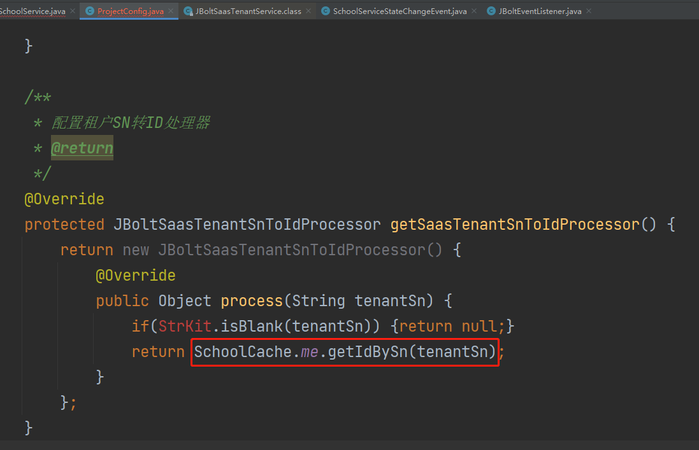
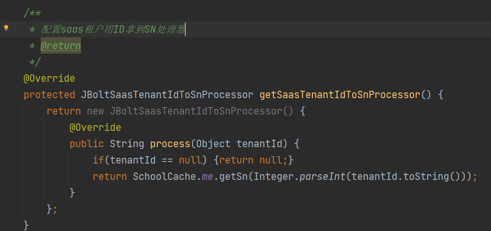
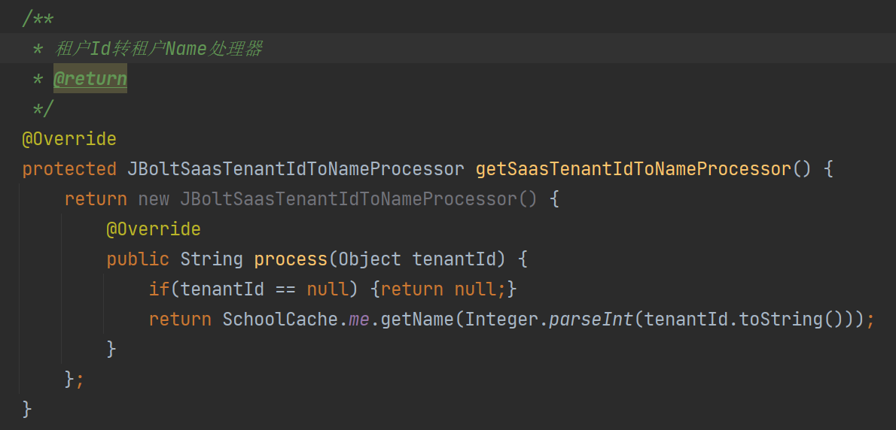
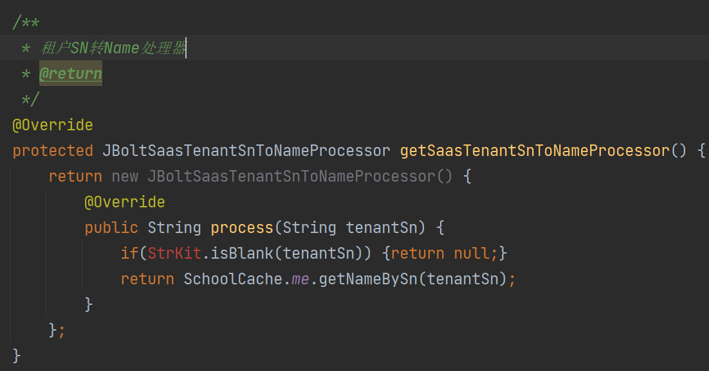
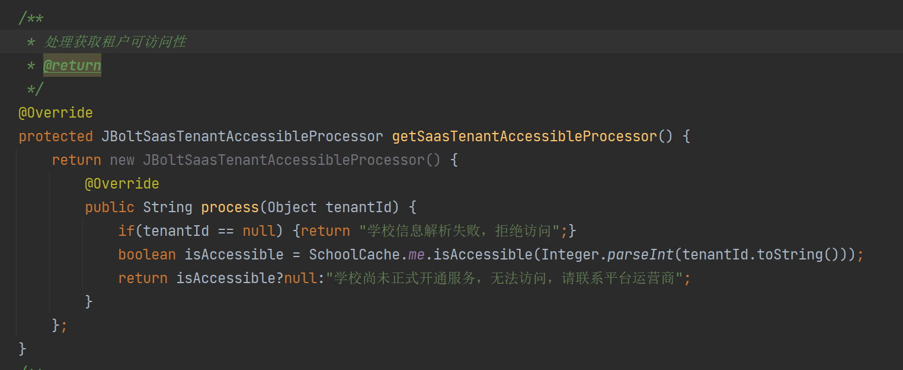
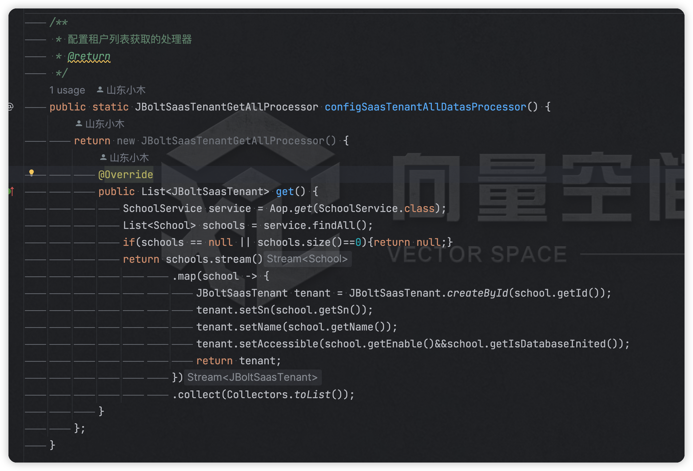

按照步骤1，配置文件配置完成后，项目启动就会加载配置文件的参数，如果saas_rnable设置为true，开启saas模式。
JBoltBaseHandler就请求进行拦截和解析了，拦截解析看如果开了saas模式，你是不是租户访问，是不是总部访问。
# 一、总部访问
开启saas模式后，总部访问还跟以前一样，没有区别

# 二、租户访问与解析

开启saas后默认使用二级域名解析器解析。
那么，我们尝试二级域名去访问试试：
http://xx.localhost
看效果：

控制台报错，网页被拒绝访问，原因是：JBoltSaasTenantKit 未设置SN to ID处理器

### 解决方案：
在ExtendProjectConfig.java中配置saas的相关解析器即可。

默认都是空 需要自己完善上去。

这里拿测评系统来举例：

#### 1、sn转ID

这个配置是在系统底层封装里用到解析出来的sn，如何去找到对应的租户的Id，找到id才能生成分表的时候拼接上去

### 2、ID转SN

这个配置是有些时候总部需要调用租户的数据去做处理，例如租户数据初始化的时候，总部需要模拟这个租户去在这个租户的独立表中添加初始化数据
就需要拿到这个租户的ID去模拟他的权限去操作，id转为SN这里用到了

### 3、ID转Name

通过租户ID拿到Name 跟ID转SN同理 有些地方拿到ID需要输出日志或者错误信息的时候带着租户name 用这个处理器就行了
只要在一些业务里有用到。

#### 4、SN转Name

通过租户SN转为Name处理，举个例子，解析二级域名后解析出来了SN 然后拦截器handler处理中发生异常需要输入当前租户名称到错误日志里 需要直接从cache里通过sn拿到name

这四个都配置上 有很多地方用到

租户的表信息对应的Model 是肯定要进入缓存的。

#### 5、租户可访问性
返回当前租户是否符合可访问条件，租户已经处于启用状态，服务状态为正式开通，数据库也初始化完成，这些条件都满足的时候，就可以访问了

#### 6、 配置租户列表获取的处理器
将自己的租户列表读取出来 转为List<JBoltSaasTenant>  返回即可

通过这个配置后就可以进入租户自己的后台了。

