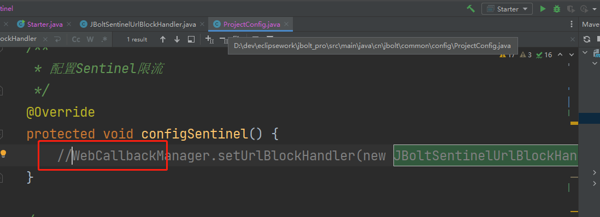

如果项目里需要开启ureport、sentinel、redis、caffeine 需要使用oracle SqlServer postgresql等
需要在pom.xml 里处理相关依赖。
默认ureport 、sentinel scope设置为provide了 需要删掉

sentinel 需要解开注释的代码即可

默认redis、caffeine oracle SqlServer postgresql 这些依赖都是注释掉了
需要的时候解开

## 为了打包体积 默认减少二分之一
