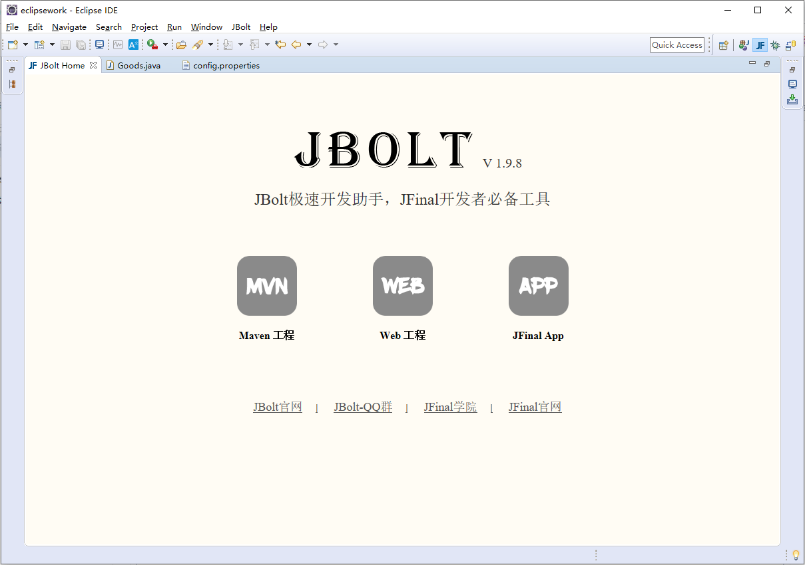
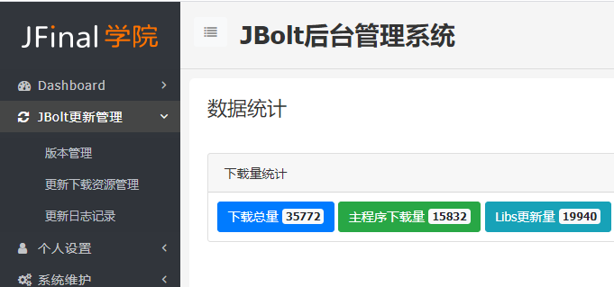
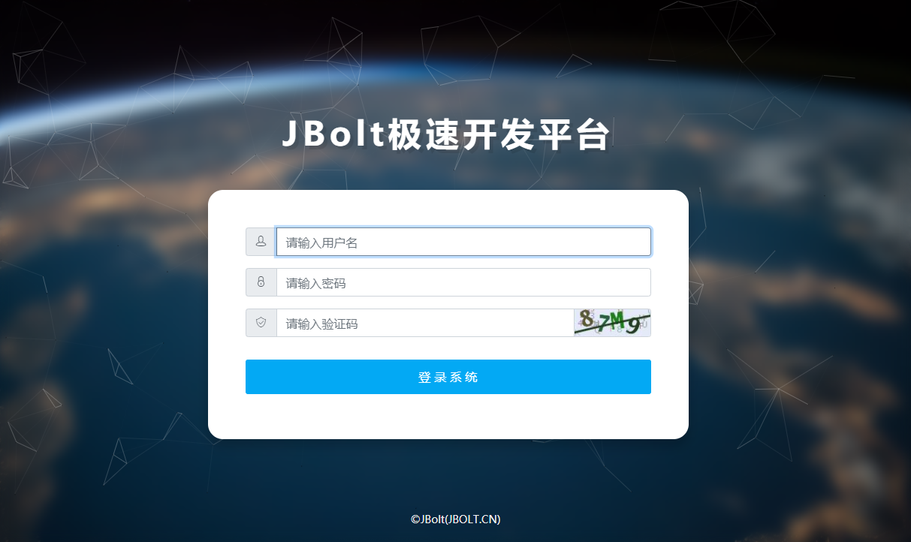
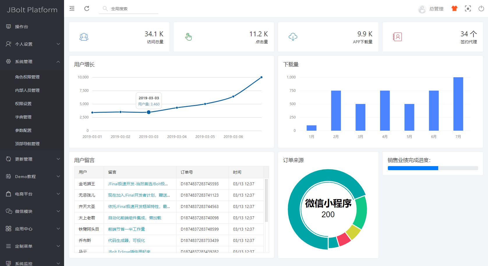
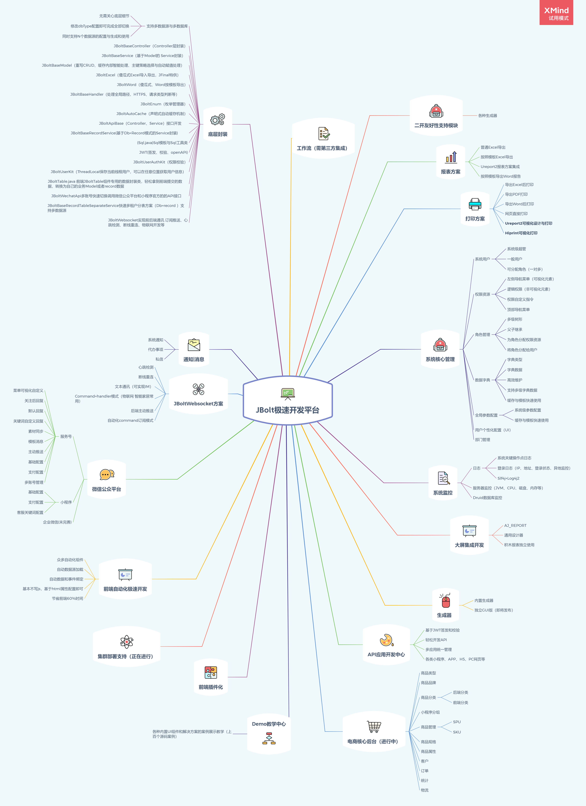

# 一、JBolt产品简介
### 0、概述
JBolt产品分为两部分，JFinal的开发助手插件、JBolt极速开发平台
JBolt产品的宗旨是为JFinal开发者提供全方位的技术开发服务，在开发过程中，从工具层面、教程培训等多方面为开发者将本增效。

### 1、JFinal开发助手插件
插件分 Eclipse版（已发布）和Idea版（开发中）
如果开发基于 JFinal 框架的项目，那么 JBolt 插件是必须要安装的，安装后可以帮开发者在 IDE 中快速创建基于 JFinal 的 Maven 项目开发环境，一键打包发布，一键生成代码等。
官网：[http://jbolt.cn](http://jbolt.cn)

目前插件都是无偿免费提供给JFInal社区开发者，现在有近1W活跃用户在使用Eclipse版插件。

### 2、JBolt极速开发平台
JBolt极速开发平台是JFinal学院推出的，基于JFinal框架最佳实践的企业级项目开发平台。
官网：[http://jbolt.cn/jbolt.html](http://jbolt.cn/jbolt.html)
视频教程地址：
http://jfinalxueyuan.com/jiaocheng/jbolt
目前已经拥有商业用户300家，属于JFinal社区里的头部商业项目。

同类商业优秀竞争产品还有EOVA和Jbootadmin，说是竞争，但是服务形式、价格、和方向各不相同。
JBolt极速开发平台只要依托于社区JFinal开发者计划实施服务，终身制，费用远低于同类产品,属于社区福利计划。

#### 更多实用教程正在更新，敬请期待。