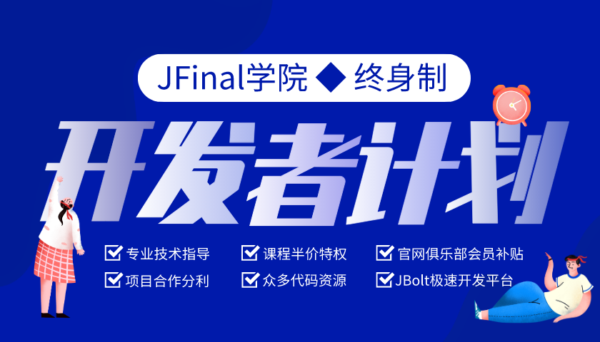
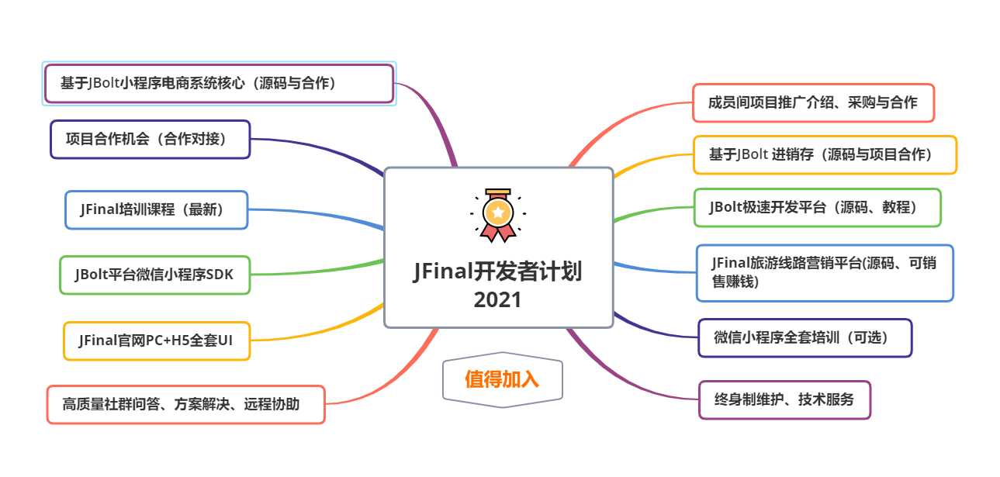
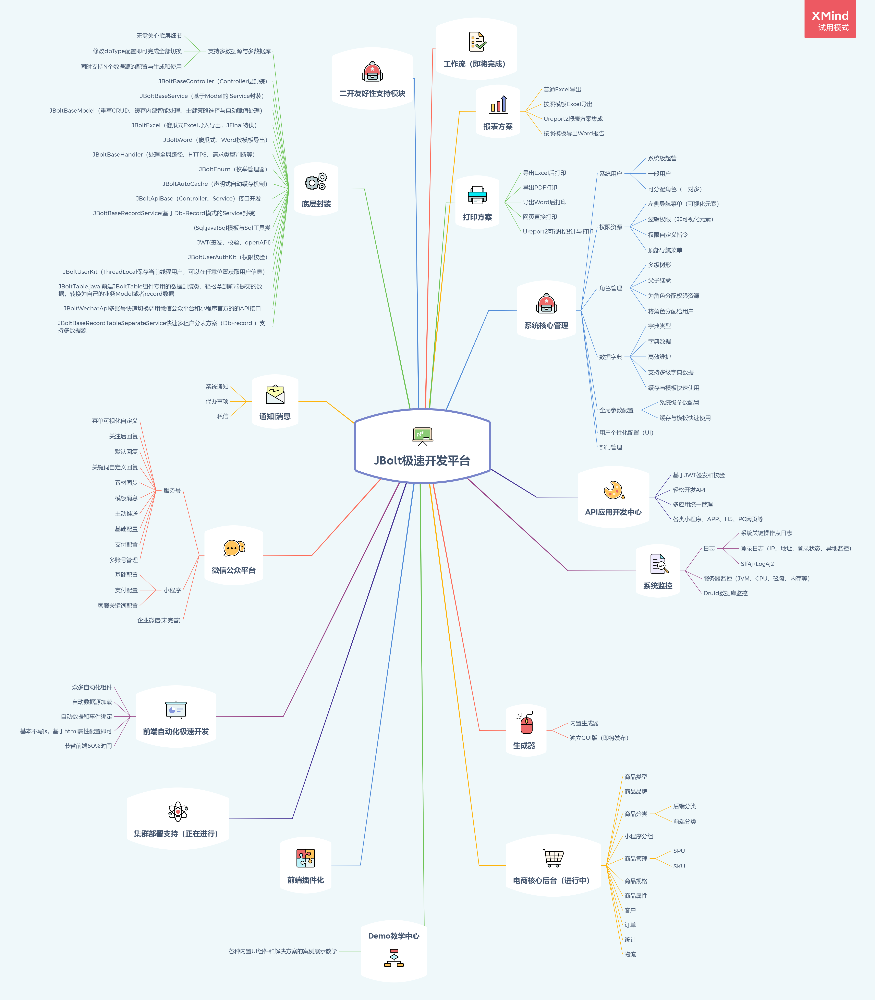
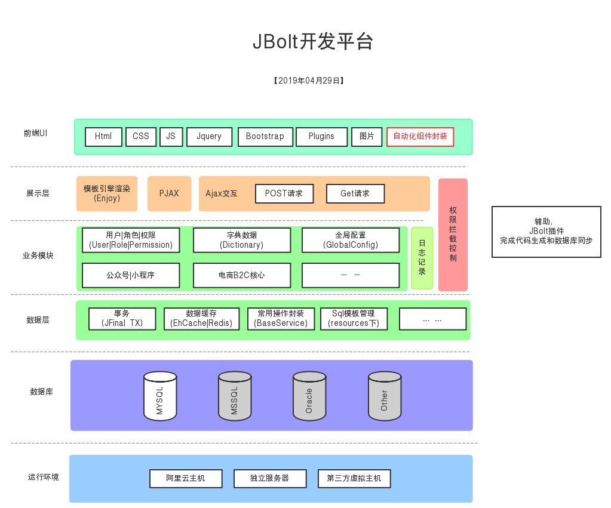

JFinal开发者计划，让你高效学习JFinal、使用JFinal最佳实践、利用JBolt极速开发平台为个人和企业降本增效。
JFinal学院推出JFinal开发者计划已经一年半了，目前加入开发者和企业300名

享受JFinal学院师徒式、保姆级、终身制技术服务。

如果开发者个人或者所在企业正打算使用或者已经启用JFinal作为项目核心技术框架进行开发的话，很有必要加入JFinal开发者计划，为你保驾护航，终身制技术问答、技术指导、远程服务、课程教学、资源分享、项目合作。

JFinal学院做你身边的开发伴侣！！

我们有课程、有资源、有代码、有项目、有师傅带、有耐心指导。

计划包括内容详细列表：

项目| 简介
:-----------: | :----------- 
 JBolt极速开发平台        |     基于JFinal的最佳实践开发的企业开发平台，快速上手二开自己的项目，降本增效。官网与演示：http://jbolt.cn/jbolt.html   
 JFinal旅游线路营销平台（Saas）        |     基于JFinal开发的旅游信息化管理平台，多用户，可直接商用。官网与演示：http://jbolt.cn/lvyou.html
 JFinal官网前端UI完整源码        |     JFinal官网定制版全套UI源码包括移动h5版 比现在的官网还全
 JBolt平台微信小程序SDK        |     在微信小程序端的开发框架，针对JBolt平台快速开发微信小程序的基础架构，帮助开发者快速搞定微信小程序核心环境和架构搭建
 技术问答、服务、指导        |    全日制早8点-晚23点 在线随时技术问答、服务、技术指导、远程协助服务 终身制有效
JFinal课程| 加入计划的可以学到最好的JFinal+JBolt平台开发教程
微信小程序从入门到精通培训课程 | 新加入计划企业版用户 可以选择赠送一套零基础学通微信小程序的训练营课程 课程近200节视频 四大实战项目练手，专门VIP群教学与服务
商业合作机会 | 本计划重在打造JFinal社区生态建设，加入成员在JBolt极速开发平台用熟练后 我们这边可以选择与其合作外包项目

JFinal开发者计划，让你高效学习JFinal、使用JFinal最佳实践、利用JBolt极速开发平台为个人和企业降本增效。

详细咨询 请加我微信：mumengmeng

### JBolt开发平台架构总览

### JBolt开发平台技术栈

核心框架：JFinal4.9.11、JFinal weixin 3.1
缓存：Ehcache 、Redis
数据库：Mysql、Oracle、Sqlserver、Postgresql
数据库连接池：Druid
IDE插件：JBolt插件Eclipse版、Idea版（开发中）
工具类库：hutool,fastjson,poi
定时任务：jfinal-cron
项目构建工具：maven
日志：slf4j+log4j2
Token认证：JWT-jjwt
Web容器：JFinal-undertow(默认)、Tomcat
前端UI主框架：基于Bootstrap4.6、JBolt自动化组件封装
集成第三方前端组件：layer.js、laydate.js、jquery-form、autocomplate、select2、Bootstrap-fileinput、webcam等
内置开发JBoltTable组件：支持固定表头、固定列、异步加载、CRUD、可编辑、复杂表头、动态调整列宽、自适应宽度等高级特性
API应用开发中心JS-SDK：目前提供了微信小程序中的SDK，JSSDK在H5页面通用。
