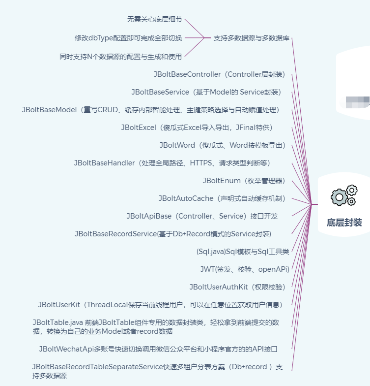

### JBolt开发平台架构总览

点击查看高清大图↓

### JBolt开发平台技术栈

核心框架：JFinal4.9.17、JFinal weixin 3.3
缓存：Ehcache 、Redis
数据库：Mysql、Oracle、Sqlserver、Postgresql、（达梦、金仓、翰高等国产 开发中）
数据库连接池：Druid
IDE插件：JBolt插件Eclipse版、Idea版（开发中）
工具类库：hutool,fastjson,poi
定时任务：jfinal-cron
项目构建工具：maven
日志：slf4j+log4j2
Token认证：JWT-jjwt
Web容器：JFinal-undertow(默认)、Tomcat
前端UI主框架：基于Bootstrap4.6、JBolt自动化组件封装
集成第三方前端组件：layer.js、laydate.js、jquery-form、autocomplate、select2、Bootstrap-fileinput、webcam等
内置开发JBoltTable组件：支持固定表头、固定列、异步加载、CRUD、可编辑、复杂表头、动态调整列宽、自适应宽度等高级特性
API应用开发中心JS-SDK：目前提供了微信小程序中的SDK，JSSDK在H5页面通用。

### JBolt底层做了哪些封装
