### 平台核心Java 主包名 cn.jbolt

此包下面所有的代码都是JBolt平台官方维护升级的，一般开发者拿到JBolt平台代码 不是特殊情况不需要修改核心代码的。
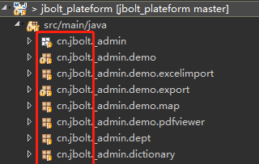

### 0、cn.jbolt.base 包
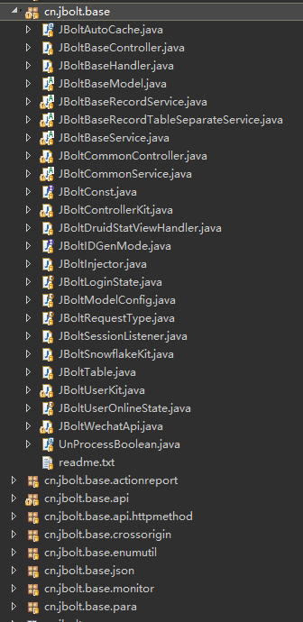

base包是整个平台的基石，包含了基础的Controller层、Service层、Model层、数据库连接池、id策略、基础handler、自动化缓存、枚举工具、万能JBoltPara参数获取器、JSON序列化配置、服务监控工具类、actionReport配置、http请求method、API访问拦截、跨域处理、判断和赋值请求的类型、接口开发方案、JWT工具类、API访问用户和绑定业务。

### 1、cn.jbolt.common包
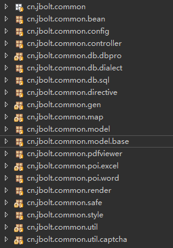
这里是整个JBolt平台核心公共模块，大量的封装常用的类库和功能

**cn.jbolt.common.bean** 平台里常用的javaBean
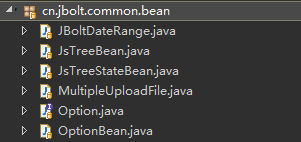
**OptionBean** 提供radio、checkbox、select数据源表option的Bean
**JBoltDataRange** 封装支持laydate跨时间选择的时间区间Bean
**JsTreeBean** 封装了jstree组件数据源对应javaBean
**MultipleUploadFile** 多文件上传组件 包装JavaBean

**cn.jbolt.common.config** 平台基础公用配置
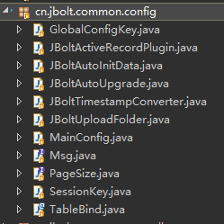
其中整JBolt项目启动需要的全局JFinalConfig在这个包里
就是**MainConfig**,里面有Main方法 整个项目可以在这个类里右键运行

**GlobalConfigKey **全局参数配置KEY的配置
**JBoltActiveRecordPlugin **自动扫描配置ORM映射
**JBoltAutoInitData **系统启动 自建检测配置初始化
**JBoltAutoUpgrade **系统启动 自动处理配置升级
**JBoltUploadFolder  **核心模块上传资源路径配置
**Msg** 配置常用的交互消息反馈信息
**PageSize** 配置常用的分页页码
**SessionKey** 配置Session里的数据的key
**TableBind** Model上映射表和数据源信息的注解

**cn.jbolt.common.controller** 平台公用controller
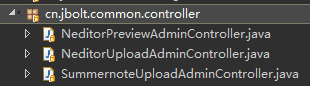
**NeditorPreviewAdminController** Neditor组件预览html使用
**NeditorUploadAdminController** Neditor富文本编辑器 各种上传封装
**SummernoteUploadAdminController** Summernote富文本编辑器 上传封装

**cn.jbolt.db.***封装了很多Sql工具了和数据库操作 其他数据库的方言等
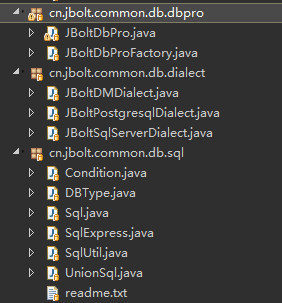

**cn.jbolt.common.directive** 封装了常用的页面模板和sql模板指令
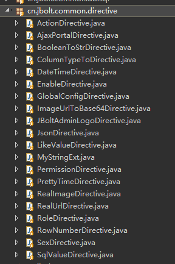

**cn.jbolt.common.gen** 封装了支持多种数据库的model、baseModel、controller、service、html和数据库设计文档的内容

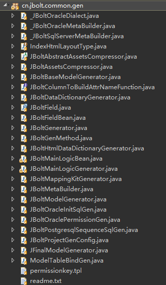

**cn.jbolt.common.map** 封装地图APi

**cn.jbolt.common.model** 系统核心库的表对应model和baseModel

**cn.jbolt.common.pdfviewer** pdf阅读器公用
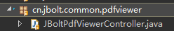

**cn.jbolt.common.poi.***  封装Excel和Word操作
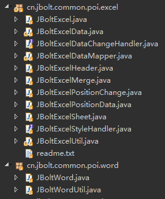

**cn.jbolt.common.render** 封装公用的render
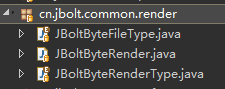

**cn.jbolt.common.safe** 安全处理
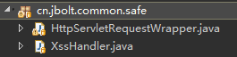

**cn.jbolt.common.style** 系统的样式 后台管理的UI样式选择
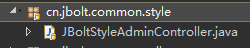

**cn.jbolt.common.util** 公用工具类 多种验证码封装
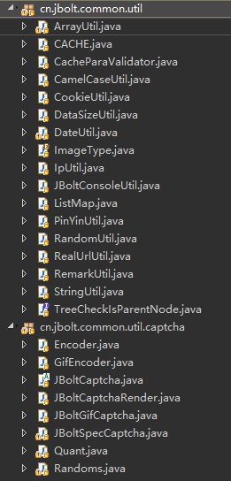

### 2、cn.jbolt._admin包
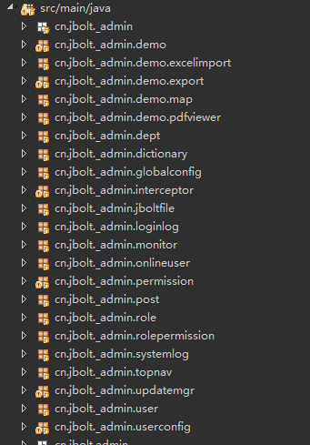
这里_admin是整个JBolt后台管理的核心包，存放JBolt平台官方维护核心库的后台管理部分的代码

**cn.jbolt._admin.demo** 自定义前端组件自动化 演示demo
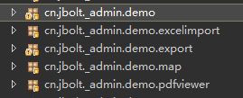

**cn.jbolt._admin.dictionary** 数据字典管理
**cn.jbolt._admin.globalcofig** 全局参数配置
**cn.jbolt._admin.interceptor**  后台管理权限拦截校验相关处理
**cn.jbolt._admin.dept**  部门组织机构管理
**cn.jbolt._admin.post**  岗位管理
**cn.jbolt._admin.user**  用户管理
**cn.jbolt._admin.userconfig**  用户个性化配置
**cn.jbolt._admin.role**  用户角色管理
**cn.jbolt._admin.permission**  权限资源管理
**cn.jbolt._admin.rolepermission**  角色权限分配
**cn.jbolt._admin.topnav**  后台顶部导航管理
**cn.jbolt._admin.jboltfile**  系统文件上传资源库
**cn.jbolt._admin.systemlog**  系统操作日志
**cn.jbolt._admin.onlineuser**  在线用户管理 监控
**cn.jbolt._admin.monitor**  系统服务器监控
**cn.jbolt._admin.loginlog**  系统后台用户登录日志

### 3、cn.jbolt.admin包
这里admin是JBolt平台提供后台核心基础上开发的应用模块代码
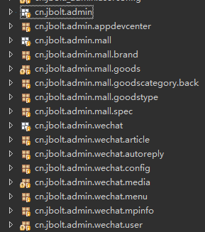
**cn.jbolt.admin.appdevcenter** API应用开发中心模块
**cn.jbolt.admin.mall**  电商核心模块
**cn.jbolt.admin.wechat** 微信开发平台模块

### 4、cn.jbolt.wxa包
这是JBolt平台对微信小程序提供的默认常用功能的封装实现
wx.login 用户信息授权与解密 手机号授权获取与解密
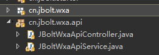

### 5、cn.jbolt.starter包
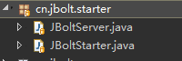
JBoltServer 对UndertowServer的封装和定制
JBoltStarter JBolt平台主启动入口 启动器 可以配置很多服务器相关的配置 例如 websocket sessionListener等

### 6、cn.jbolt.index包
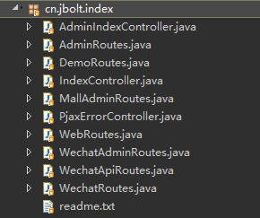
平台访问入口和配置所在地
各种路由配置和平台主访问入口、后台主访问入口、登录退出等

### 7、cn.jbolt._admin.websocket
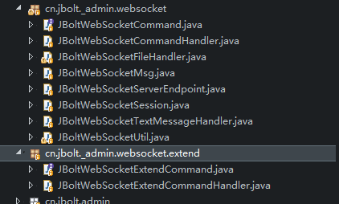
主要在这里处理与前端UI的websocket交互，指令定义 handler处理等

### 8、cn.jbolt.extend包

这里是二开项目日常开发要使用的地方，由平台提供
**ModelGenerator** model和baseModel生成
**MainLogicGenerator** 主逻辑生成器
**JBoltMineAssetsCompressor** 二开js css静态资源压缩器
**JBoltPermissionKeyGen** 权限PermissionKey生成器
**ExtendProjectConfig** 二开项目配置
**ExtendDatabaseConfig** 数据库额外配置
**ExtendUploadFolder** 上传路径配置
**Message** 消息配置等