### 平台配置文件包resources
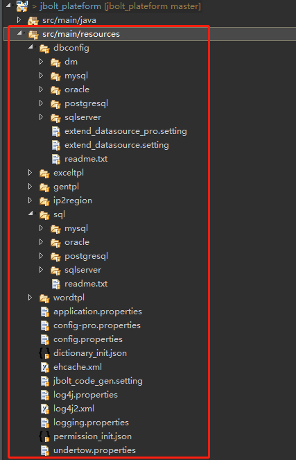
src/main/resources下存放了整个平台的所有配置相关的配置文件。

### 0、undertow.properties
平台使用内置Undertow服务器启动服务，这个文件是undertow服务器的配置文件
项目启动首先加载的是这个文件，在哪个端口启动，contentpath等配置。

### 1、application.properties

服务启动后 第一个要加载的配置文件，配置了整个部署方式 所在节点的信息、当前是否为demo模式等信息

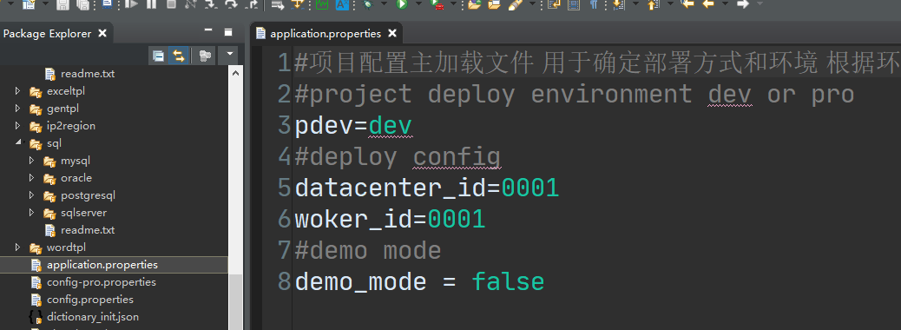

通过读取这个配置文件就确定了下面读取其他配置文件的顺序了。

pdev = dev是开发模式 pro就是生产模式

根据这个，第二个要去读取的就是config-*.properties文件了

### 2、config.properties

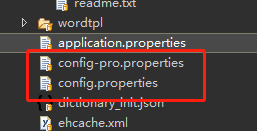

根据dev还是pro 去找到config.properties或者config-pro.properties加载不同环境的配置文件。
这个配置文件里只要配置的是核心主数据源数据库类型、默认上传路径、下载路径、服务器域名、网页和数据库的模板引擎开发模式、富文本编辑器的上传文件前缀域名、百度地图的账号配置等。

### 3、数据库配置文件
服务器和环境配置的文件加载到常量里，接下来就是要启动数据库和数据库连接池了。
这里需要读取的配置文件是在dbconfig包下面。
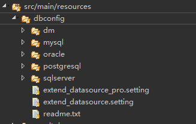

根据你在第二步骤设置的dbType配置参数去加载不同数据库类型的配置文件。

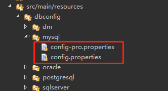

同样是根据开发模式还是生产模式，去加载不同模式下的配置文件，配置数据连接信息。

成功加载后，数据库连接无误，项目正式启动了！

### 4、多数据源扩展配置文件
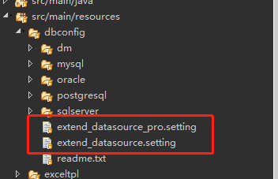
上面讲的是平台核心主数据源类型和配置文件，如果我们要开发的系统存在多个数据源，而且每个数据源的数据库类型不一样。
那么需要我们在扩展数据源里面添加响应的数据源配置信息，这样启动了主数据源后，额外的扩展数据源也会跟着加载和启动了。
这里的扩展数据源配置文件 同样是开发一个配置 生产一个配置。

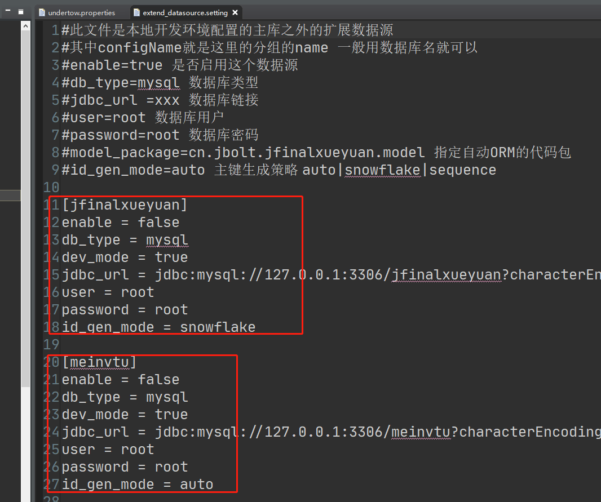
一个组为一个数据源配置。
多数据源配置有相关视频教程：

### 5、sql模板文件
针对数据源所对应的数据库类型，这里封装了对应的数据库sql模板
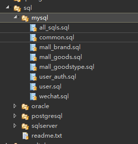
这些sql模板都在MainConfig.java中配置configPlugin中去配置数据库相关的模板

### 6、代码生成器模板
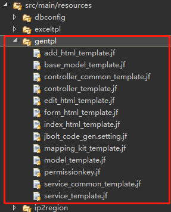
在gentpl里存放了 model、basemodel、controller、service、index.html add.html edit.html _form.html相关文件的模板
生成器执行时依赖这些模板文件，一般是由JBolt官方维护，如果自己有特殊需求可以复制一个修改名字 在相应调用的地方 改为自己的模板。

### 7、Excel、Word模板
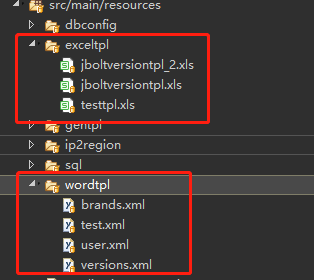
有些模块需要生成导出excel和word报告等格式文档，这里是放置导出使用模板资源的地方。

### 8、系统数据初始化 json数据
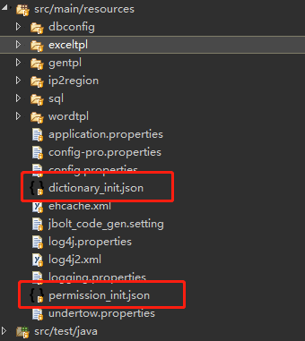
这两个文件是系统维护的默认初始化数据。
默认导入的sql初始化文件里是没有插入任何数据的 只是创建出表结构，系统启动时会自动检测是否初始化数据了，如果没有就根据这两个文件 拿到数据 插入到对应表里去。

### 9、log配置文件
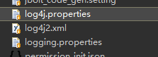
现在系统里使用了slf4j+log4j2的 配置，所以主要看**log4j2.xml**文件里的配置即可。