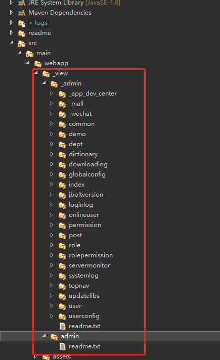
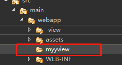

### 前端view层
在src/main/webapp下 有_view这个目录 在此目录下存放JBolt平台核心模块的所有html模板文件。

### 二开模块的view层放在那里？
这个二开的时候你自己创建的模块 配置路由的时候都会配置每个路由对应的baseViewPath

建议你的二开模块不要放在_view里 这里主要放JBolt自身核心模块的东西。
你可以放在_view同级目录，例如你可以取名为 myview

