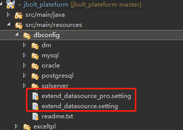
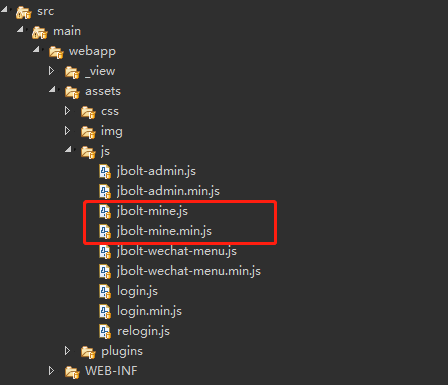

JBolt极速开发平台在有利于快速二开项目上做了很多工作和设计。
### 在Java代码上有 cn.jbolt.extend包

这里是二开项目日常开发要使用的地方，由平台提供
**ModelGenerator** model和baseModel生成
**MainLogicGenerator** 主逻辑生成器
**JBoltMineAssetsCompressor** 二开js css静态资源压缩器
**JBoltPermissionKeyGen** 权限PermissionKey生成器
**ExtendProjectConfig** 二开项目配置
**ExtendDatabaseConfig** 数据库额外配置
**ExtendUploadFolder** 上传路径配置
**Message** 消息配置等

### 在配置文件上有扩展数据源

### 在前端js css上

有jbolt-mine.js和jbolt-mine.css去开发自己需要的js css 或者其他自己创建jscss都可以。
js css文件编辑完 可以执行上面java中的 **JBoltMineAssetsCompressor** 二开js css静态资源压缩器去压缩出min.js和min.css

### 还有什么

JBolt的架构在不断按需优化和迭代，未来 CACHE.java 系统日志targetType等定义 都会独立出来 不与核心库掺和 更好的支持二开。