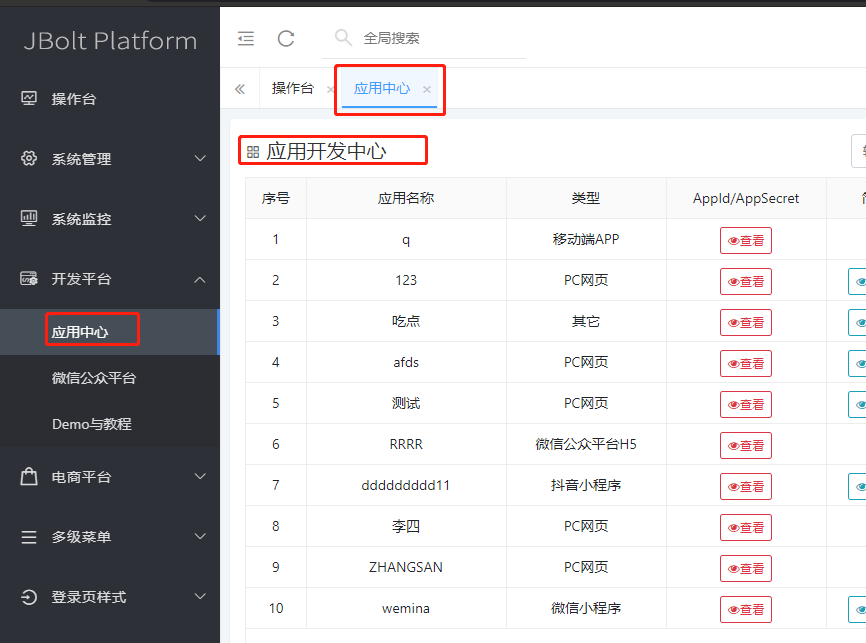
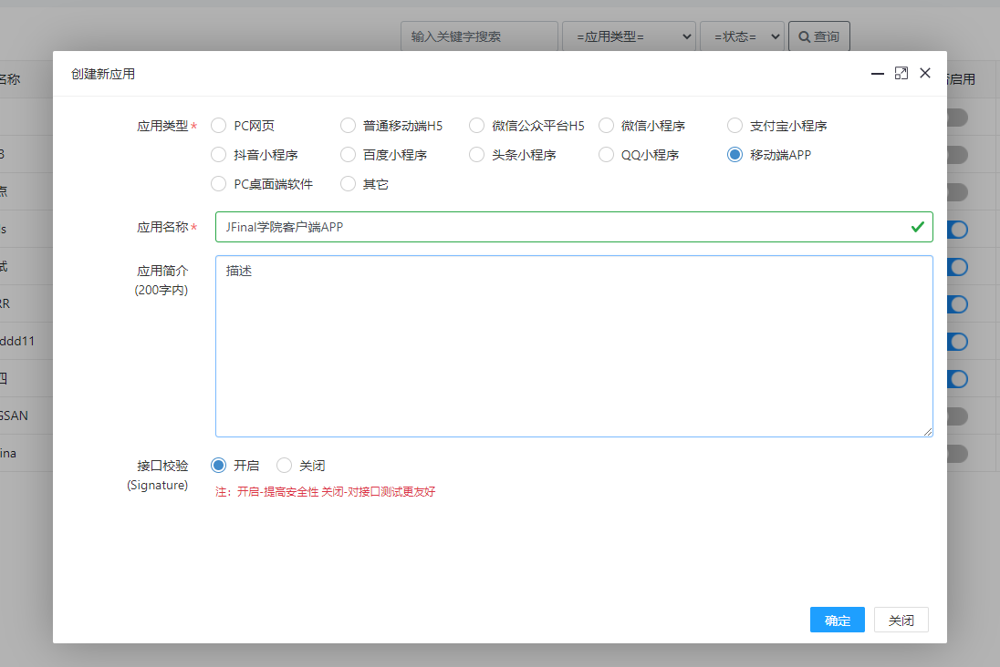
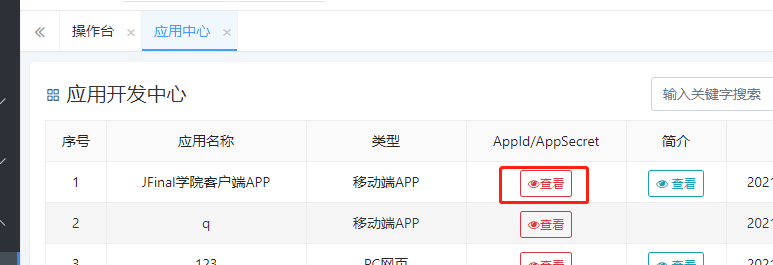
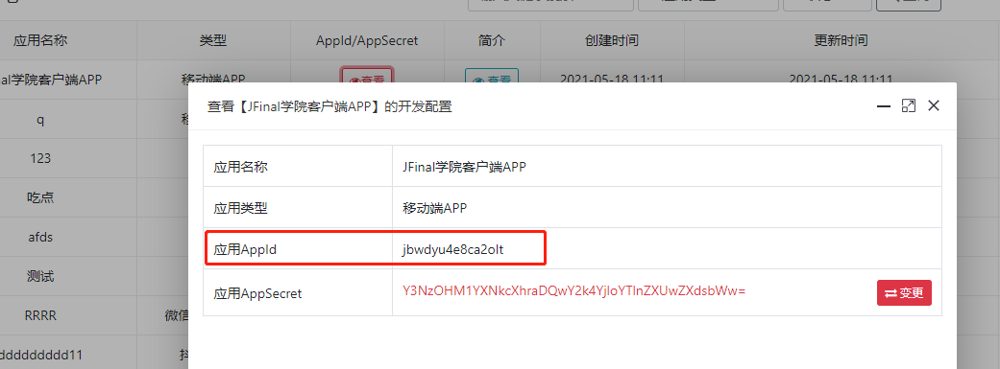
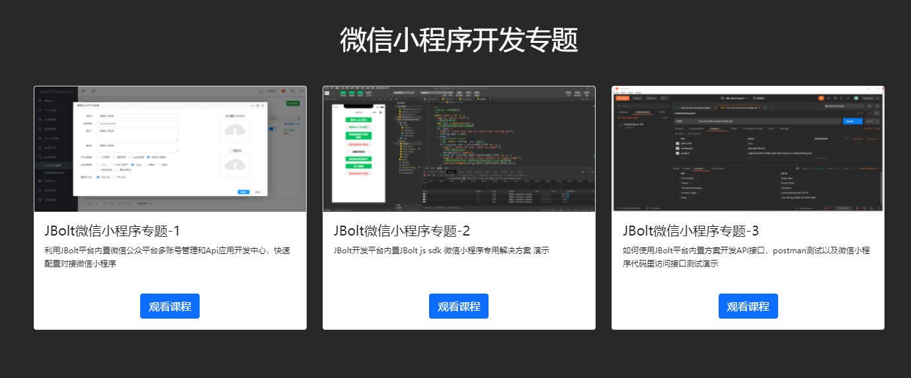

如果你要开发一个APP或者一个微信小程序、一个VUE写的前后分离的前端项目，需要后端管理系统和后台服务接口的话，使用JBolt的应用开发中心相当合适。

在JBolt中找到开发平台->API应用开发中心：

在这里先创建一个你的客户端应用：

创建应用后，拿到APPID：

这样就可以在自己的APP里使用这个创建出来的客户端应用来与JBolt里的API接口访问请求和对接了。
具体的对接方式，API的编写方式，请参考这个视频教程：
http://jfinalxueyuan.com/jiaocheng/jbolt/

