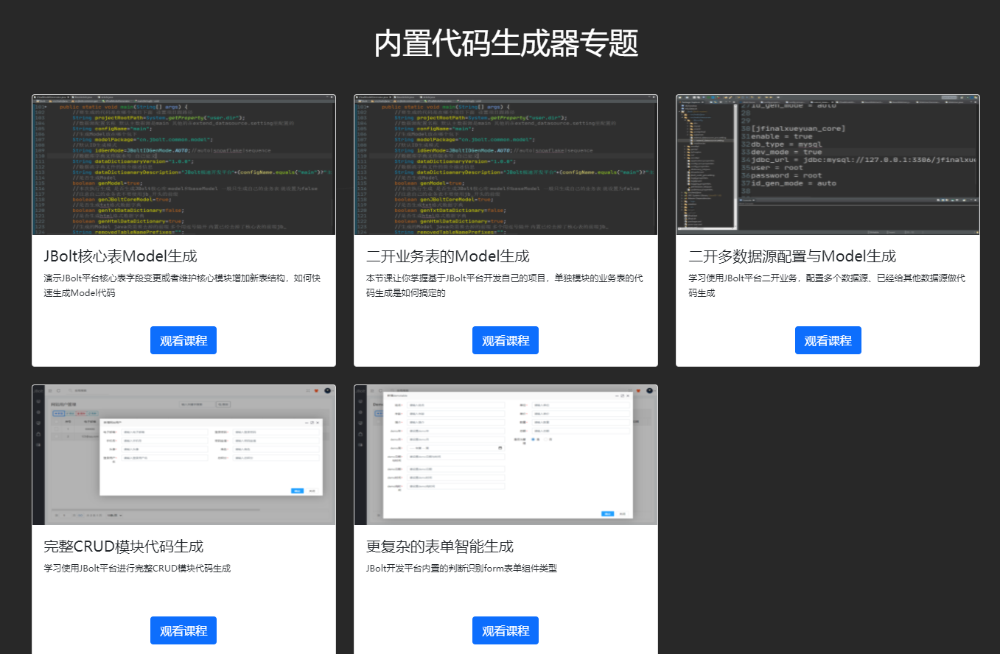
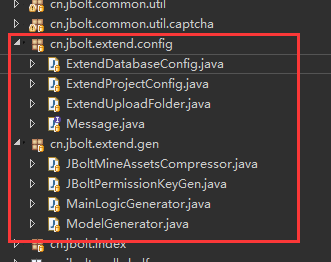
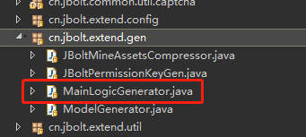
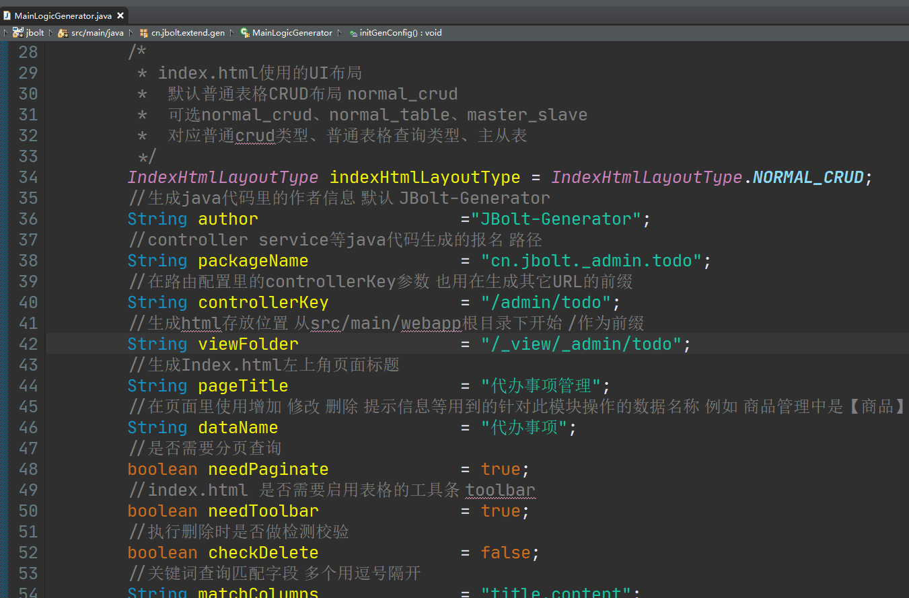
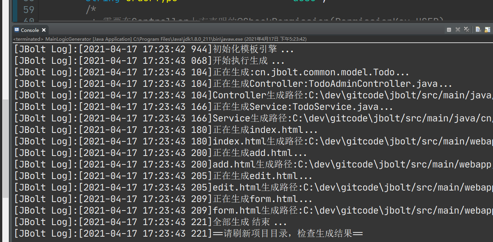
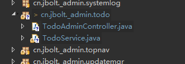
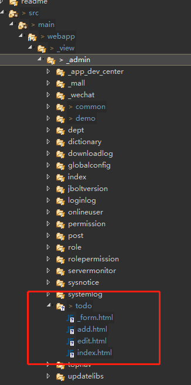

这里有详细的视频教程演示生成器如何快速生成Model和CRUD模块代码。
http://jfinalxueyuan.com/jiaocheng/jbolt/

## 需要注意：

视频录制的时候是老版本的 思路是一样的 值得看，这里时候一下新版的生成器位置：
都放在了这里：
JBolt极速开发平台在有利于快速二开项目上做了很多工作和设计。
 cn.jbolt.extend包

### 思考
首先，我们思考一下，一个模块我们需要做哪些工作，写哪些代码才能搞定呢？
### 一个模块需要：
1、有view层的交互操作
2、有后端接收交互请求的Controller
3、有处理单个请求的Action
4、有处理业务的Service
5、有承载数据和传递数据的Model或者Record或者JavaBean
6、有数据库和表结构去支撑数据的存取和事务

## 流程
那么，我们去写一个模块的基本流程应该是：
### 1、创建模块里使用数据的数据库和数据表

这里设计表结构的时候，一定注意规范：
因为JBolt平台是满足底层数据库无缝切换的，基本不需要修改Java代码就可以切换底层数据库的，所以各个数据库兼容性都要涉及到。
- 都用小写、或者都用大写
- 下划线区分单词，而不是用驼峰，因为oracle之类的数据库 不适合
-  用char(1) 表示boolean类型字段属性
- 创建时间最好用create_time     因为JBolt底层自动检测这个属性，在save的时候会自动赋值 不需要自己处理
- 更新时间最好用update_time    因为JBolt底层自动检测这个属性，在save和update的时候会自动赋值 不需要自己处理
- 尽量不用复合主键 单一主键就行
- mysql、SqlServer推荐id策略是auto 自增  也可以选择雪花Long
- oracle、postgresql 推荐雪花long 也可自增序列
- 数据库字段内置校验是否可以为Null设置上 这样生成的时候 表单可以生成校验规则 是否必填
- 数据库表名 最好 或者说 一定要加上一个前缀 比如jbolt核心前缀的jb_ 你自己开发的模块前缀自己起名 例如  tb_mall

JBolt-Mysql 数据库设计规则：

一、名称书写规则
1、表名、字段名全部小写 
2、纯英文 见名知意
3、多单词使用下划线分隔 例如 category_id   dept_id   post_id
4、表名加前缀 jbolt核心表都是jb_前缀 二开所有业务表 可以根据实际情况给予前缀 比如学校端业务用sc_ 总平台表用pl_

二、主键
1、主键统一使用名称id
2、mysql中使用bigint(20) 对应java Long
3、主键策略统一使用雪花算法生成 不用自增  特殊需要自增的可能就是学校表 因为需要通过他的数字ID去给学校模块里的student表做分表 tb_student_[schoolId]
4、单一主键 不用符合多主键
5、单表树形设计 需要 主键id 和 父主键pid 固定名称

三、外键
1、外键使用逻辑外键，程序控制
2、外键名称 见名知意 例如 category_id   dept_id   post_id
3、mysql中使用bigint(20) 对应java Long

四、类型 状态 这种字段设计
1、mysql中用 int(11) 
2、类型一般用 type
3、状态一般用 state

五、boolean类型字段设计规则
1、在mysql中使用char(1) 表示true false 不用bit char(1) 在所有数据库里通用 方便迁移转库 jbolt平台自动识别char(1)转Boolean
2、所有boolean类型字段必须必填给予默认值 默认值根据实际情况

六、【是否启用】 字段设计
1、用enable 
2、类型char(1)
3、必须有默认值

七、排序字段
1、用固定的sort_rank
2、类型int(11)
3、JBolt自动处理这个名字 底层做了优化

八、真删除还是假删除
1、根据需要 如果假删除 必须使用字段 is_deleted 标识
2、char(1) 默认值false
3、JBolt在调用删除的时候 底层自动识别是否存在这个标识字段 如果有 还是false 就执行假删除 没有这个字段就真删除

九、日期时间类型字段
1、创建时间 create_time  JBolt内置字段处理优化 不用自己赋值 save和update的时候 自动检测 自动赋值
2、更新时间 update_time JBolt内置字段处理优化 不用自己赋值 save和update的时候 自动检测 自动赋值
3、类型选择 datetime
4、java里使用java.util.Date 赋值 数据库查询后转为java.util.Date

十、当前用户作为 创建人 更新人 ID
1、创建人create_user_id JBolt内置字段处理优化 不用自己赋值 save和update的时候 自动检测 自动赋值
2、更新人update_user_id JBolt内置字段处理优化 不用自己赋值 save和update的时候 自动检测 自动赋值

十一、能用字典表解决的就用字典表解决
1、字典表 设计使用sn字段 作为选项的值 外键

十二、数据名称字段设计规则
1、举例 学校管理中 学校名称用name就行了 没必要在school表里学校名称写成school_name 这样java调用的时候school.getName()
2、如果有其他表冗余学校名称 字段名应该是school_name

十三、数字字段设计
1、如果确定就是整数 用int(11)
2、如果数字很大 或者 存在小数点 用 decimal(10,2) java里对应BigDecimal

### 2、生成Model和BaseModel的Java代码

这里就需要使用到二开扩展生成器了。

项目中找到ModelGenerator.java打开：
具体配置和用法 视频教程里都讲的很详细的。

配置好之后，执行Java 类 main方法，即可生成.

# 这里需要注意的是，设置你的新model生成路径不要跟JBolt核心model放在一块儿，这样以后随着主库更新不会冲突
自己生成model的包需要配置到数据源配置文件里：

### 3、执行主逻辑生成
和第二步一样 需要二开扩展生成器。

项目中找到MainLogicGenerator.java打开：
具体配置和用法 视频教程里都讲的很详细的。

这里生成的UI和java代码都是在自己设置的包和目录下。

**生成的Java代码和包**

**生成的html**

### 4、权限和路由配置
上面model和crud的逻辑都生成之后，只要配置一下路由和权限 菜单就可以访问了。
具体配置在视频教程里都有的。

登录后台找到权限资源管理，添加你这个模块对应的菜单：

 然后给这个菜单生成PermissionKey，这里需要执行二开里的工具类生成器：

直接运行生成全新的PermissionKey.java

然后给你的这个模块主逻辑生成器生成的Controller上配置一下路由和权限key就好了

路由配置：

这里是手工去配置路由映射，如果嫌麻烦，可以按照视频教程里讲的，生成@Path注解就可以省略这个配置步骤了。

### 5、启动与测试
上面都生成配置完，启动服务，进入后台，通过菜单访问：

发现菜单加了，但是左侧导航里没出来，这是因为你的角色上没有分配，分配一下菜单就好了。

刷新后，菜单出来了：

图标没设置，所以没有。

点击进入模块主页：

CRDU，默认都生成了，排序也带着，测试功能，按照自己的真实需求，修改一下生成的UI，达到满意为止！！

