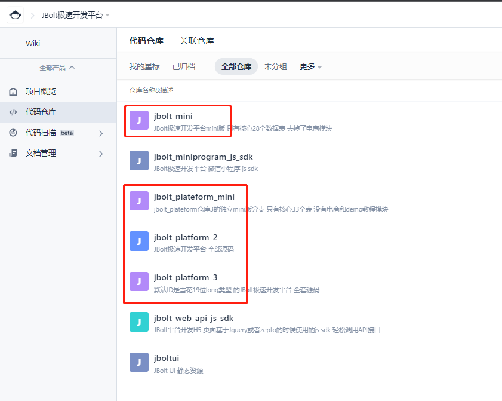

这里有详细的视频教程演示：
http://jfinalxueyuan.com/jiaocheng/jbolt/

### 一、仓库选择

JBolt平台现在源码有五个仓库：
### 1、jbolt_platform_2
这个仓库是目前的主线仓库，保持稳定和长期迭代，包含JBolt目前所有功能的全部源码。
JBolt核心库的ID主键生成策略默认是数据库自增，默认数据库是Mysql。
同时支持其他类型的数据库和扩展数据源 都是没有问题的。

### 2、jbolt_platform_3
这个仓库与仓库2功能现在保持一致 同步更新，主要区别就是默认ID生成策略为雪花算法，并且ID类型为Long，需要初始化的时候使用Longid的sql初始化。

### 3、jbolt_mini
这个仓库是跟jbolt_platform_2的功能和id策略保持一致，只是去掉了demo和商城模块。

### 4、jbolt_plateform_mini
这个仓库是跟jbolt_platform_3的功能和id策略保持一致，只是去掉了demo和商城模块。

### 5、jbolt_pro
这个仓库是2022年全新升级开发的一个支持saas的架构。更好用 目前还得迭代 不太稳定
### 二、那我们应该选择哪个仓库到入？

这个需要学习阶段 就用jbolt_platform_2这个仓库，所有视频教程录制也是按照这个来的。
另外，新项目来了选择仓库就要先分析自己的项目了，是要用Int类型的ID主键，还是想要Long 19位类型的雪花主键。

**雪花主键**：long类型 可排序 性能好 生成ID依赖数据库 无阻塞 按时间戳生成