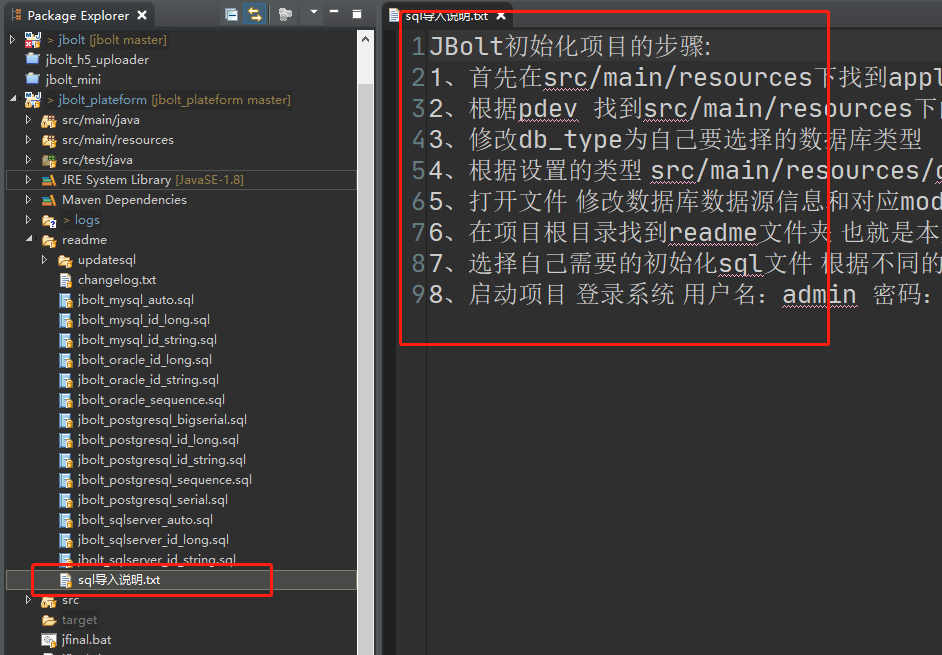

这里有个详细讲解视频教程：
http://jfinalxueyuan.com/jiaocheng/jbolt/

视频教程录制的时候，初始化sql还没有现在这么丰富，但是流程是一致的而且讲解了一些启动的流程和原理，有必要看一下。

### 导入说明：

JBolt初始化项目的步骤:
1、首先在src/main/resources下找到application.properties 设置pdev=dev 或者 pdev=pro 
2、根据pdev 找到src/main/resources下的config.properties和config-pro.properties
3、修改db_type为自己要选择的数据库类型   mysql|oracle|postgresql|sqlserver|dm
4、根据设置的类型 src/main/resources/dbconfig 找到对应的数据库类型 数据源配置文件 config.properties和config-pro.properties
5、打开文件 修改数据库数据源信息和对应model_package
6、在项目根目录找到readme文件夹 也就是本文件所在目录
7、选择自己需要的初始化sql文件 根据不同的数据库类型和id策略 选择不同文件 导入数据库即可完成数据库表初始化
8、启动项目 登录系统 用户名：admin 密码：123