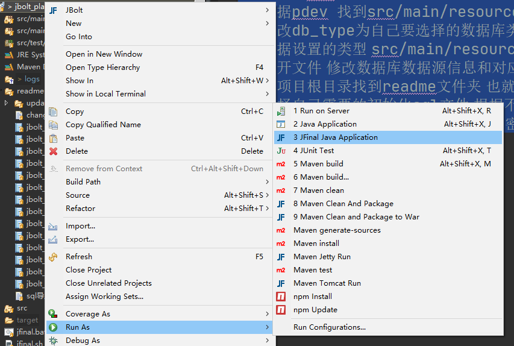
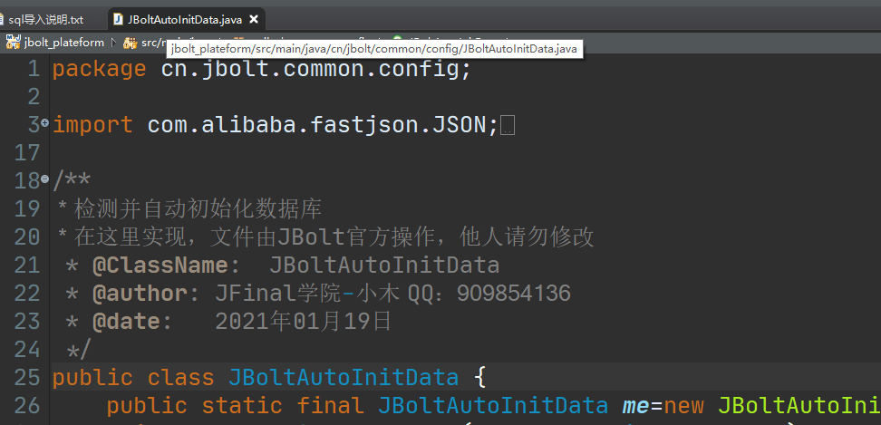

项目启动，找到MainConfig.java 或者JBoltStarter.java 右键即可运行启动整个JBolt平台。

如果你使用的是Eclipse这个开发工具，可以安装JBolt插件，右键一键运行项目：

JBolt插件-Eclipse版完整使用教程地址：
https://gitbook.cn/books/5e9bf58b6e10e519aa234b3c/index.html

JBolt平台项目启动时会进行自检，检查用户表里有没有初始化超管信息、权限资源表里有没有定义资源信息、必要的几个数据字典是否存在。
哪一项不存在，在启动后就自动执行哪一项的初始化工作。

### 具体代码在：
