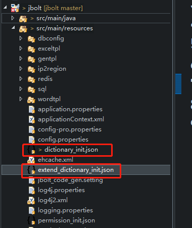
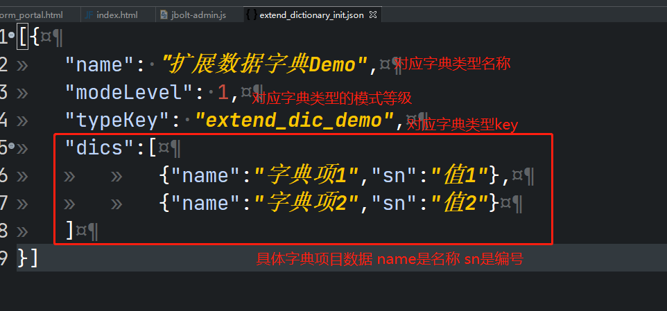

JBolt平台里系统内置的数据字典数据 是在项目启动的时候，检测和自动写入了。

检测的文件在这里：

dictionary_init.json 是JBolt平台核心运行需要的内置字典数据的默认初始化数据，初始化的时候会检测它 并入库更新。
如果以后JBolt内置新模块需要新字典数据 默认需要在这里定义字典数据

### 切记 这个是JBolt官方团队维护的 其他开发人员 请勿修改

如果需要扩展自己业务需要的内置字典数据 请在这里添加

extend_dictionary_init.json 专门针对扩展字典数据用的文件

