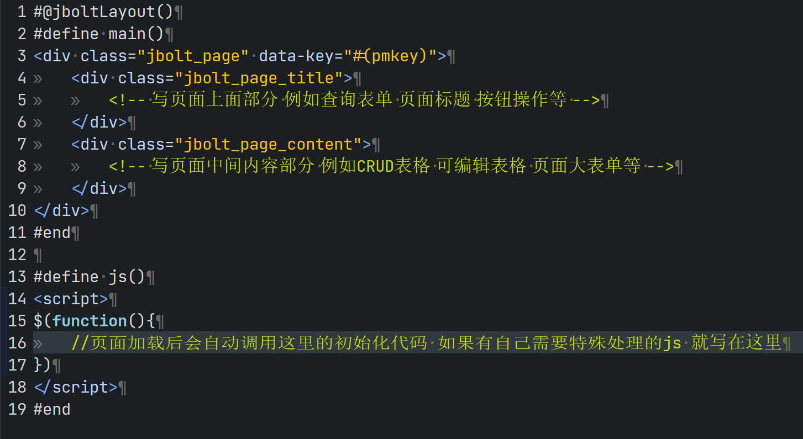

JBolt整体架构html是有特殊设定的：
具体可以参考本视频：
http://jfinalxueyuan.com/jiaocheng/jbolt/jbolttable/001.html



```
#@jboltLayout()
#define main()
<div class="jbolt_page" data-key="#(pmkey)">
	<div class="jbolt_page_title">
		<!-- 写页面上面部分 例如查询表单 页面标题 按钮操作等 -->
	</div>
	<div class="jbolt_page_content">
		<!-- 写页面中间内容部分 例如CRUD表格 可编辑表格 页面大表单等 -->
	</div>
</div>
#end

#define js()
<script>
$(function(){
	//页面加载后会自动调用这里的初始化代码 如果有自己需要特殊处理的js 就写在这里
})
</script>
#end
```
