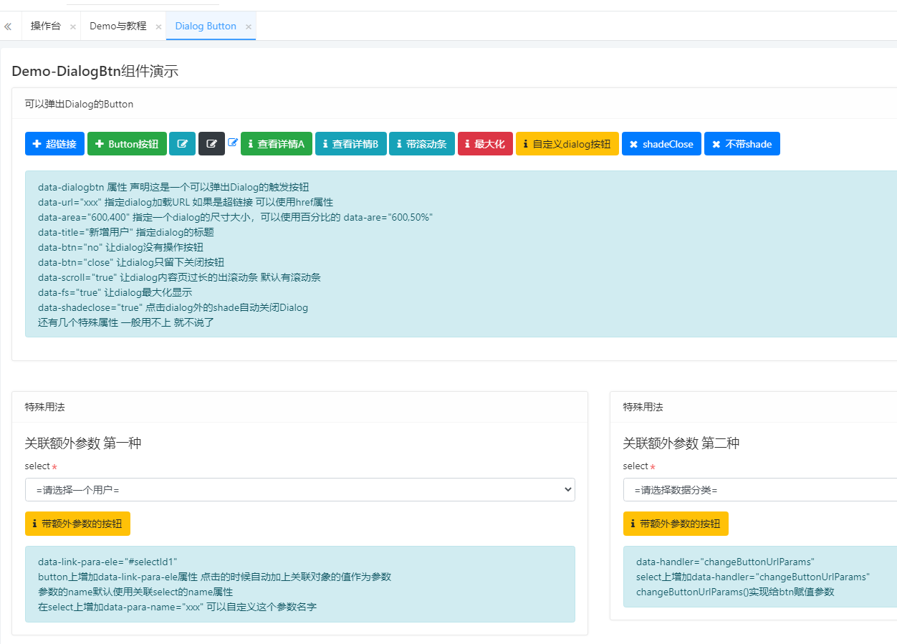

顾名思义，可以弹出一个Dialog的按钮，不管标签是button、a、span、div 只要声明data-dialogbtn 属性 它就拥有点击打开一个dialog的能力，成为一个Dialog button。

各种弹出的效果，配置的参数 demo教程里都有说明和演示

属性名 | 案例值 | 默认值 | 说明
| :----------- : | :-----------: | :-----------:| 
data-dialogbtn | 无 | 无 | 声明按钮是一个触发弹出Dialog组件的按钮
data-title | “编辑用户信息” | 使用按钮text | 设置弹出Dialog的title属性 默认使用按钮的text
data-area | "800,600" | "800,500" | 设置打开Dialog的尺寸 横向宽度和纵向高度
data-btn | “close” | 无 | 设置默认确定和关闭按钮的显示状态 close是只显示关闭按钮 no是不显示默认确定和关闭按钮
data-fs | “true” | false | 设置是否全屏显示
data-target | "parnt" | 无 | 设置在Dialog中 弹出dialog 或者在Iframe中弹出dialog到父页面 不受iframe宽度限制
data-shade | “false” | tue | 设置去掉遮罩
data-shadeclose | "true" | false | 设置点击遮罩层就关闭dialog
data-handler | "" | 无 | 设置确定按钮点击后的处理handler
data-close-handler | "" | 无 | 设置点击关闭按钮后的回调处理
data-check-handler|""|无|设置点击按钮执行弹出前要干事情，根据返回值，选择是否打开dialog，false是不打开，true是打开，如果是字符串等非boolean值返回，会带着这个数据去打开
handler 就写function的名字即可

