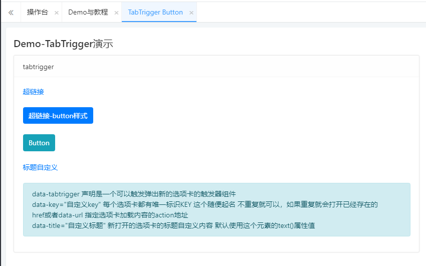

这是一个启用了多选项模式下，在任意UI界面上可以打开选项卡的触发器按钮。

data-tabtrigger 声明是一个可以触发弹出新的选项卡的触发器组件
data-key="自定义key" 每个选项卡都有唯一标识KEY 这个随便起名 不重复就可以，如果重复就会打开已经存在的
href或者data-url 指定选项卡加载内容的action地址
data-title="自定义标题" 新打开的选项卡的标题自定义内容 默认使用这个元素的text()属性值