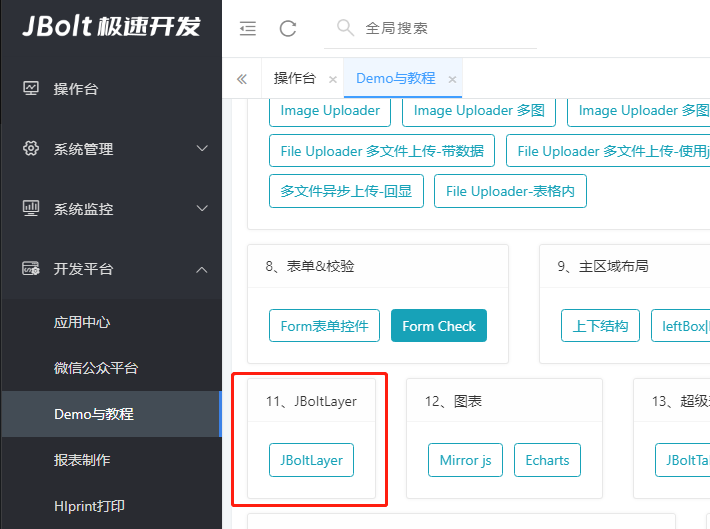
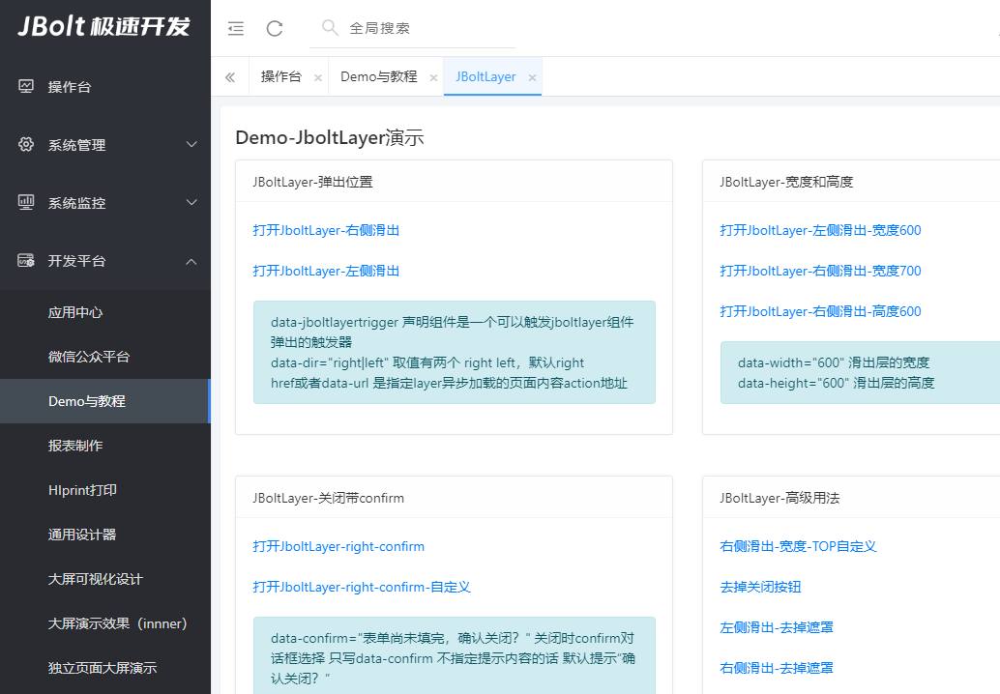
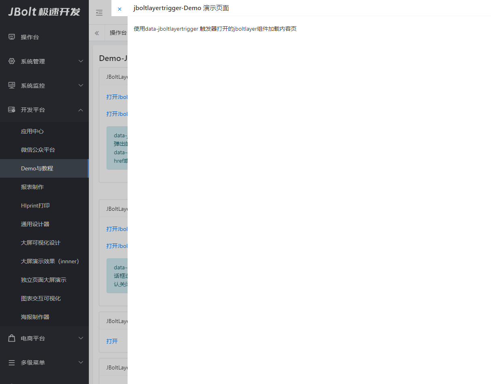

JBoltLayer组件是一种滑出层组件没也叫抽屉组件，可以在当前页面上层滑出一个独立的layer层 用来承载额外处理的一些UI。

通过点击触发器组件 触发弹出

data-jboltlayertrigger 声明组件是一个可以触发jboltlayer组件弹出的触发器
data-dir="right|left" 取值有两个 right left，默认right
href或者data-url 是指定layer异步加载的页面内容action地址

data-confirm="表单尚未填完，确认关闭？" 关闭时confirm对话框选择 只写data-confirm 不指定提示内容的话 默认提示“确认关闭？”
data-resize="true" 指定可以调节宽度
data-width="600" 滑出层的宽度
data-height="600" 滑出层的高度
data-top="60" 指定top的属性举例顶部距离
data-noclose 去掉关闭按钮
data-nomask 去掉遮罩层
data-keep-open="true" 指定保持打开 下一个请求打开layer的也用当前已经打开的，具体可以参考登录日志里点击日志tr查看详情的效果

data-load-type="iframe" 声明组件内容使用Iframe加载 默认值："ajaxportal"