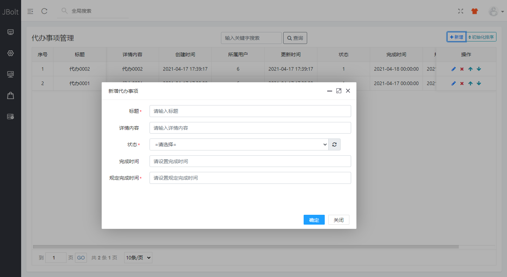
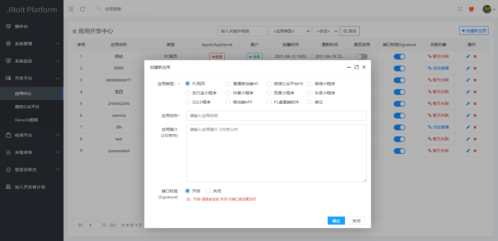
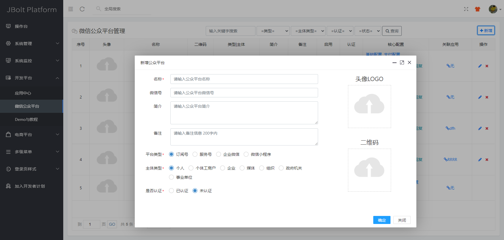

这里有使用内置代码生成器生成完整CRUD模块的视频教程：
http://jfinalxueyuan.com/jiaocheng/jbolt/gen/004.html
http://jfinalxueyuan.com/jiaocheng/jbolt/gen/005.html

Dialog弹出来进行新增和修改数据，这种是最经典常见的布局类型
主区域使用一个表格显示数据，带着几个操作按钮。

这种布局，可以完成一些基础数据模块的CRUD等基础操作，非常实用，实用JBolt内置代码生成器可以直接生成完整的这种布局。

再来看几个例子：
都是一样的模式！

