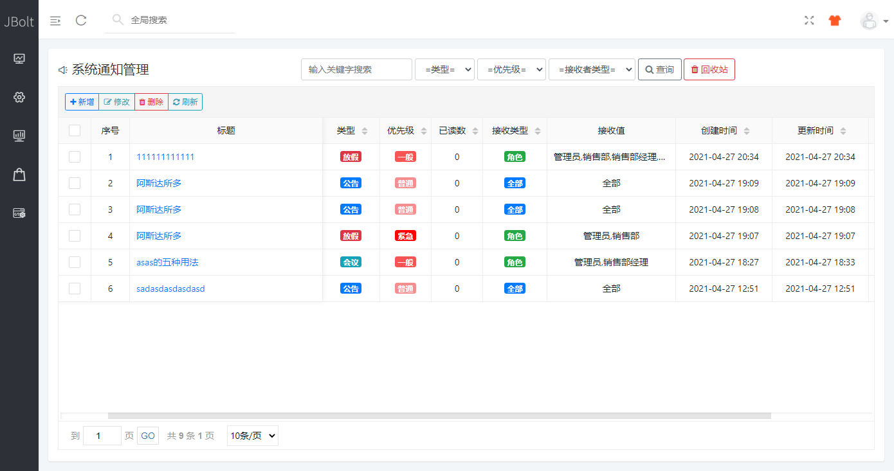

### 关于Toolbar的使用，这里有视频教程：
[http://jfinalxueyuan.com/jiaocheng/jbolt/jbolttable/015.html](http://jfinalxueyuan.com/jiaocheng/jbolt/jbolttable/015.html)

### 举例：系统通知模块

这个模块使用了最新版代码生成，生成带toolbar工具条的UI样式，提供第一列checkbox 选择数据后操作等。

当然你还是可以在一行的前面或者后面去加上其他操作列的。