主子表的demo在这里：
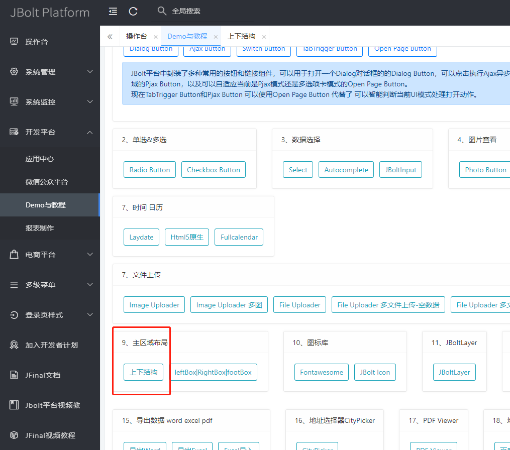
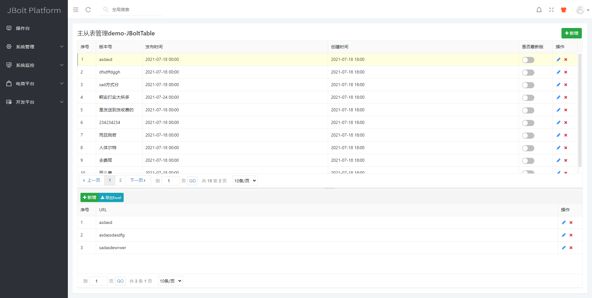

### 解释说明：
#### 主表是jb_jbolt_version表
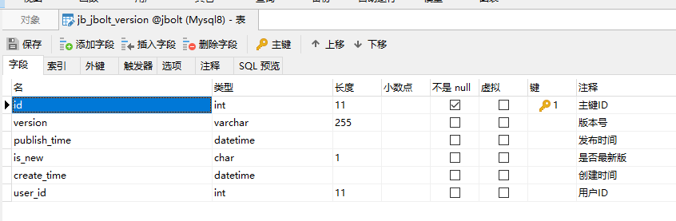
主要存放JBolt新版本发布信息，每次发布一个新版本，都会在这增加一条新的记录，is_new设置为true，只有一条可以是true。

#### 子表是jb_jbolt_version_file表
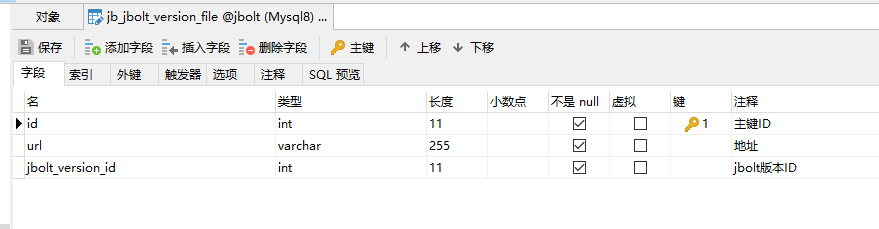
子表主要存的是这个新版本对应的需要更新的文件有哪些。

## 这就是主从表典型的1对多的案例。

具体代码结构：
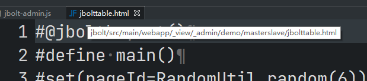
### 参考这个文件demo。
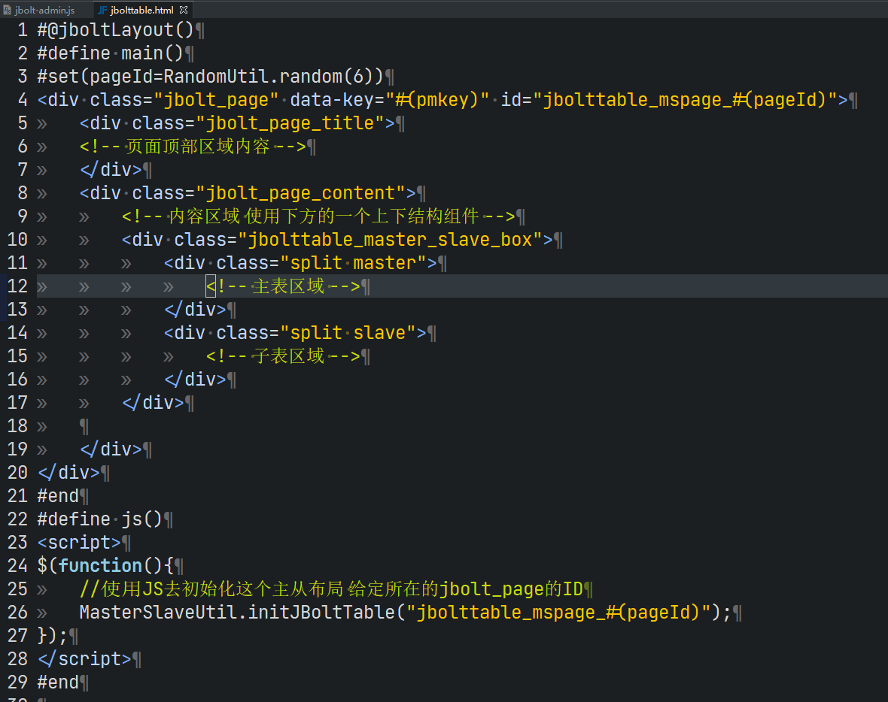

```
#@jboltLayout()
#define main()
#set(pageId=RandomUtil.random(6))
<div class="jbolt_page" data-key="#(pmkey)" id="jbolttable_mspage_#(pageId)">
<div class="jbolt_page_title"></div>
<div class="jbolt_page_content">
<!-- 内容区域 使用下方的一个上下结构组件 -->
<div class="jbolttable_master_slave_box">
	<div class="split master">
		<!-- 主表区域 -->
	</div>
	<div class="split slave">
		<!-- 子表区域 -->
	</div>
</div>

</div>
</div>
#end
#define js()
<script>
$(function(){
	//使用JS去初始化这个主从布局 给定所在的jbolt_page的ID
	MasterSlaveUtil.initJBoltTable("jbolttable_mspage_#(pageId)");
});
</script>
#end
```

### jbolttable不管是主表还是子表，都是ajax异步加载的数据源，使用data-url去定义数据源的地址：

## 先看主表：
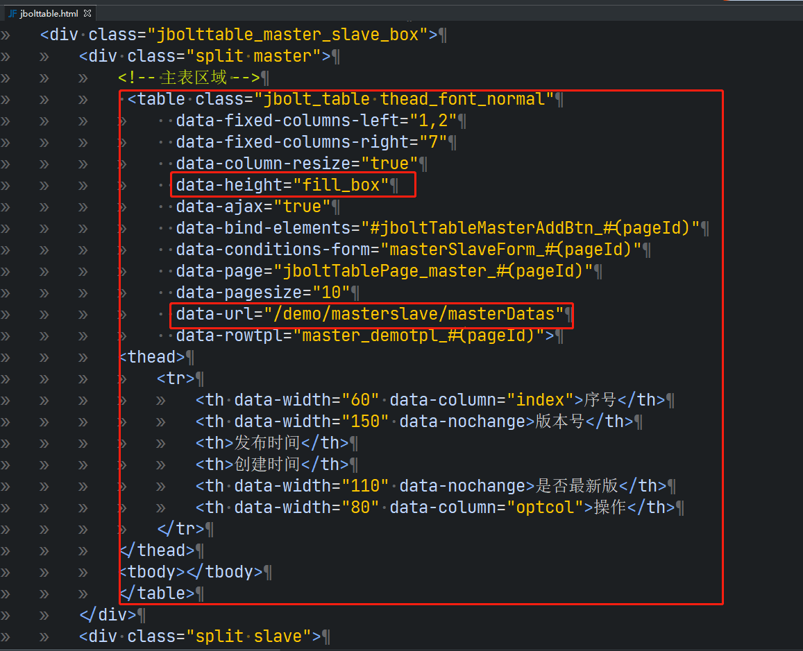
因为这个主子表两个table是嵌入到一个主从页面上下分割结构里，所以data-height需要设置为fill_box 意思就是填充所在的区域。子表也是一样的。

## 主表如何点击驱动子表？
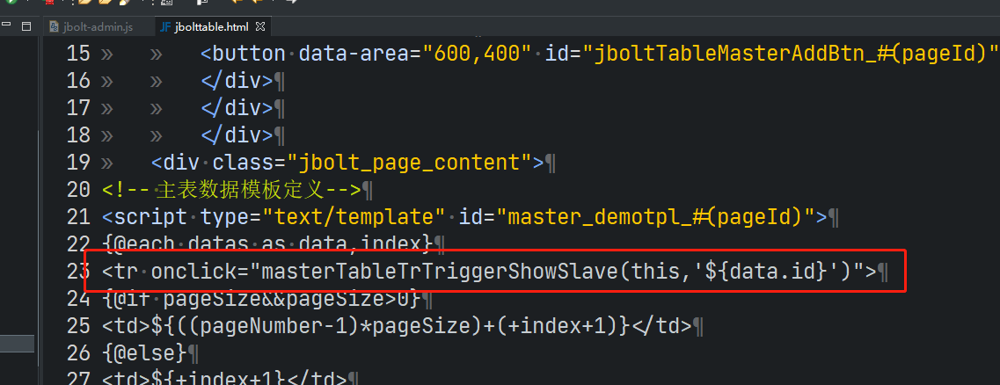
点击一行数据 调用了这样的一个函数 onclick="masterTableTrTriggerShowSlave(this,'${data.id}')"
会自动去找子表slave区域里的表格去驱动加载新的数据源
------------------------------------------------------------------------
## 注意：
主从表的的表格 不能加data-jbolttable 因为加了的话 没等主从结构初始化 jbolttable就已经异步执行渲染初始化了
这里不加这个声明是为了 容易让下方的主从JS去处理表格初始化：
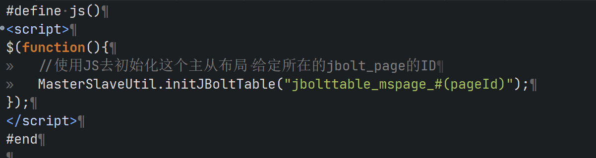

## 再看从表：
# 这里最好是加入 data-autoload="false" 这个配置 标识子表默认只初始化布局样式 但是不加载数据 等主表点击时候触发加载
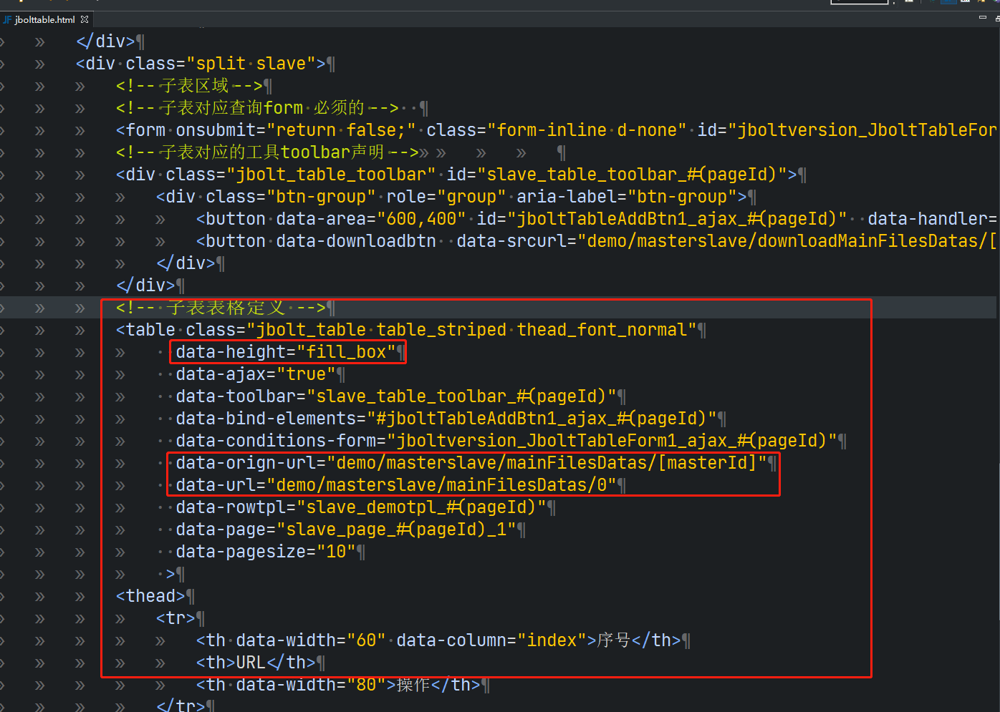
因为从表是依赖主表选择的某一条数据的ID作为外键查询条件去查询数据的，所以数据源定义上需要做额外处理，需要两个URL
data-url="demo/masterslave/mainFilesDatas/0"  
使用这个是一上来默认加载的数据 正常应该最后一个值0是要传主表选中数据的Id的，现在默认一上来渲染传0即可，后台查询方法判断是0就返回空数据即可。
data-orign-url="demo/masterslave/mainFilesDatas/[masterId]"
这个data-orign-url 是一个模板URL，是专门为子表设计的，子表默认读取data-url这个地址，然后当主表选择一行数据后，触发子表按照主表选择数据的ID去查询，那么选中的主表数据ID会使用data-orign-url定义的主表ID占位符[masterId]去替换成新的值。

例如，主表选择数据ID是10001 那么data-orign-url通过替换得到最终的URL=demo/masterslave/mainFilesDatas/10 然后赋值给data-url，那么子表格被触发使用新URL去加载新数据。

同样，对子表区域里的按钮也是有效的：
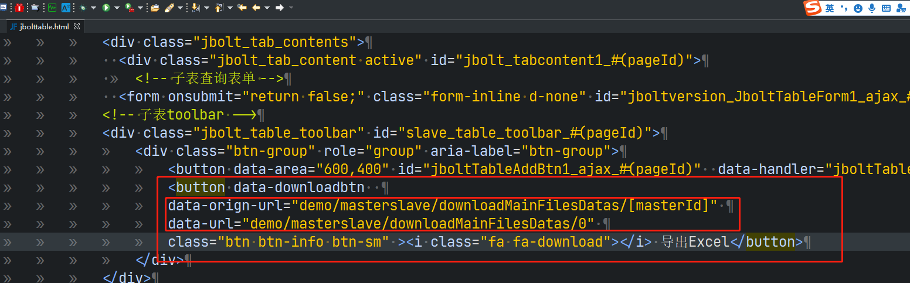


