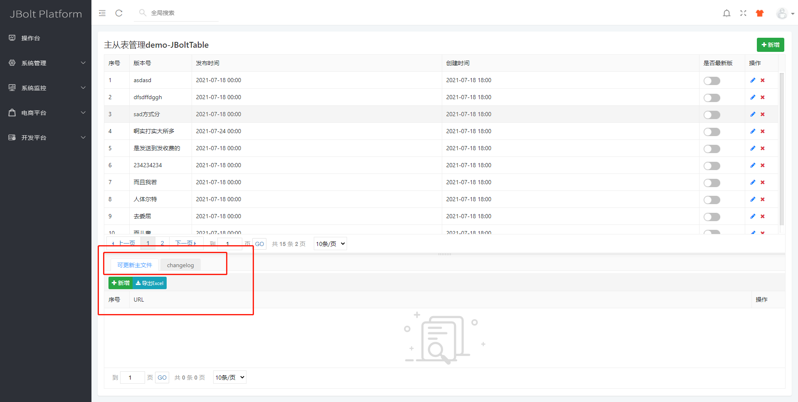
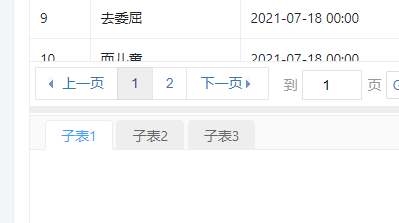
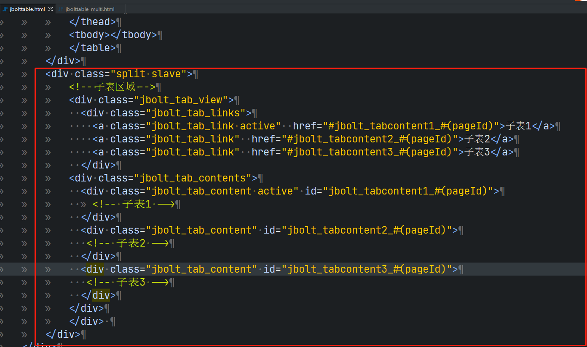

上一个课程是1主1子表：https://jfinalxueyuan.coding.net/p/jbolt_platform/wiki/57
这个课程讲一下1对多子表：

如果只有一个子表，就在slave区域中填充一个表就行了。
如果是多个子表 就用tab_view 多选项卡组件 就可以了 多选项卡 一个代表一个子表。
其他跟单子表的设置一模一样。



```
<div class="jbolt_tab_view">
    	 <div class="jbolt_tab_links">
    			<a class="jbolt_tab_link active"  href="#jbolt_tabcontent1_#(pageId)">子表1</a>
    			 <a class="jbolt_tab_link"  href="#jbolt_tabcontent2_#(pageId)">子表2</a>
    			 <a class="jbolt_tab_link"  href="#jbolt_tabcontent3_#(pageId)">子表3</a>
    	 </div>
    	<div class="jbolt_tab_contents">
    		 <div class="jbolt_tab_content active" id="jbolt_tabcontent1_#(pageId)">
    				<!-- 子表1 -->
    		  </div>
    		 <div class="jbolt_tab_content" id="jbolt_tabcontent2_#(pageId)">
    			       <!-- 子表2 -->
    		 </div>
    		 <div class="jbolt_tab_content" id="jbolt_tabcontent3_#(pageId)">
    			      <!-- 子表3 -->
    		</div>
    	</div>
</div> 
```
