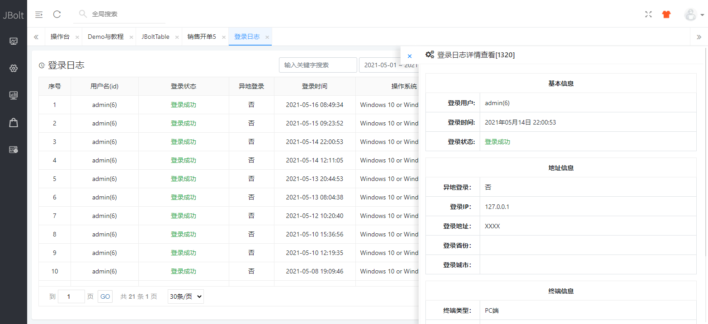
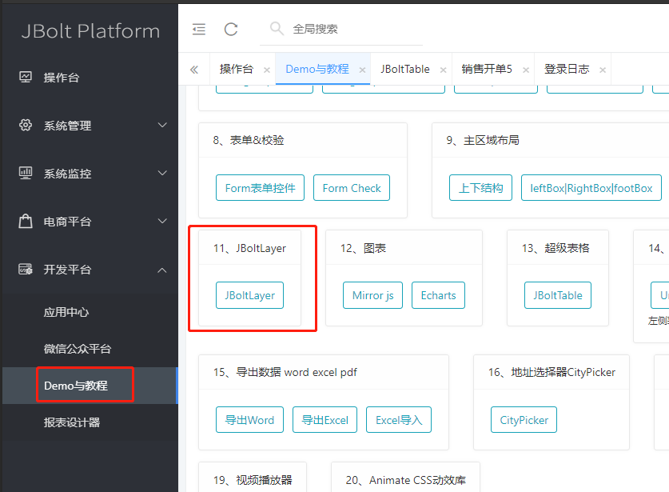
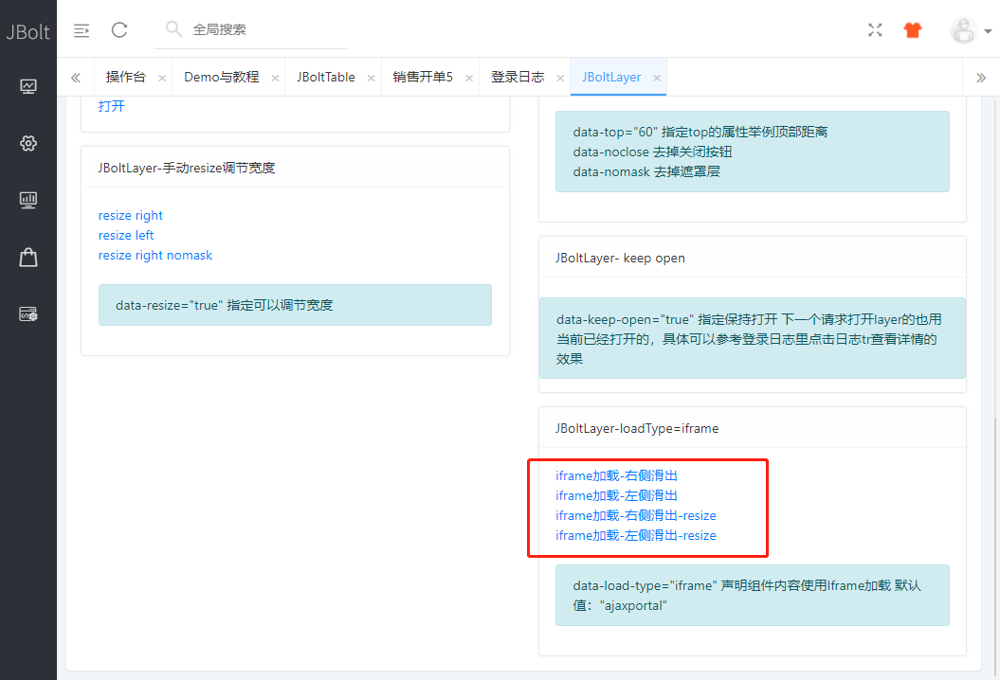
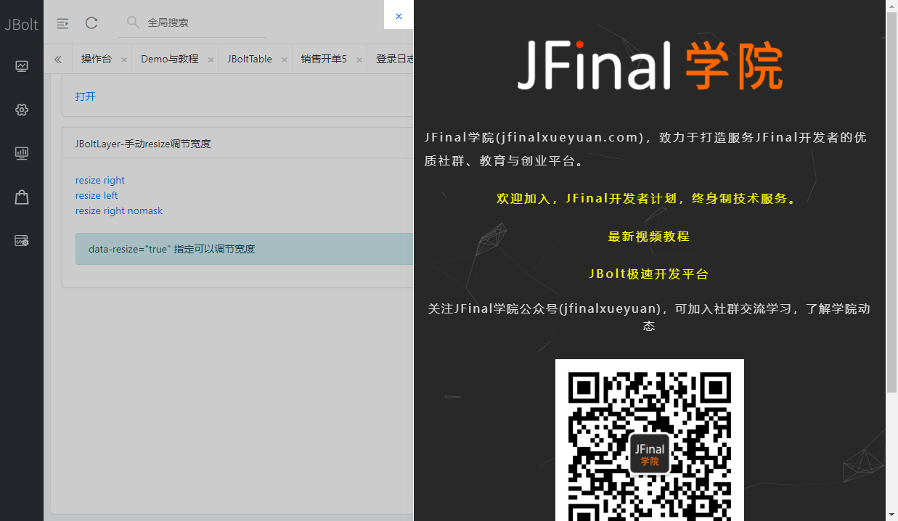

JBoltLayer除了做设置类表单，还可以做各种数据展示，他是异步加载div和iframe都支持。
一、异步ajaxPortal 
主要是加载系统内的提供的接口返回的html片段，去放在jboltlayer中展示。

例如：

系统日志点击一行，右侧滑出一个jboltlayer组件，展示日志详情信息。

二、iframe加载第三方资源

在demo教程里有jboltlayer的demo演示。
进入之后右下角demo有iframe的演示

点击可以查看JBoltlayer里通过Iframe加载第三方资源的效果。
