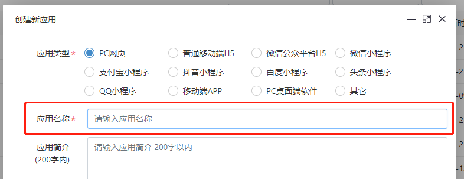
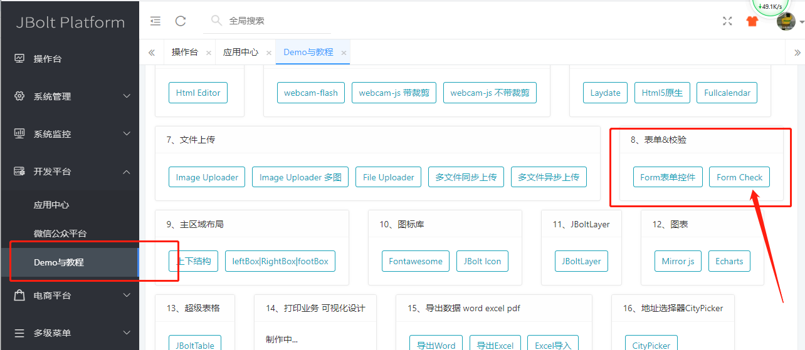
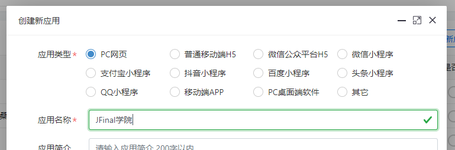
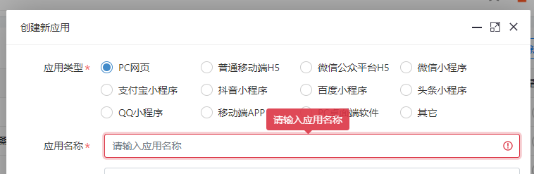
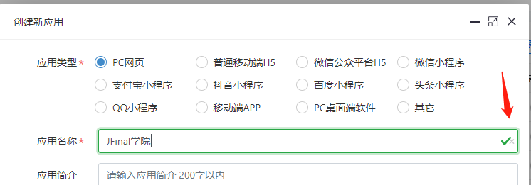

在JBolt中默认使用的都是Bootstrap框架提供的input 输入框


```
<div class="form-group row">
    <label class="col-sm-2 col-form-label is_required">应用名称</label>
    <div class="col">
        <input type="text" autocomplete="off" placeholder="请输入应用名称 " class="form-control" data-rule="required" data-tips="请输入应用名称" maxlength="40" name="application.name"  value="">
    </div>
</div>
```

这个组件可以加自动前端js校验规则 使用data-rule 具体看demo里的表单验证demo

加上之后，表单提交的时候自动验证



还可以加清空按钮。
使用 data-with-clearbtn属性


```
<input type="text" data-with-clearbtn autocomplete="off" placeholder="请输入应用名称 "  class="form-control" data-rule="required" data-tips="请输入应用名称"  maxlength="40" name="application.name" value="#(application.name??)">
```


