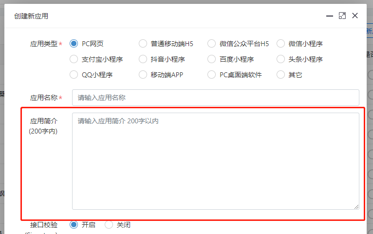

TextArea组件，经常被用在表单中，填写多行文本、200字以内的备注简介之类的文本信息，如果需要支持格式的富文本信息，除了Textarea自身之外，还需要其他富文本编辑器的集成，但是最终还是要把富文本的代码内容同步到Textarea中，提交到后台保存和修改。

举例： 用于短的简介内容




```
 <div class="form-group row">
	<label class="col-sm-2 col-form-label">应用简介<br/>(200字内)</label>
	<div class="col">
		<textarea class="form-control"  placeholder="请输入应用简介 200字以内 "  name="application.briefInfo" style="height:200px;" maxlength="200">#(application.briefInfo??)</textarea>
	</div>
</div>
```

