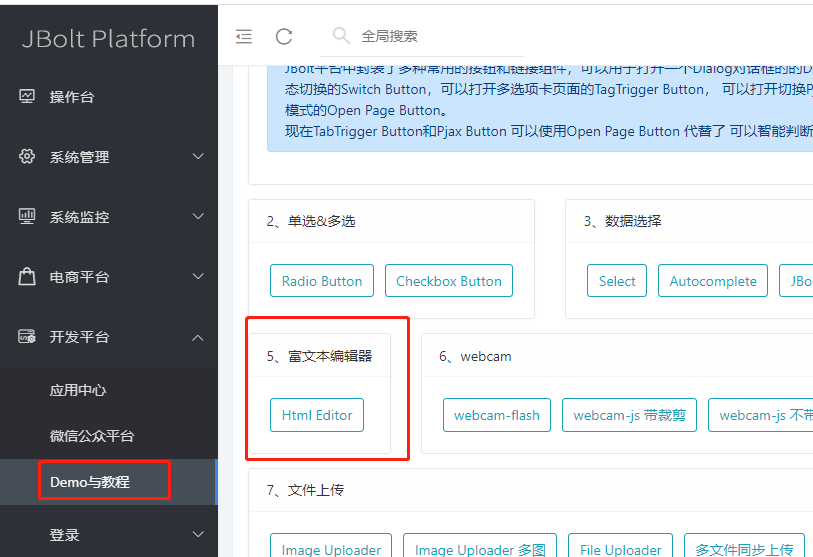
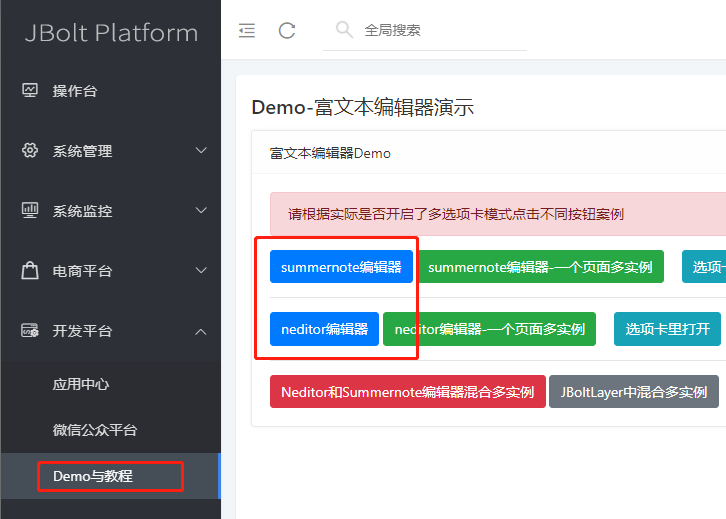
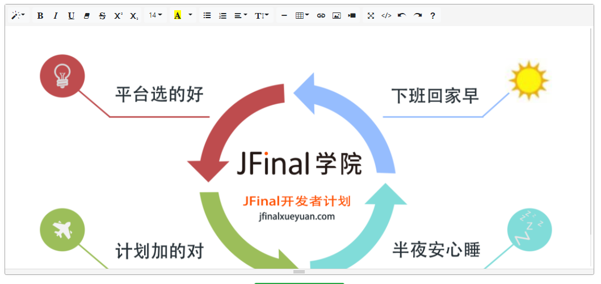
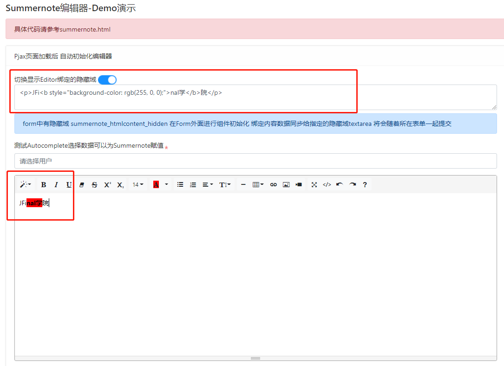
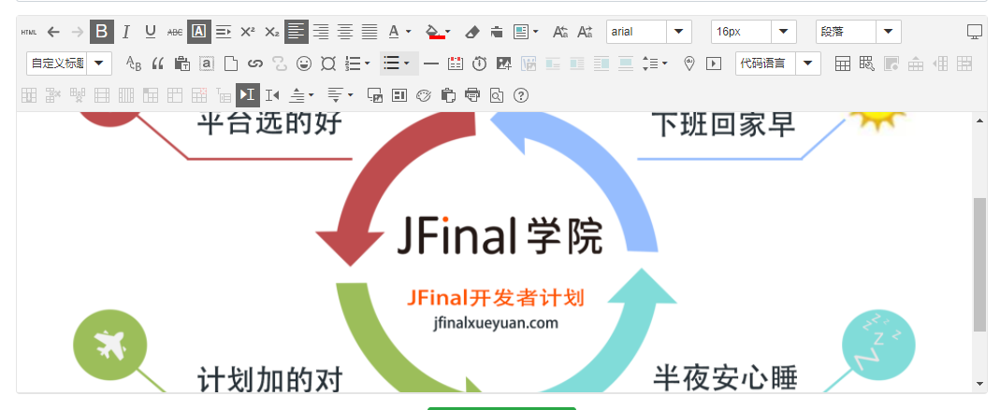

Textarea可以提交一段长文本内容，但是如果你需要有丰富HTML格式的文本的话，就需要使用富文本编辑器了。
在JBolt平台里集成了两款富文本编辑器NEditor和Summernote

在Demo中可以找到：





**1、Summernote编辑器：**



基础HTML编辑功能，可以加入图片、视频、表格等常用html元素。
适合简单的富文本编辑需求。

**在JBolt里使用Summernote编辑器，相当简单：**

```
<!-- summernote编辑器组件代码 -->
<div class="form-group" >
<div id="summernote_#(pageId)" data-editor="summernote" data-height="350" data-urlprefix="#(urlprefix??)" data-hidden-input="summernote_hidden_#(pageId)">
#(htmlcontent??)
</div>
</div>
```
### 需要特殊注意的是，JBolt里 富文本编辑器是不能放在Form标签里的 需要放在外面 然后同步内容到form里的一个textarea隐藏输入组件。



**2、NEditor编辑器：**

Neditor编辑器是基于百度的UEditor编辑器二开改进的版本，比较好用，界面美观，功能强大了许多，图片，视频，涂鸦、地图、表格等都支持。



### 富文本编辑器 属性表


属性名 | 取值 | 特有 | 描述
:-----------: | :-----------: | :-----------: | :-----------:
 data-editor|     summernote 或者 neditor| 共用|   声明此处需要填充渲染一个富文本编辑器
 data-width|     350 或者 50% |   共用| 初始编辑器显示的宽度 默认值 填充父元素宽度 可以是数字 也可以是百分比
 data-height|     350 |  共用|  初始编辑器显示的高度 默认值 300  必须为数字 不能百分比
 data-urlprefix|     http://jbolt.cn|    共用 | 设置上传图片 视频的url前缀 默认为空
data-hidden-input| hiddenInputId| 共用 | 设置数据同步到哪个隐藏输入组件里 例如设置表单里的一个隐藏的textarea 接收同步数据
data-imgmaxsize|200| 共用 |设置图片上传最大多少KB 单位（KB） 默认值200
data-videomaxsize|10| NEditor |设置视频上传最大多少M 单位（M） 默认值10
data-wordcount|true或者false|NEditor|设置是否开启字数统计功能 默认值 false