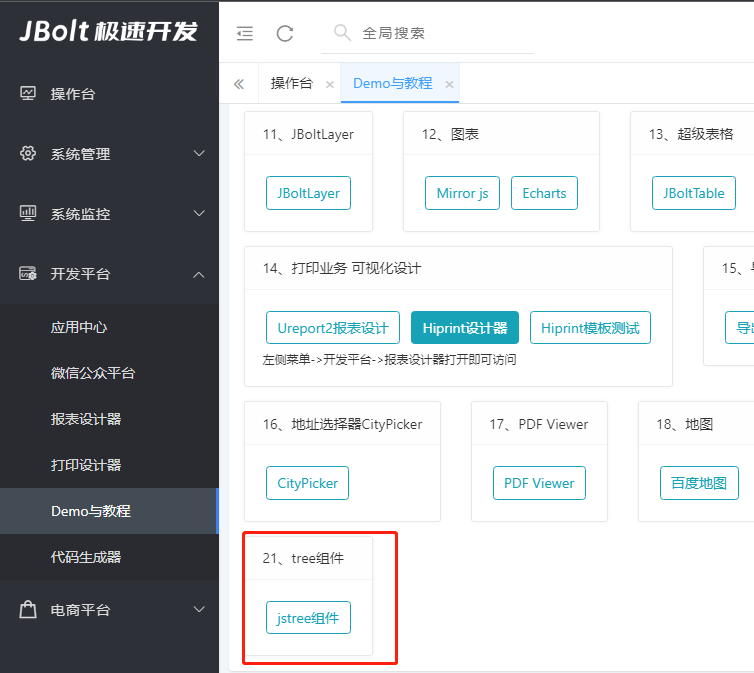
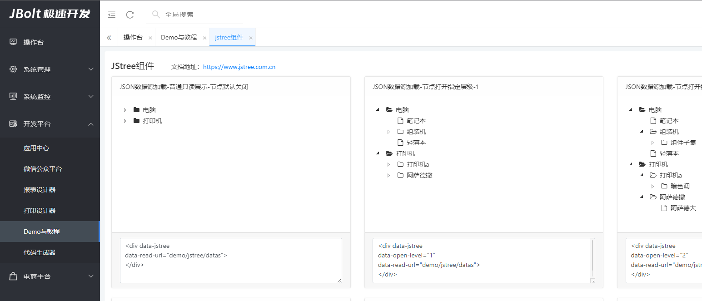

树组件 可以独立使用 也可以在JBoltInput组件中使用。


1、最简单的一棵树 给一个数据源就行了


```
<div data-jstree
        data-read-url="demo/jstree/datas">
</div>

```

data-read-url="demo/jstree/datas" 数据源地址
data-open-level="1" 打开级别 默认全部收起
data-async="true"    启用异步加载机制
data-change-handler="jstreeChangeHandler2"  切换选中节点的处理事件

```
function jstreeChangeHandler2(tree,data){
console.log(tree)
console.log(data)
LayerMsgBox.alert("选择了："+data.text);
}
```

data-checkbox="true" 是否显示节点的checkbox组件 多选使用
data-select="1,3,7,8"  选中值 当data-checkbox="true" 时有效
data-default-select="1,3,7,8"   默认选中值 当data-checkbox="true" 并且data-select无值时有效
data-sync-ele="#checkbox_hidden_1,#checkbox_hidden_2"
选中节点后 同步外部其他元素 同select组件一样


data-jstree   声明是一个jstee
data-target="portal"  声明点击操作指向一个portal div
data-portalid="knowledgePortal"   指定的portal div的id
data-change-handler="portalEdit"    data-target="portal"的时候 固定值 
data-search-input="searchBackGoodsTypeInput"  绑定搜索input
data-curd="true"  设置为可以crud操作
data-open-level="-1"  打开级别 全部打开
data-read-url="admin/knowledge/mgrTree/"  数据读取地址
data-conditions-form="searchTreeForm"  绑定查询表单
data-add-url="admin/knowledge/add/" 新增页面地址
data-edit-url="admin/knowledge/edit/" 修改页面地址
data-delete-url="admin/knowledge/delete/" 删除api地址
data-move-url="admin/knowledge/move/" 移动api地址


属性列表：
属性名 | 案例值 | 默认值 | 说明
:-----------: | :-----------: | :-----------: | :-----------: 
data-jstree | 无 | 无 | 声明input是自动jstr'ee组件
data-read-url | “admin/xxx” | 无 | 声明数据源地址
data-open-level | 1 | 0 | 设置打开层级 -1是全部打开 1是1级 2是2级 以此类推
data-sync-ele | “#deptInput” | 空 | 设置选中数据后同步的其他组件ID 多个逗号隔开
data-change-handler | processJsTreeHandler | 空 | 设置数据选切换选中后执行的handler portalEdit是内置打开指定portal
data-checkbox | “true” | false | 设置tree 多选框
data-onlyleaf | “true” | false | 设置只允许选择叶子节点
data-search-input | “#searchInputId” | 空 | 设置绑定使用哪个input作为默认搜索框
data-link-para-ele | “#xxxId” | 空 | 设置关联元素组件值
data-conditions-form | “formId” | 空 | 设置数据后端查询使用条件表单
data-async | "true" | false | 设置开启异步加载子节点数据
data-curd | "true" | false | 设置是否支持curd
data-add-url | “admin/dept/add” | 空 | 设置add地址
data-edit-url | “admin/dept/edit” | 空 | 设置edit地址
data-delete-url | “admin/dept/delete” | 空 | 设置delete地址
data-move-url | “admin/dept/move” | 空 | 设置move地址
data-dialog-area | "1280,800" | “800,600” | 弹出dialog的大小
data-diaog-handler | “refreshJsTree” | 空 | 设置dialog确定后执行handler refreshJsTree 内置 自动刷新树
data-target | "portal" | dialog | 设置add edit形式 默认dialog打开 portal是动态ajaxPortal
data-portalid | deptPortal“” | 空 | 设置portal的id
function processJsTreeHandler(tree,node){
conse.log(node.id)
}

