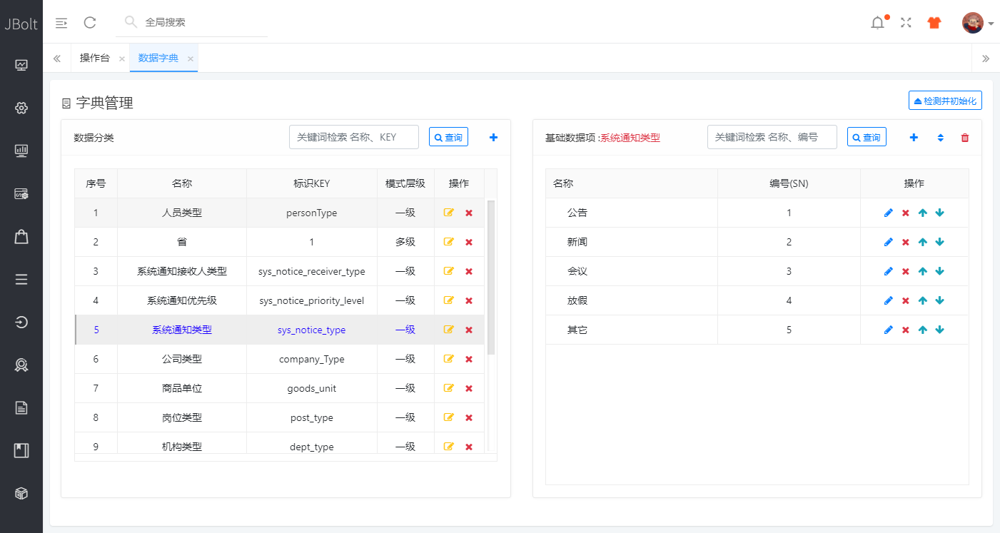
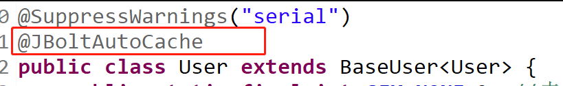
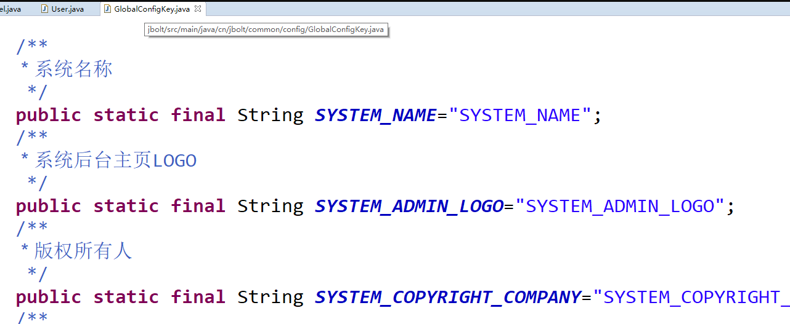
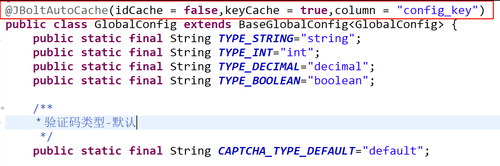
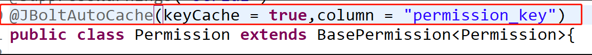
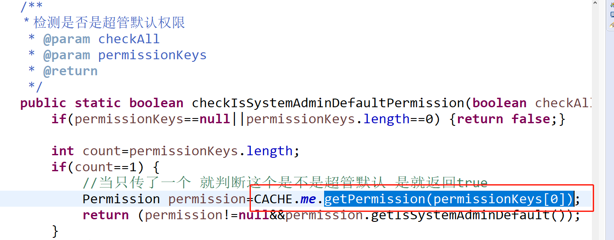

### 平台内置了自动缓存处理机制。
这个机制可以极大降低手动操作缓存带来的风险，少写代码，自动处理，省心省力。

在说自动缓存机制之前，我们来看一下什么数据需要进缓存，什么时候需要操作缓存？
一般情况，系统里的用户基础信息，字典数据，全局配置信息，角色、用户、权限基础信息以及对应关系，导航菜单、商品分类、商品基础信息、组织架构信息、部门信息。再比如网站首页的一些轮播图啊、每个版块的前十条数据，热门文章前十条，等等这些吧。

### 举例：下图、左侧导航、右侧的字典表都使用了缓存。

### 这里分析一下：
这些数据，有的是很基础的数据，使用缓存也很简单，只要ID对应Object作为KV键值对即可。
基础数据如果被其它模块中的数据引用了，表里用他们的ID作为外键关联的，比如一个商品属于笔记本这个类型。

那么笔记本分类的ID作为KEY，笔记本的Model作为Value存入缓存，商品中使用笔记本的类型ID作为外键关联。
当查询商品信息的时候，除了需要显示商品自身属性字段，还要显示这个商品是什么类型，这个类型商品只存了类型ID，要显示的是类型的名字-笔记本，这个时候就需要从缓存里通过这个外键ID去作为KEY得到实际笔记本类型这个Value数据了。

#### 当然，有些系统不用缓存就直接left join去查询了。

下面就来揭秘一下自动缓存机制的实现：
### 自动缓存机制提供了三种策略：
ID-Object策略、Key策略、ID-Object Key公用策略。

### 一、ID-Object策略
使用ID作为key，model数据作为value，只要有表中外键使用了这个数据的ID，就可以通过缓存获取数据，当指定ID的数据进行update和delete的时候，自动清除缓存，等待下次懒加载。

#### JBolt平台中具体使用的Model有哪些？
User.java,Dictionary.java等 都是使用ID就能查询到缓存数据的

#### 具体启动自动缓存ID-Object策略的写法：

只要在Model是增加注解@JBoltAutoCache，就声明启用了自动缓存处理，人工无需干预，而且没有任何参数的情况下，使用的就是默认策略-ID-Object策略。

### 二、Key策略
不使用ID作为键值对中的key，而是使用此model对应表中的一个特殊字符串字段作为KEY。

#### JBolt平台中具体使用的Model有哪些？
GlobalConfig.java 表中有config_key字段，标识为全局配置唯一的识别标识KEY，只要知道一个配置的全局标识KEY，就能从缓存中拿到数据。

#### 下图，是GlobalConfig全局配置的KEY定义。

#### key策略配置写法

同样也是使用注解 @JBoltAutoCache 只不过这里需要关闭默认ID-Object策略：idCache=false,
然后启用KEY策略：keyCache=true，并且指定使用哪个特殊字段作为唯一KEY column="config_key"

简单的配置一下参数，自动根据KEY进行自动缓存处理，就完成了。

### 三、ID-Object策略与Key策略同时使用
这里比较特殊，在JBolt中权限资源定义Model上用了这个组合策略。
使用方式也很简单，跟上面KEY策略讲的一样，只要开启KEY策略keyCache=true，设置key字段column="permission_key"就行了，只要不设置idCache=false，默认就是开启的。

这里权限为何使用组合策略呢，因为底层ID-Object是针对单个Permission的缓存进行处理的，但是针对一个用户角色上分配了N个资源，也就是一个角色对应了一个List<ID>集合 这里底层只用到ID-Object策略。

但是，其他模块里，JBolt提供了在页面上判断权限的指令，通过指定权限的KEY，去cache中查找对应的权限，判断当前用户是否有权访问某个页面元素，列，按钮等。

