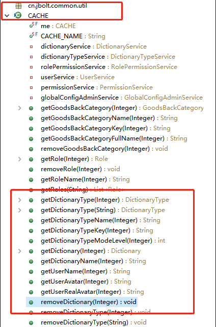
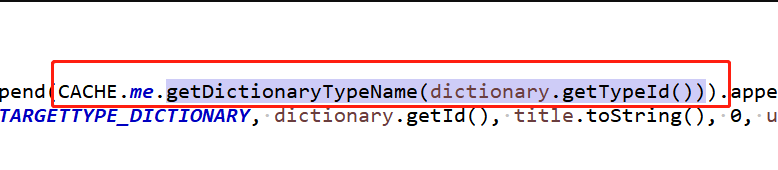
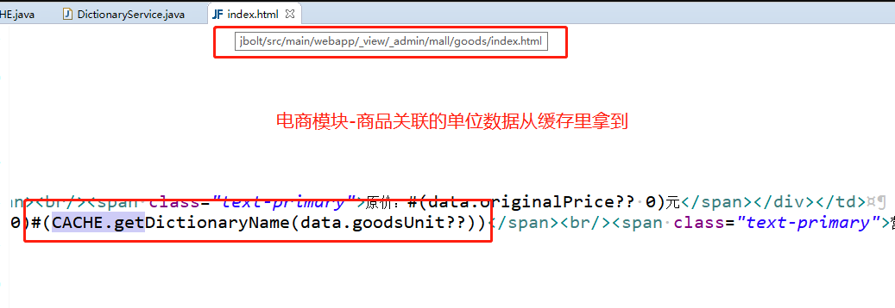
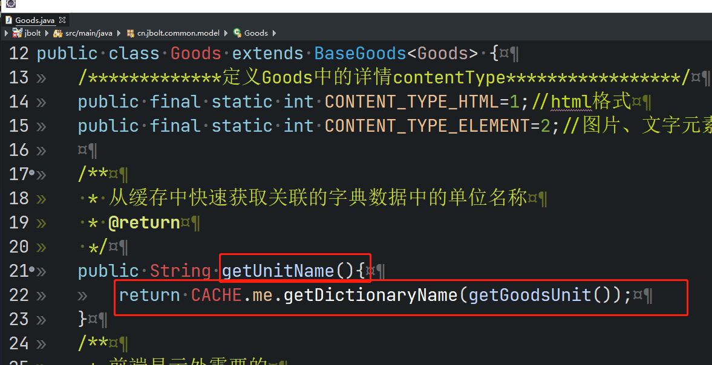

在我们日常开发中，经常会用到数据缓存。

#### 举了例子：JBolt开发平台里的全部字典数据都要进入缓存的。
问题：数据在什么时间点进入缓存呢？
答案：JBolt中使用的“懒加载”，就是什么时候用到的时候，什么时候去内存里找，内存里没有就从数据库里找，找到在放进缓存里。如果数据库里原数据被修改了，就删掉这个缓存，等下一次再‘懒加载’一次。

JBolt里的基础数据，现在使用Ehcache进行缓存。后面会集成J2Cache，支持Ehcache和Redis缓存。特别是电商模块里需要用到 redis 比如购物车里的数据等。
### 一、JBolt java里如何调用缓存数据？

使用CACHE.java这里定义的静态方法。

这个工具类里，提供了字典数据的缓存操作处理，其他的数据如果想加入缓存管理，可以进入这个工具类参照增加。或者单独复制一个工具类 改个名字，比如电商模块中的商品或者品牌数据，可以自己增加BrandCACHE.java处理相关缓存业务。

在其他地方，例如Service、Controller、拦截器中需要用到缓存的时候，可以直接使用这个工具类静态方法。

### 二、在JFinal的网页模板里，使用呢？
这里一个场景，比如很多表里有外键关联了字典表里的数据的主键ID，但是我们在网页上需要显示的并不是字典数据的ID，而是他的文本值。

那么，就需要从缓存里直接拿到这个字典数据的名称。

这里是将工具类加入到了JFinal的模板共享对象里，才实现了此调用方式。

### 三、如果model中不存在一个属性，例如上线的商品单位名称 需要序列化JSON中存在怎么办？
fastjson序列化model使用的是调用javaBean的getter方法 拿到返回值的当时去构建JSON数据，所以在Model里动态创建一个getter就行了，具体getter的返回值就可以直接从cache里获取了！

