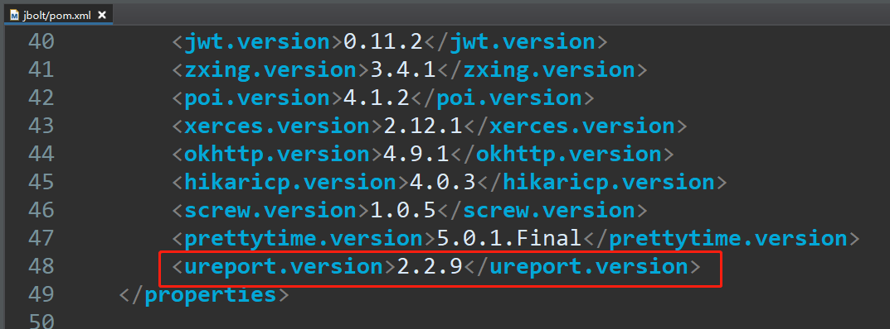
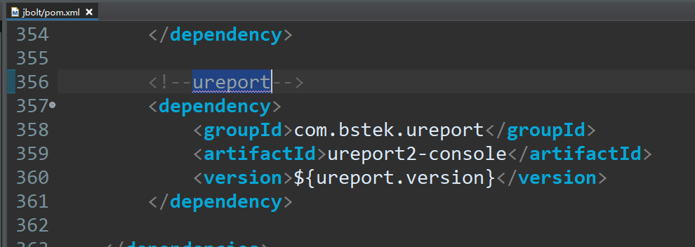
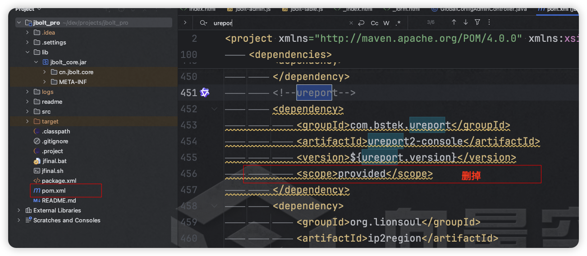
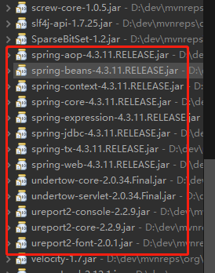
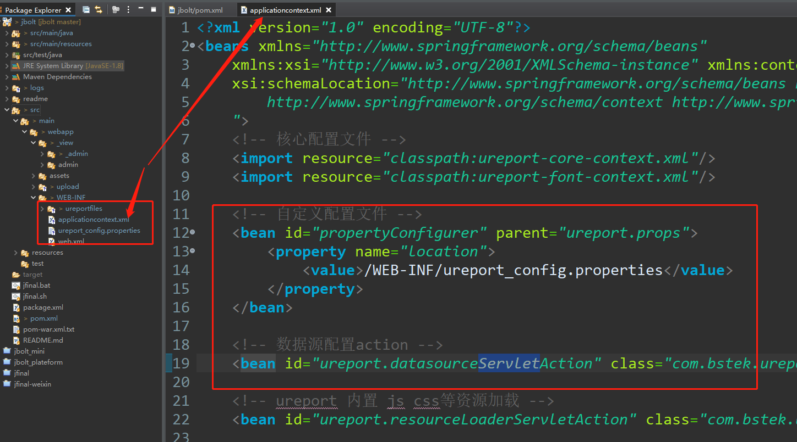
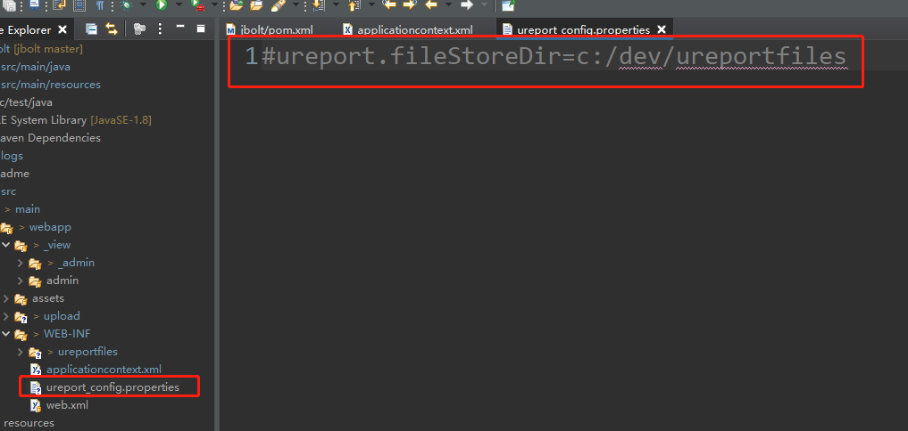
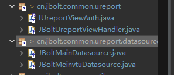
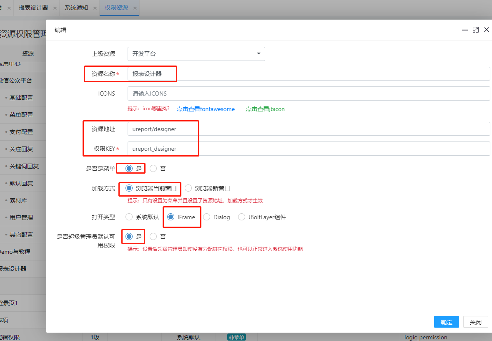
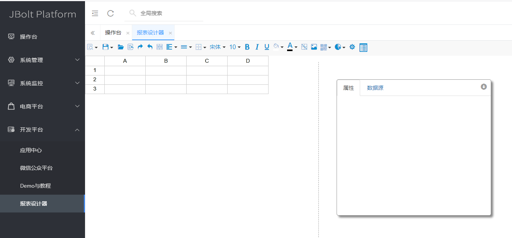
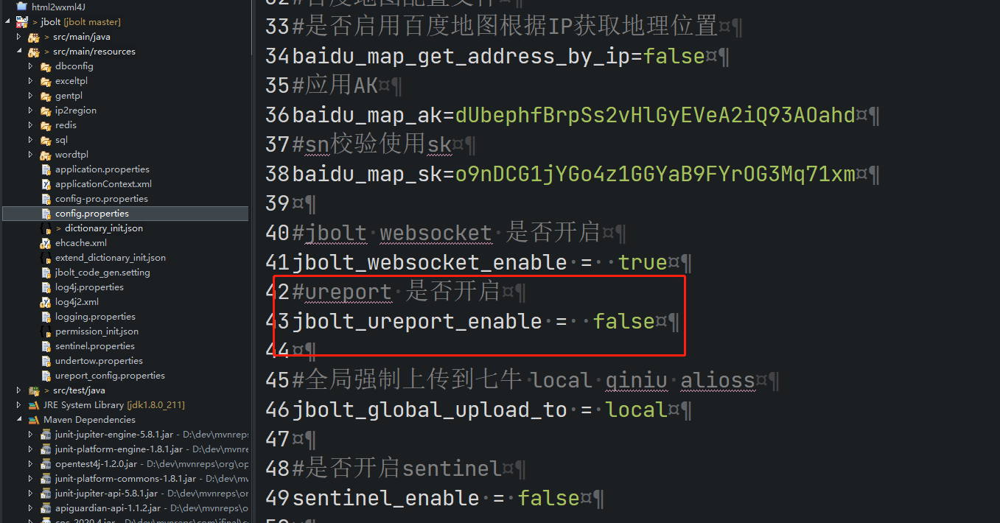

JBolt平台里集成了UReport报表，可以可视化设计报表、打印、导出word、pdf、excel等格式文件。
Ureport教程地址:
https://www.w3cschool.cn/ureport/
UReport2 教学视频
http://pan.baidu.com/s/1boWTxF5，密码：98hj

### 一、JBolt里如何集成Ureport2？
ureport2是基于Spring架构的，不过JFinal相当灵活，可以轻松对接。

### 1、Pom.xml中引入Ureport2

默认ureport 、sentinel scope设置为provide了 需要删掉

### 二、Ureport基于Servlet的
需要按照spring的方式，使用bean注册进去。

 这里没学过Spring的 也没问题 只要知道一个xml里注册bean 关联访问action就行了。
在WEB-INF下创建applicationcontext.xml就行了。

核心配置文件、数据源、各种action、自定义配置、报表存放位置配置文件等，都需要在这里配置和引用。

### 三、报表存储位置配置

在WEB-INF下创建ureport_config.properties配置文件，里面可以配置报表设计器设计的模板文件的物理存放位置。
默认存放位置是同目录下得最上面 ureportfiles文件夹。
注意：默认配置文件里只注释的，如果不想放在项目下保存 就解开注释，配置到项目外的路径里即可，记得是绝对路径！！

### 四、访问测试
前面说过Ureport是基于Servlet的，那么JFinal就不应该拦截处理ureport的请求了，所以需要我们配置handler处理权限访问和路径过滤问题。
JBolt里提供了一个package下内容专门处理这些事情：

JBoltUreportViewHandler.java 在mainconfig里配置就行了
都配置好后，在权限菜单里加一个菜单即可访问：

### 注意 系统默认禁用了 ureport2报表的启动加载 因为报表太大 也不是所有项目都需要 所以默认是禁用状态
相关配置文件在config.properties文件里配置

