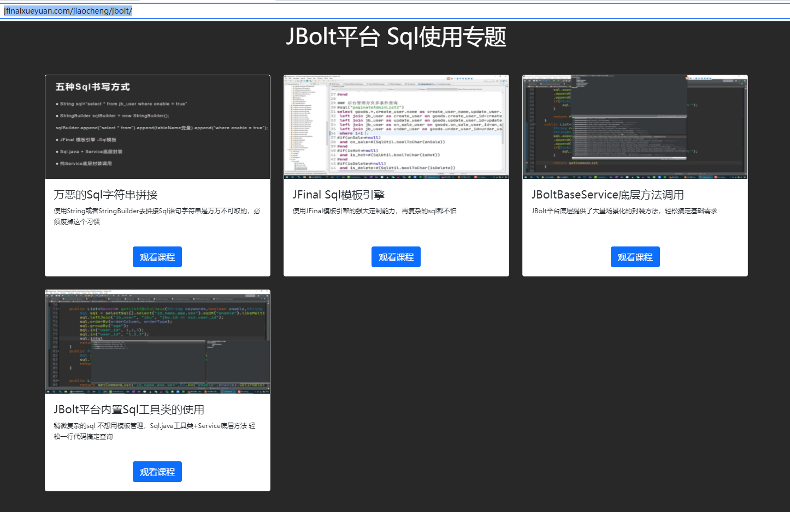
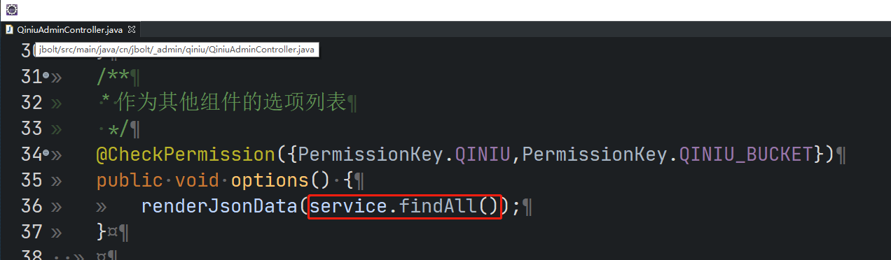
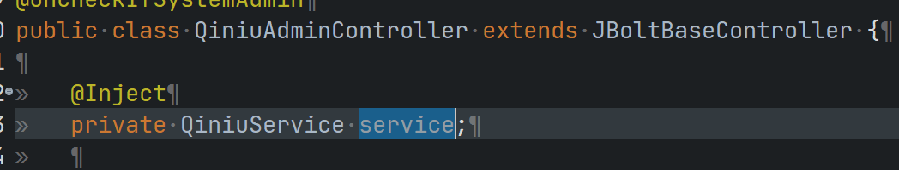
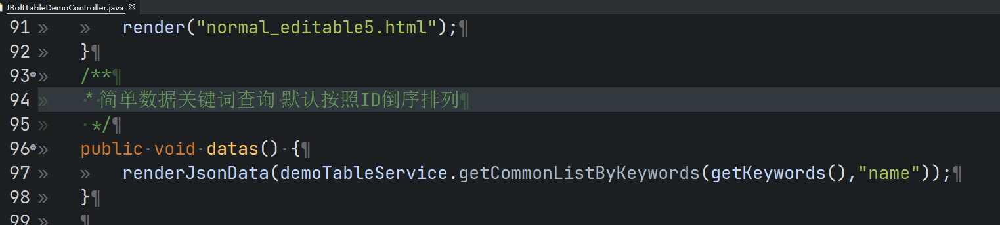
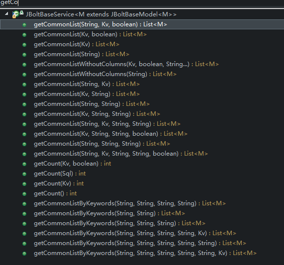
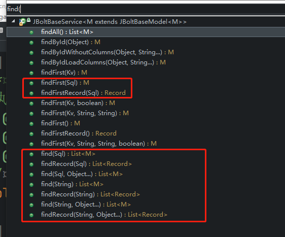
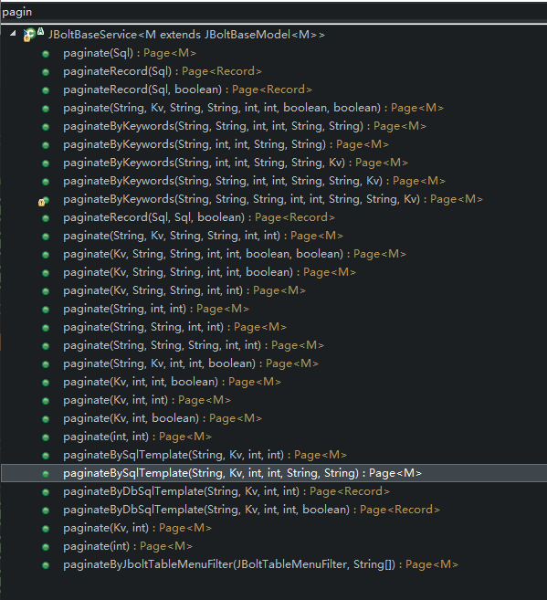
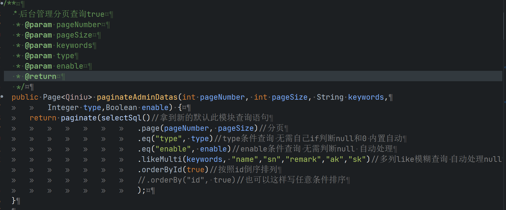

JBolt平台中查询数据方式有多种，满足各种情况的使用，而且基本都是一行代码搞定问题。
视频教程已经提供了几节课，需要大家深入看看学习一下：
http://jfinalxueyuan.com/jiaocheng/jbolt/




###  一、小表直接返回所有数据


只要有对应集成JBoltBaseService的service 直接一行代码查询所有



###  二、小表关键词查询



JBoltBaseService里提供了底层方法，可以不用理会任何sql的事情 一行代码搞定


```
service.getCommonListByKeywords(getKeywords(),"name")
```
第一个参数是前端输入的关键词
第二个参数是要去数据库里使用关键词模糊匹配哪个字段？多个使用逗号自己隔开


### 三、更多底层方法 查询List
底层提供了大量封装好的方法 帮助你提升开发效率，传个参数就好了


### 四、如果不想传参数 想搞sql怎么整？
可以使用这个方法：


有纯sql自己拼接的 有使用Sql.java工具类的

### 五、分页怎么查

底层方法 应有尽有，满足各种分页查询 根据视频教程可以学到 自己摸索也可

