代码生成器固然爽，但是不会让你一直爽，还是需要开发者深入使用和了解一个模块是如何开发出来的。
即使没有代码生成器，也可以轻松开发自己的模块。

### 思考
首先，我们思考一下，一个模块我们需要做哪些工作，写哪些代码才能搞定呢？
### 一个模块需要：
1、有view层的交互操作
2、有后端接收交互请求的Controller
3、有处理单个请求的Action
4、有处理业务的Service
5、有承载数据和传递数据的Model或者Record或者JavaBean
6、有数据库和表结构去支撑数据的存取和事务

## 流程
那么，我们去写一个模块的基本流程应该是：
### 1、创建模块里使用数据的数据库和数据表
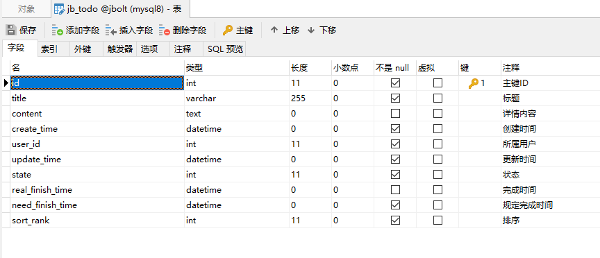

这里设计表结构的时候，一定注意规范：
因为JBolt平台是满足底层数据库无缝切换的，基本不需要修改Java代码就可以切换底层数据库的，所以各个数据库兼容性都要涉及到。
- 都用小写、或者都用大写
- 下划线区分单词，而不是用驼峰，因为oracle之类的数据库 不适合
-  用char(1) 表示boolean类型字段属性
- 创建时间最好用create_time     因为JBolt底层自动检测这个属性，在save的时候会自动赋值 不需要自己处理
- 更新时间最好用update_time    因为JBolt底层自动检测这个属性，在save和update的时候会自动赋值 不需要自己处理
- 尽量不用复合主键 单一主键就行
- mysql、SqlServer推荐id策略是auto 自增  也可以选择雪花Long
- oracle、postgresql 推荐雪花long 也可自增序列
- 数据库字段内置校验是否可以为Null设置上 这样生成的时候 表单可以生成校验规则 是否必填
- 数据库表名 最好 或者说 一定要加上一个前缀 比如jbolt核心前缀的jb_ 你自己开发的模块前缀自己起名 例如  tb_mall

### 2、生成Model和BaseModel的Java代码

model的生成我们还是依赖内置生成器的，这个方便。

这里就需要使用到二开扩展生成器了。
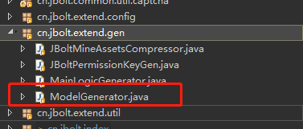

项目中找到ModelGenerator.java打开：
具体配置和用法 视频教程里都讲的很详细的。
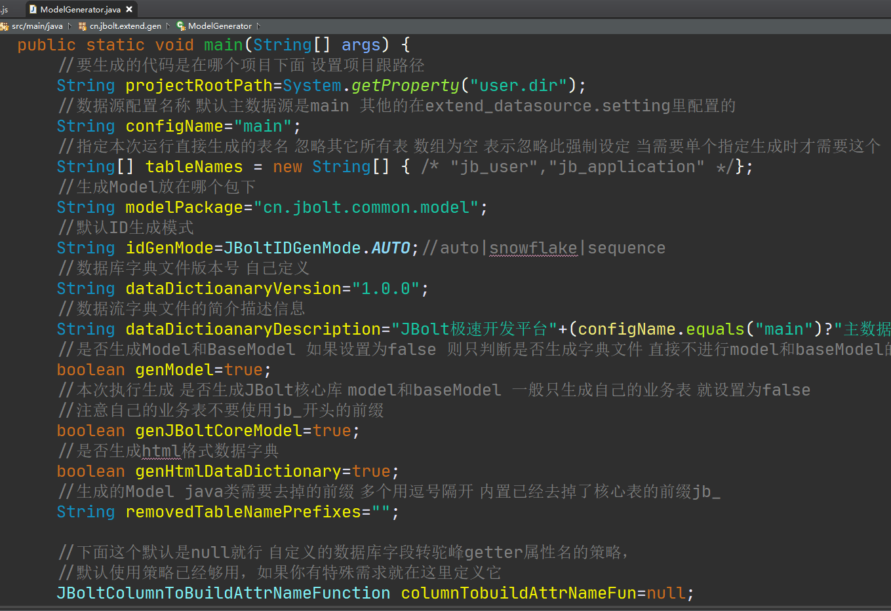

配置好之后，执行Java 类 main方法，即可生成.

# 这里需要注意的是，设置你的新model生成路径不要跟JBolt核心model放在一块儿，这样以后随着主库更新不会冲突
自己生成model的包需要配置到数据源配置文件里：
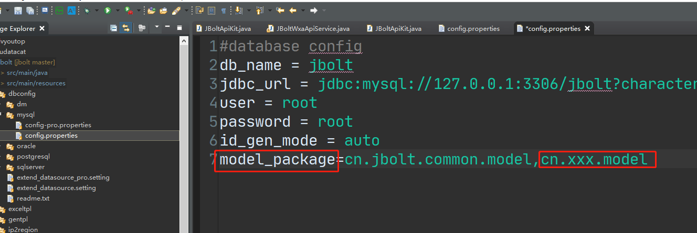

### 3、主逻辑编写
主逻辑主要有Controller、Service、html html又分index.html add.html edit.html _form.html

**TodoAdminController**:

```
package cn.jbolt._admin.todo;

import com.jfinal.aop.Before;
import com.jfinal.aop.Inject;
import com.jfinal.plugin.activerecord.tx.Tx;

import cn.jbolt.base.JBoltBaseController;
import cn.jbolt.common.config.Msg;
import cn.jbolt.common.model.Todo;

/**
 * 代办事项管理 Controller
 * @ClassName: TodoAdminController   
 * @author: JBolt-Generator
 * @date: 2021-04-17 17:43  
 */
public class TodoAdminController extends JBoltBaseController {

	@Inject
	private TodoService service;
	
   /**
	* 首页
	*/
	public void index() {
		render("index.html");
	}
  	
  	/**
	* 数据源
	*/
	public void datas() {
		renderJsonData(service.paginateAdminDatas(getPageNumber(),getPageSize(),getKeywords(),getDateRange()));
	}
	
   /**
	* 新增
	*/
	public void add() {
		render("add.html");
	}
	
   /**
	* 编辑
	*/
	public void edit() {
		Todo todo=service.findById(getInt(0)); 
		if(todo == null){
			renderDialogFail(Msg.DATA_NOT_EXIST);
			return;
		}
		set("todo",todo);
		render("edit.html");
	}
	
  /**
	* 保存
	*/
	public void save() {
		renderJson(service.save(getModel(Todo.class, "todo")));
	}
	
   /**
	* 更新
	*/
	public void update() {
		renderJson(service.update(getModel(Todo.class, "todo")));
	}
	
   /**
	* 删除
	*/
	public void delete() {
		renderJson(service.delete(getInt(0)));
	}
	
  /**
	* 排序 上移
	*/
	@Before(Tx.class)
	public void up() {
		renderJson(service.up(getInt(0)));
	}
	
  /**
	* 排序 下移
	*/
	@Before(Tx.class)
	public void down() {
		renderJson(service.down(getInt(0)));
	}
	
  /**
	* 排序 初始化
	*/
	@Before(Tx.class)
	public void initRank() {
		renderJson(service.initRank());
	}
	
	
}
```

**TodoService**：


```
package cn.jbolt._admin.todo;

import java.util.List;

import com.jfinal.kit.Kv;
import com.jfinal.kit.Ret;
import com.jfinal.plugin.activerecord.Page;

import cn.jbolt.base.JBoltBaseService;
import cn.jbolt.base.JBoltUserKit;
import cn.jbolt.common.bean.JBoltDateRange;
import cn.jbolt.common.config.Msg;
import cn.jbolt.common.db.sql.Sql;
import cn.jbolt.common.model.Todo;
/**
 * 代办事项管理 Service
 * @ClassName: TodoService   
 * @author: JBolt-Generator
 * @date: 2021-04-17 17:43  
 */
public class TodoService extends JBoltBaseService<Todo> {
	private Todo dao=new Todo().dao();
	@Override
	protected Todo dao() {
		return dao;
	}
		
  /**
	 * 后台管理分页查询true
	 * @param pageNumber
	 * @param pageSize
	 * @param keywords
	 * @param dateRange 
	 * @return
	 */
	public Page<Todo> paginateAdminDatas(int pageNumber, int pageSize, String keywords, JBoltDateRange dateRange) {
		Sql sql=selectSql();
		sql.page(pageNumber, pageSize);
		sql.likeMulti(keywords, "title","content");
		sql.orderById(true);
		sql.ge("create_time", toStartTime(dateRange.getStartDate()));
		sql.le("create_time", toEndTime(dateRange.getEndDate()));
		return paginate(sql);
	}
	
  /**
	 * 保存
	 * @param userId
	 * @param todo
	 * @return
	 */
	public Ret save(Todo todo) {
		if(todo==null || isOk(todo.getId())) {
			return fail(Msg.PARAM_ERROR);
		}
		todo.setUserId(JBoltUserKit.getUserIdAs());
		todo.setSortRank(getNextSortRank());
		boolean success=todo.save();
		return ret(success);
	}
	
   /**
	 * 保存
	 * @param todo
	 * @return
	 */
	public Ret update(Todo todo) {
		if(todo==null || notOk(todo.getId())) {
			return fail(Msg.PARAM_ERROR);
		}
		//更新时需要判断数据存在
		Todo dbTodo=findById(todo.getId());
		if(dbTodo==null) {return fail(Msg.DATA_NOT_EXIST);}
		boolean success=todo.update();
		return ret(success);
	}
	
   /**
	  * 删除
	 * @param id
	 * @return
	 */
	public Ret delete(Integer id) {
		return deleteById(id,false);
	}
	
	
   /**
	  * 上移
	 * @param id
	 * @return
	 */
	public Ret up(Integer id) {
		Todo todo=findById(id);
		if(todo==null){
			return fail("数据不存在或已被删除");
		}
		Integer rank=todo.getSortRank();
		if(rank==null||rank<=0){
			return fail("顺序需要初始化");
		}
		if(rank==1){
			return fail("已经是第一个");
		}
		Todo upTodo=findFirst(Kv.by("sort_rank", rank-1));
		if(upTodo==null){
			return fail("顺序需要初始化");
		}
		upTodo.setSortRank(rank);
		todo.setSortRank(rank-1);
		
		upTodo.update();
		todo.update();
		return SUCCESS;
	}
	
/**
	 * 下移
	 * @param id
	 * @return
	 */
	public Ret down(Integer id) {
		Todo todo=findById(id);
		if(todo==null){
			return fail("数据不存在或已被删除");
		}
		Integer rank=todo.getSortRank();
		if(rank==null||rank<=0){
			return fail("顺序需要初始化");
		}
		int max=getCount();
		if(rank==max){
			return fail("已经是最后已一个");
		}
		Todo upTodo=findFirst(Kv.by("sort_rank", rank+1));
		if(upTodo==null){
			return fail("顺序需要初始化");
		}
		upTodo.setSortRank(rank);
		todo.setSortRank(rank+1);
		
		upTodo.update();
		todo.update();
		return SUCCESS;
	}
	
   /**
	  * 初始化排序
	 */
	public Ret initRank(){
		List<Todo> allList=findAll();
		if(allList.size()>0){
			for(int i=0;i<allList.size();i++){
				allList.get(i).setSortRank(i+1);
				allList.get(i).deleteIdCache();
			}
			batchUpdate(allList);
		}
		return SUCCESS;
	}
	
}
```

#### Service 注意事项：
为模块创建一个新的Service，这个Service是绑定Model的，创建Service的泛型就是对应绑定的Model，这样Service底层封装的方法就可以直接对指定的model对应的数据源里的数据表进行操作了。

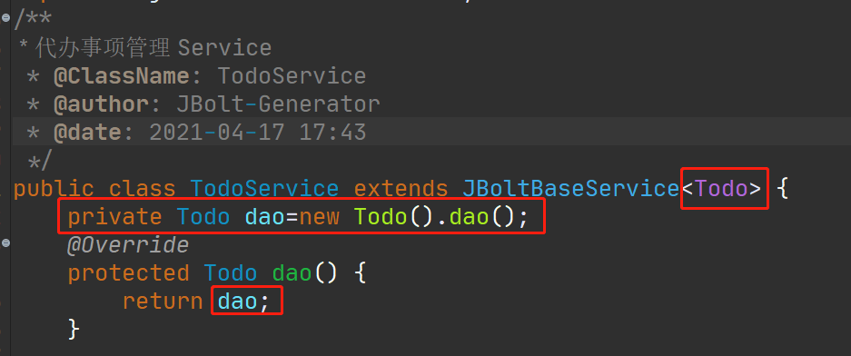

实现Service的dao()方法即可。


UI界面，根据实际情况编写这个模块的view层html代码，在指定目录下创建add.html edit.html _form.html index.html即可，具体可以参考视频教程里 JBoltTable 普通表格 高级表格部分的讲解流程。

一般去现有的模块 复制一套html过来 修改一下基本很快就做完一个模块了，嫌麻烦的话，靠第四章生成器完成页面基础生成把。


### 4、权限和路由配置
上面model和crud的逻辑都生成之后，只要配置一下路由和权限 菜单就可以访问了。
具体配置在视频教程里都有的。

登录后台找到权限资源管理，添加你这个模块对应的菜单：
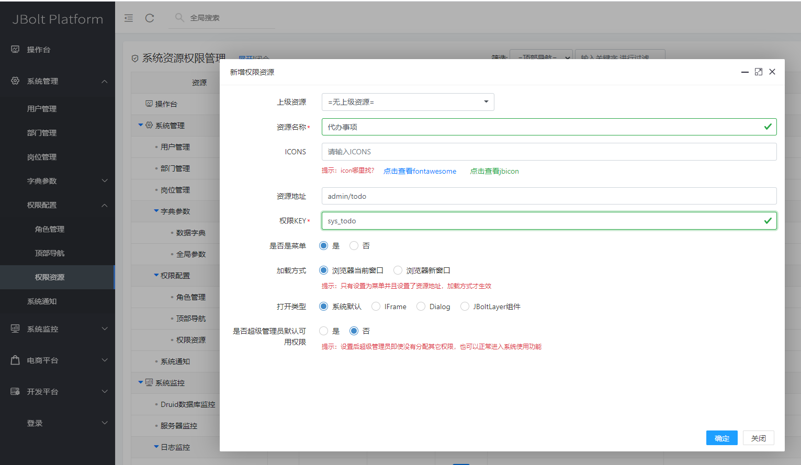
 然后给这个菜单生成PermissionKey，这里需要执行二开里的工具类生成器：
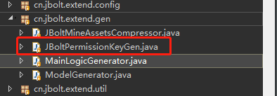
直接运行生成全新的PermissionKey.java
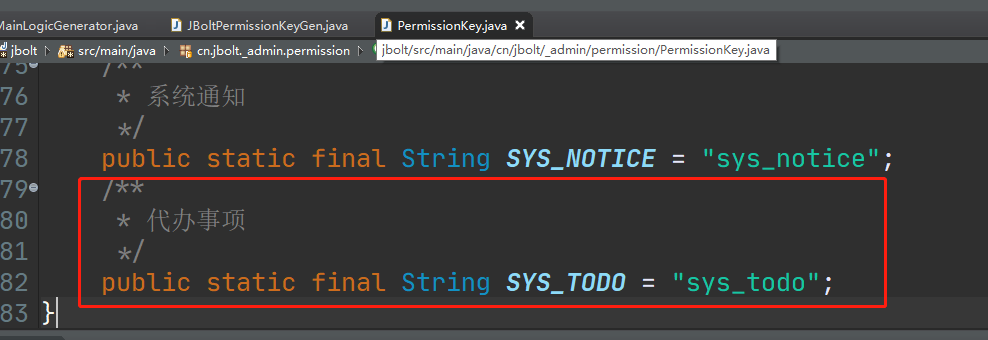

然后给你的这个模块主逻辑生成器生成的Controller上配置一下路由和权限key就好了
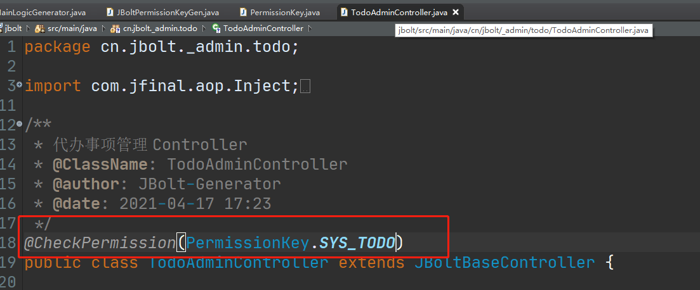
路由配置：
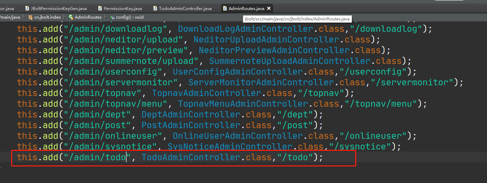
这里是手工去配置路由映射，如果嫌麻烦，可以按照视频教程里讲的，生成@Path注解就可以省略这个配置步骤了。

### 5、启动与测试
上面都生成配置完，启动服务，进入后台，通过菜单访问：
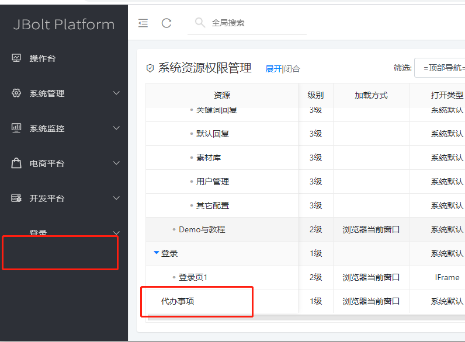
发现菜单加了，但是左侧导航里没出来，这是因为你的角色上没有分配，分配一下菜单就好了。
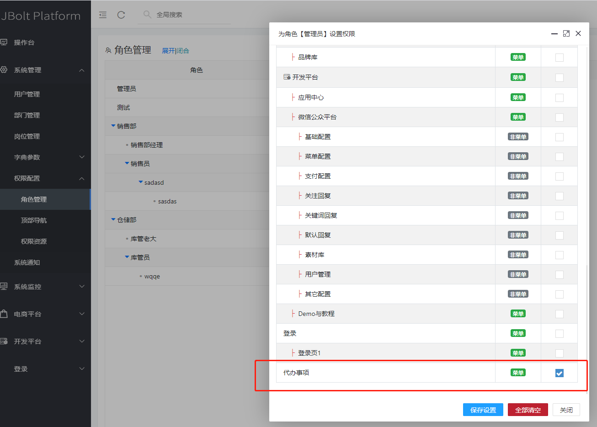

刷新后，菜单出来了：
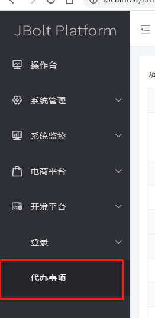
图标没设置，所以没有。

点击进入模块主页：


CRDU，默认都生成了，排序也带着，测试功能，按照自己的真实需求，修改一下生成的UI，达到满意为止！！

