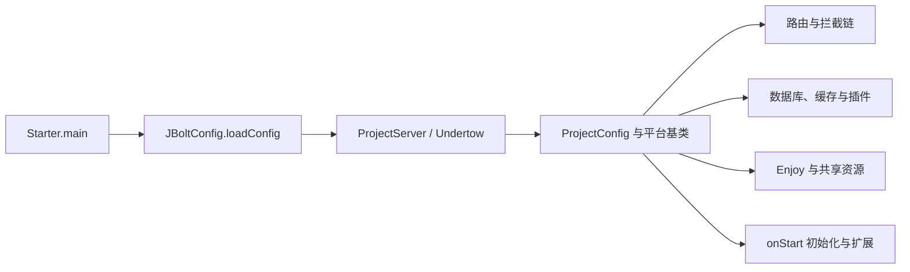

# JBolt 平台核心架构

> 核对日期：2026-09-30；源码基线：Siargo v2.9.4 / `18c1de8`。本篇依据当前配置与调用链编写，不代表已启动服务验收。返回[文档导航](README.md)。

## 系统边界与技术栈

Siargo 是质管部业务系统，使用 JFinal MVC、JBolt 后台组件和 Enjoy 服务端模板。产品目录、报告、设备、技术通知单等业务共用用户、角色、字典、文件及消息基础设施。它与 `siargo_ai` 是不同项目，不能套用后者的 Spring Boot、Vue、迁移脚本或接口治理实现。

| 层次 | 当前依赖或实现 | 核对位置 |
| --- | --- | --- |
| Java / 构建 | JDK 25 / Maven | [pom.xml](../../pom.xml) |
| MVC / 平台 | JFinal 5.2.7 / JBolt Core 5.3.6 | POM 与 `lib/jbolt_core.jar` |
| HTTP 服务 | JFinal Undertow 3.8 / Undertow 2.2.37.Final | POM、Starter |
| 数据 | ActiveRecord、Druid 1.2.24、MySQL Connector 8.4.0 | POM、数据库配置 |
| 页面 | Enjoy、JBoltTable、jQuery、Bootstrap 4.6.2 | [前端指南](05-前端开发指南.md) |
| 缓存 / 调度 | Caffeine 2.9.3、Cron4j 2.2.5、JFinal Event 3.1.3 | POM、ProjectConfig |
| 文件 / 数据转换 | POI 4.1.2、iTextPDF 5.5.13.4、Fastjson 1.2.83、Hutool 5.8.37 | POM |

核心 JAR 的构建 JDK 信息不等于项目的编译目标。存在 `spring-core` 或 ureport 依赖也不表示业务采用 Spring MVC；ureport 当前配置关闭。MySQL 驱动版本不能当作数据库服务器版本。

## 代码与页面分层

| 位置（相对项目根目录） | 职责 |
| --- | --- |
| `src/main/java/cn/jbolt/starter/` | main 入口、Undertow 定制、项目版本 |
| `src/main/java/cn/jbolt/common/config/` | 配置、路由、模板共享对象、插件、拦截链 |
| `src/main/java/cn/jbolt/extend/` | 平台扩展点、缓存、生成器与日志扩展 |
| `src/main/java/cn/jbolt/index/` | 平台路由、登录、首页看板、会话下线页面 |
| `src/main/java/cn/jbolt/_admin/` | 用户、角色、权限、字典、消息等平台模块 |
| `src/main/java/cn/jbolt/admin/siargo/` | 业务 Controller、Service 及辅助类 |
| `src/main/java/cn/jbolt/siargo/model/` | 业务 Model；`base/` 为生成层 |
| `src/main/webapp/_view/` | Enjoy 模板；`_admin/` 为平台，`admin/siargo/` 为业务 |
| `src/main/webapp/assets/js/siargo.js` / `assets/css/siargo.css` | 业务脚本、业务样式 |

典型调用为 Controller 接收入参并做入口控制，Service 执行业务和数据库操作，Model 映射数据，模板或 JSON 消费结果。事务可能由 Controller 或 Service 持有，必须沿实际调用链确定所有者。不可把“分层规范”理解为所有历史代码都已完全符合；文档中的例子以核实过的具体场景为准。

## 启动与装配顺序

[Starter](../../src/main/java/cn/jbolt/starter/Starter.java) 负责读取配置，创建服务器，并按配置注册 Servlet、WebSocket 和 HTTP 方法限制。[ProjectServer](../../src/main/java/cn/jbolt/starter/ProjectServer.java) 提供项目名、版本及服务器定制，不是 main 入口。

[ProjectConfig](../../src/main/java/cn/jbolt/common/config/ProjectConfig.java) 继承平台 `JBoltProjectConfig`；平台基类承担基础装配，项目在各重写方法中加入实际能力。[ExtendProjectConfig](../../src/main/java/cn/jbolt/extend/config/ExtendProjectConfig.java) 是二开扩展入口，空方法或被注释示例不能视为已启用功能。

`onStart()` 调用自动初始化、升级入口及框架配置方法。启动可能触发数据库初始化逻辑，不能把“为了看文档启动一下”当作纯只读操作。服务启停按工作区约定由用户执行。

## 路由与认证分组

| 分组 | 注册方式 | 应理解的边界 |
| --- | --- | --- |
| 平台后台 | `AdminRoutes` 显式 `add` | `/admin`、用户、角色、字典、消息等；配有会话下线与后台认证拦截 |
| Siargo 后台业务 | `ProjectConfig.configRoutes()` 按业务子包显式 `scan` | 12 个业务包中的 API 独立，其余后台包使用业务后台路由组；新增顶级包需补扫描 |
| Siargo 对外 API | 独立扫描 `cn.jbolt.admin.siargo.api`，开启父类映射 | 不使用后台登录拦截，不等于无需应用身份及 Token |
| 应用中心 / 开发文档 | 单独的 Routes | 应用中心入口与接口调用入口职责不同 |
| 公共、微信、前台、测试与生成器 | 各自 Routes 或包扫描 | 生成器受配置开关控制；已有测试路由仍在源码注册，应如实识别其来源 |

路由是否可访问取决于实际注册、HTTP 方法限制、拦截器、权限及业务校验，不由页面按钮是否显示决定。请求参数和返回格式见 [Controller 指南](02-Controller层开发指南.md)。

## 模板、静态资源与响应

`configEngines()` 注册布局函数和 `CACHE`、`CacheExtend`、`PermissionKey`、`JBoltUserKit`、`ProjectAssets` 等共享对象。`#@jboltLayout()` 按页面请求上下文选择布局；业务页面不能随意复制一套完整 HTML 外壳。

`ProjectAssets` 只处理配置清单中的本地 CSS/JS，按开发或生产环境选择实际存在的版本。Enjoy 服务端表达式与浏览器中的行模板是两套执行阶段；输出转义、字段大小写和组件初始化见 [前端指南](05-前端开发指南.md)。

## 会话、任务与消息

[SiargoTerminalOfflineInterceptor](../../src/main/java/cn/jbolt/common/interceptor/SiargoTerminalOfflineInterceptor.java) 在平台及 Siargo 后台路由组中校验当前活跃会话。失效请求按类型返回 `jbolt_terminal_offline` 或跳转到下线提示页；登录、验证码、重新登录、退出及下线页面有明确放行集合。`terminalOffline` / `forcedOffline` 是顶号或强制下线提示，不是断网业务功能。

Cron4j 当前显式注册在线用户清理任务，表达式 `0-59/1 * * * *` 表示每分钟。微信媒体下载任务的注册示例被注释。JFinal Event 使用项目配置的线程池扫描 `cn.jbolt._admin.event`，事件消费者可进一步推送 WebSocket；业务通知的实际触发条件以[报告单专题](11-检验报告单业务.md)为准。

## 缓存、存储与扩展定位

- 平台缓存门面、Model 缓存和业务字段缓存不是同一层。业务中的 `volatile + ReentrantLock + TTL` 不应直接称为 Caffeine 缓存实例，失效时机见 [Service 指南](03-Service层开发指南.md)。
- 本地业务文件经 `SiargoStorage` 定位，`SiargoUploadFiles` 管理临时上传和移动补偿；路径配置与部署迁移见[配置手册](08-项目配置速查手册.md)。
- `RenderFailLogHandler` 增强失败响应日志；Druid 监控具有独立授权条件。日志、消息和文件副作用需分别核对，不能把成功响应当成所有副作用均成功。
- 开发新模块先查[模块地图](07-业务模块地图.md)选择相近场景，再读对应层指南。平台低频扩展及与实际业务的区别见[原生机制手册](jbolt-native-mechanisms.md)。
