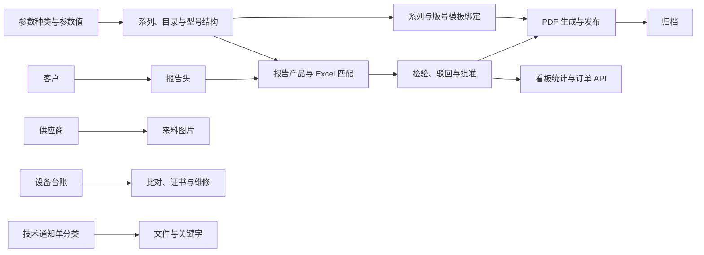

# 业务模块地图

> 核对日期：2026-09-30；源码基线：Siargo v2.9.4 / `18c1de8`。入口和关系来自当前路由、Controller、Service 与页面；未进行业务运行验收。返回[文档导航](README.md)。

## 业务导航

本篇集中回答“功能在哪里、与谁关联、详细规则去哪里看”。流程状态、字段协议、统计口径和删除规则由对应专题维护，不在此重复。

| 业务包 / 能力 | 主要页面或路由 | 职责与详细文档 |
| --- | --- | --- |
| `customer` | `/admin/siargo/customer` | 客户基础资料，供报告头关联；[客户、供应商与来料图片](09-客户供应商与来料图片.md) |
| `supplier` | `/admin/siargo/supplier` | 供应商资料、类型和排序，供来料图片关联；[同上](09-客户供应商与来料图片.md) |
| `imi` | `/admin/siargo/imi` | 来料到货图片、上传、检索及文件维护；[同上](09-客户供应商与来料图片.md) |
| `prodparam` / `prodparam/value` | `/admin/siargo/prodparam`、`/admin/siargo/prodparam/value` | 参数种类、参数值及排序；[产品目录与参数](10-产品目录与参数.md) |
| `prodmodel` | `/admin/siargo/prodmodel` | 系列、目录分支、型号结构、选型和资料；[同上](10-产品目录与参数.md) |
| `qarep` / `qarep/product` | `/admin/siargo/qarep` | 报告头和独立产品卡片、检验批准、驳回、回收站；[报告单业务](11-检验报告单业务.md) |
| `qarep/uploadImport` | 报告页面的 Excel / PDF 操作 | Excel 预填、报告生成发布和归档；[导入与输出](12-Excel导入与PDF输出.md) |
| `qarep/pdffolder` | `/admin/siargo/qarep/pdffolder` | 版号、模板文件及系列绑定；[同上](12-Excel导入与PDF输出.md) |
| `dms/category` / `dms/file` | `/admin/siargo/dms/category`、`/admin/siargo/dms/file` | 技术通知单分类、检索、有效状态与文件操作；[技术通知单](13-技术通知单与文件管理.md) |
| `equipment` 及子包 | `/admin/siargo/equipment`；`comparison`、`repair`、`certificate` 子入口 | 台账、检校审核、比对、维修与证书；[设备管理](14-设备管理.md) |
| 首页看板 | `/admin/dashboard` | 报告流程、数量、来源和同比；[看板与报告统计](15-首页看板与报告统计.md) |
| `api` | `/api/siargo/order/status`、`/api/siargo/order/batchStatus` | 订单检验状态查询；[接口、应用中心与日志](16-对外接口应用中心与调用日志.md) |
| `apicalllog` | `/admin/siargo/apicalllog` | 调用明细、追踪及统计；[同上](16-对外接口应用中心与调用日志.md) |
| 应用中心 | `/admin/app` | 平台提供的应用身份管理与相关校验；[同上](16-对外接口应用中心与调用日志.md) |
| `cme` | `/admin/siargo/cme`、`/admin/siargo/cme/learn` | 计量学习资料、目录及文档浏览；[学习资料与版本日志](17-学习资料与版本日志.md) |
| `changelog` | `/admin/changelog` | 部署资源中的版本说明展示；[同上](17-学习资料与版本日志.md) |

业务后端根目录为 [admin/siargo](../../src/main/java/cn/jbolt/admin/siargo/)。首页与平台应用中心在该目录之外，因此不能仅按业务文件夹统计系统能力。内部 Service 子包并不必然对应独立路由；实际入口以上述 Controller 和路由注册为准。

## 核心关系

箭头表示数据或业务使用关系，不代表数据库外键，也不承诺级联删除。系列受到报告产品与模板引用约束；参数变更会影响型号结构。供应商当前明确关联来料图片，不能沿用旧图将其直接连到报告业务。设备和技术通知单有各自的业务链，不应无依据地画成报告单前置依赖。

## 平台公共能力

| 能力 | 项目中的位置 | 阅读入口 |
| --- | --- | --- |
| 登录、用户、角色、权限、部门、岗位 | `index/`、`_admin/`、核心 JAR | [核心架构](01-JBolt平台核心架构.md)、[原生机制](jbolt-native-mechanisms.md) |
| 字典、全局配置、缓存 | `_admin/dictionary`、`_admin/globalconfig`、`extend/cache` | [原生机制](jbolt-native-mechanisms.md) |
| 站内通知、待办、WebSocket | `_admin/msgcenter`、`_admin/event`、`_admin/websocket` | 平台机制见[原生机制](jbolt-native-mechanisms.md)，报告触发规则见[报告专题](11-检验报告单业务.md) |
| 共用文件根目录与补偿 | `common/storage/` | [Service 指南](03-Service层开发指南.md)、[配置手册](08-项目配置速查手册.md) |
| 前端资源选择与组件 | `common/util/ProjectAssetResolver`、`assets/` | [前端指南](05-前端开发指南.md) |

## 按任务选择参考

- 简单资料页可参考客户与供应商，但已有空实现的引用检查不能当作完整删除保护范例。
- 主子数据和文件协作参考设备、DMS、IMI 的具体操作；先确认该操作由哪层持有事务。
- 多阶段流程参考报告专题；统计、Excel、PDF、接口分别沿消费链核对，不把一个成功提示当作全链成功。
- 型号配置和参数联动参考产品目录专题；关联变更要看展示、编辑回显和再次提交。
- 新增路由、接口或表时分别阅读 Controller、数据库和接口管理规范；编写代码或文档不代表获得实际建表、写库或启停授权。

## 导航的维护方式

新增业务能力先在本表登记真实入口并链接专题；专题中保留当前源码位置与适用日期。更改状态、字段、角色或指标时，修改其唯一说明位置，再检查相关链接和消费方。源码规范、模型映射和数据库物理结构分别见 02—06，避免将本篇重新扩写成多套重复手册。
