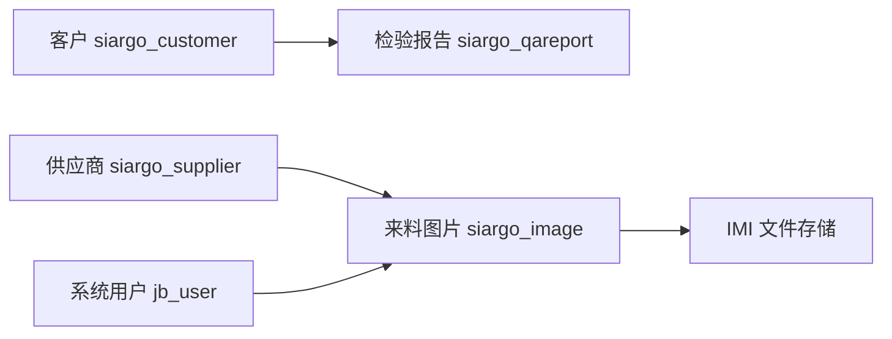

# 客户、供应商与来料图片

> 核对基线：2026-09-30，v2.9.4，Git `18c1de8`。本文依据当前源码、模型映射和页面核实，不代表数据库现状核验或运行环境验收。
>
> [返回手册目录](README.md)

## 1. 业务定位与入口

客户管理维护检验报告使用的客户名称；供应商管理维护来料到货单图片使用的供应商；IMI 保存来料到货单的图片及备注。三者都是业务资料管理，不包含采购订单、库存入库或供应商考核流程。

| 入口 | 用途 | 主要数据 |
|---|---|---|
| `/admin/siargo/customer` | 查询、新增、编辑和删除客户 | `siargo_customer` |
| `/admin/siargo/supplier` | 维护供应商、类型和显示顺序 | `siargo_supplier` |
| `/admin/siargo/imi` | 按供应商管理来料到货单图片 | `siargo_image` |

三个 Controller 均使用 `@CheckPermission(PermissionKey.SIARGO)` 和 `@UnCheckIfSystemAdmin`，经后台登录与权限链进入。供应商资料和图片内容的维护不是独立审批流程。

## 2. 实体关系与字段

客户与报告单关系见[检验报告单业务](11-检验报告单业务.md)。供应商通过 `siargo_image.supplier_id` 关联图片，图片查询同时关联上传人、更新人以显示姓名。

| 实体 | 维护重点 |
|---|---|
| 客户 | `id`、`name` |
| 供应商 | `id`、`name`、`type`、`sort_rank` |
| 来料图片 | `supplier_id`、`storage_name`、`file_path`、`md5_hash`、`description` |
| 图片记录时间与人员 | `upload_time`、`uploader_id`、`updated_time`、`update_id` |
| 图片删除标记 | `status=1` 正常、`status=0` 删除；`deleted_time` 记录删除时间 |

`storage_name` 是业务显示名称，`file_path` 是服务器返回的文件 URL；正式文件名含 UUID，不应从显示名称自行推导磁盘位置。上述字段来自模型和服务使用，不等同于对当前数据库约束的审计。

## 3. 客户与供应商维护

客户列表按 `id` 倒序，关键字匹配 `name`。新增使用 `customer.*` 表单字段，编辑带上 `customer.id`，删除入口为 `customer/delete/{id}`。Service 校验新增不能带已有 ID、编辑记录必须存在。

供应商列表按 `sort_rank` 倒序，关键字匹配名称。新增自动取下一排序值；页面支持上移、下移、移动及初始化排序。类型选择器取字典 `siargo_sup_type` 的 `sn`，不在本文硬编码类型枚举。`supplier/getSupplierName` 为 IMI 的供应商选择器提供数据，新建图片时可打开供应商新增弹窗，再刷新选择器。

当前客户与供应商 Service 中的同名检查均被注释，不能把“名称必须唯一”写成已实现的业务约束。客户删除调用框架引用检查入口，但本类未实现针对报告单的专门查询；供应商的 `checkInUse` 当前直接返回 `null`。维护时不能据此承诺“已引用资料一定无法删除”，也不能因为图片列表是 LEFT JOIN 就认为删除供应商不会影响业务显示。

## 4. 来料图片操作流程

### 查询

`imi/datas` 接收分页参数以及 `keywords`、`supplierId`、`yearMonth`。关键字匹配图片显示名称，月份限制上传时间，列表只取 `status=1`。页面显示供应商、图片、备注、上传和修改信息。

### 批量新增

1. 选择供应商，填写本批共用备注。
2. 上传组件调用 `imi/uploadImages`，图片先进入 IMI 临时目录，返回临时 URL。
3. 表单把临时 URL 以逗号分隔放入 `imgUploadUrl`，连同 `image.*` 提交 `imi/save`。
4. `ImageService.saveBatch` 检查 `supplier_id` 非空及临时文件，未查询供应商记录是否存在；计算每张图片的 MD5，同批重复或与正常记录重复时整批失败。
5. 文件移至供应商 ID、当前年月组成的正式目录；数据库事务保存全部图片记录。任一保存失败时尝试把已移动文件退回临时位置。

上传成功只说明临时文件已接收，尚未形成正式图片记录。新增页的上传组件配置了单批 20 张上限，这是页面设置，不应当作独立的后端总量限制。关闭未保存的新增弹窗时，页面会尝试清理剩余临时文件。

### 编辑与换图

编辑提交 `image.*` 至 `imi/update`。仅改备注时保留原文件；改变供应商、显示名或图片内容时创建新的目标文件，数据库提交后再清理未被引用的旧文件和换图临时文件。换图会重新计算 MD5，并排除当前记录后检查重复。

更新过程中旧文件保留到数据库提交。若返回“已更新，但旧文件清理失败”，数据库已提交，应先重新查询记录和文件状态，不能把它当成整笔更新未发生后盲目重提。文件通用处理机制见 [Service 层开发指南](03-Service层开发指南.md)和[项目配置速查手册](08-项目配置速查手册.md)。

### 删除

当前页面使用 `imi/deleteByIds`：收集物理路径，在一个事务中逐条设置 `status=0` 和 `deleted_time`；全部成功后删除物理图片。数据库标记仍在并不表示文件可恢复，本模块没有与报告单相同的恢复回收站。

代码还保留 `deleteByIds1` 框架批量删除入口；它与页面主删除链不同，不应把两个入口的行为混写，也不要在新增调用方中未经核对直接替换。

## 5. 前后端契约与失败边界

| 场景 | 调用要点 | 结果或失败含义 |
|---|---|---|
| 上传图片 | `uploadImages`，多文件表单 | 仅接收图片，返回临时 URL 列表 |
| 保存批次 | `image.supplierId`、`image.description`、`imgUploadUrl` | 重复图片、无有效文件、临时文件越界或保存失败均不能视为新增完成 |
| 更新图片 | 带 `image.id`；保留未改变的 `filePath`、`storageName`、`supplierId` | 后端据这些值判断是否换图或搬移文件 |
| 删除图片 | `deleteByIds` 的 `ids` 为逗号分隔 ID | 数据库软标记与物理文件清理分阶段执行 |
| 清理临时文件 | `deleteTempFile?filePath=...` 或 `deleteTempFiles?filePaths=...` | 只能删除 IMI 临时区内的路径 |

不要把表单 Model 的驼峰属性与 Record 列表响应混为一谈。当前 Record 容器将列键转为小写，列表以实际 JSON 和模板消费字段为准；例如 `supplier_name`、`uploader_name` 等 SQL 列键不能凭 Java 属性名改成另一套字段。ID 应按字符串传递与展示，避免浏览器数值精度损失。

## 6. 开发定位与维护核对

| 内容 | 代码位置 |
|---|---|
| 客户查询、保存和删除 | [CustomerAdminController](../../src/main/java/cn/jbolt/admin/siargo/customer/CustomerAdminController.java)、[CustomerService](../../src/main/java/cn/jbolt/admin/siargo/customer/CustomerService.java) |
| 供应商下拉与排序 | [SupplierAdminController](../../src/main/java/cn/jbolt/admin/siargo/supplier/SupplierAdminController.java)、[SupplierService](../../src/main/java/cn/jbolt/admin/siargo/supplier/SupplierService.java) |
| 图片入口、表单参数与删除事务 | [ImageAdminController](../../src/main/java/cn/jbolt/admin/siargo/imi/ImageAdminController.java) |
| 图片查重、保存、换图及软标记 | [ImageService](../../src/main/java/cn/jbolt/admin/siargo/imi/ImageService.java) |
| 页面实际交互 | [客户页面](../../src/main/webapp/_view/admin/siargo/customer/)、[供应商页面](../../src/main/webapp/_view/admin/siargo/supplier/)、[IMI 页面](../../src/main/webapp/_view/admin/siargo/imi/) |

修改时重点核对供应商选择与编辑回显、同批及跨批查重、仅改备注与换图的区别、保存失败后的文件位置、删除后的正常列表过滤。本文未执行上传、保存或删除，实际持久化和图片显示仍须按任务授权在运行环境核验。
