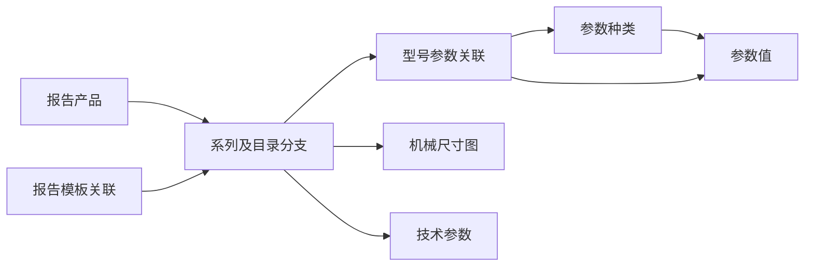

# 产品目录与参数

> 核对基线：2026-09-30 / v2.9.4 / `18c1de8`。本文依据当前源码核实，不代表数据库现状或运行验收已完成。

[返回文档目录](README.md)

## 用途与入口

产品目录保存系列、目录分支、型号选型结构和产品资料；参数管理提供结构中引用的种类与可选值。报告单以系列记录 ID 关联目录，Excel 导入也读取这套目录。系列名称相同的多条记录可以代表不同目录分支，不可把列表中的合并展示理解为同一条记录。

| 入口 | 用途 |
|---|---|
| `/admin/siargo/prodparam` | 左侧参数种类、右侧该种类的参数值；两个 `ajaxPortal` 联动 |
| `/admin/siargo/prodmodel` | 系列/分支列表、新增、编辑、启停及删除 |
| `/admin/siargo/prodmodel/selection/{id}` | 同系列全部目录分支的只读选型图 |
| `/admin/siargo/prodmodel/materials/{id}` | 产品简介、特点、尺寸图、技术参数和选型资料 |

以上 Controller 使用 `PermissionKey.SIARGO` 和系统管理员豁免。当前没有另设每项目录操作的专属审批流程。通用后台权限见 [Controller 指南](02-Controller层开发指南.md)，接口治理现状见 [接口与应用中心](16-对外接口应用中心与调用日志.md)。

## 数据关系与目录含义

| 实体 | 表与关键关系 |
|---|---|
| 参数种类 | `siargo_prod_param_type`：`type_name`、`sort_rank`、`is_active` |
| 参数值 | `siargo_prod_param_value`：`param_type_id` 指向种类，内容为 `param_value`、`description` |
| 系列/分支 | `siargo_prod_model`：`model_series`、`branch_label`、`catalog_sort`、`prod_type`、`model_desc`、`is_active` |
| 型号参数引用 | `siargo_prod_model_param`：`model_id`、`param_type_id`、`param_value_id` |
| 尺寸图 | `siargo_prod_model_dimension.model_id` 指向系列/分支记录 |
| 技术参数 | `siargo_prod_technical_param.model_id` 指向系列/分支记录 |

`model_series` 是目录分组的来源，`catalog_group` 随之保存；旧请求中的 `catalogGroup` 不能另建独立分组。同一系列的不同 `branch_label` 保持各自 ID、结构及关联。`prod_type` 是产品类型字典 SN；名称从启用的 `siargo_prod_type` 字典读取，找不到名称时显示类型编码，不能据此猜成另一类产品。

### 型号结构

`model_desc` 保存参数片段 JSON 字符串：单个分支为片段数组，多个分支为数组的数组。字符串片段是固定文字，对象片段引用参数种类及可选值。读取器兼容旧的 `version=2/variants/tokens` 包装，规范化存储仍采用片段数组，运行时 `variants` 不应整对象写回。

常用槽字段包括 `t`（种类 ID）、`key`、`label`、`valueIds`、`prefix`、`selection`、`optional`；多选槽还可带 `minSelect/maxSelect`、`groups` 和 `allowedCombinations`。槽内约束由 `ProdModelSelectionSchema` 统一验证和组合，不能只把可选值拼成笛卡尔积。种类名称按当前字典补齐。

结构限制为 1—12 组分支、每组 1—40 个片段，UTF-8 总量不超过 65535 字节。具体合法编码、槽约束及组合行为以该解析器为准。不存在的种类/值、跨种类引用及不合法组合不能通过保存或组合校验。

## 参数维护

先维护种类，再选中种类维护其值。管理页面只展示有效项，新增记录自动追加到有效列表末尾。上移、下移和初始化顺序由对应接口维护；编辑内容不会把客户端提交的排序或有效状态直接写回。

| 操作 | 实际行为 |
|---|---|
| 种类新增/编辑 | `prodParamType` 表单前缀；名称必填、最多 20 字，有效种类中不能同名 |
| 值新增/编辑 | `prodParamValue` 表单前缀；`paramValue` 必填且最多 50 字，所属种类通过 `paramTypeId` 传入，编辑不能把已有值移到另一种类 |
| 种类排序 | `/prodparam/up/{id}`、`down/{id}`、`initRank`；`move` 为已有灵活移动入口 |
| 值排序 | `/prodparam/value/up/{id}`、`down/{id}`、`initRank/{typeId}`，仅在所属种类内调整 |
| 选项读取 | `/prodparam/options` 与 `/prodparam/value/options/{typeId}`，供型号编辑器读取有效种类/值 |

值和种类的 `is_active` 不能统一理解为普通启停开关：当前管理入口的删除语义见下文。型号编辑回显只装载当前有效种类和有效关联值；有效种类暂时没有可用值时，可以保留待重新选择的空段位，不应将其误认为完整可组合的型号。

## 系列编辑与字段协议

`save`、`update`、`compose` 读取原始 JSON 对象。`save/update` 的业务字段如下；更新另带字符串 `id`。雪花 ID 在浏览器中保持字符串，不能转成 JavaScript `Number` 后再提交。

| 请求字段 | 含义和约束 |
|---|---|
| `series` | 系列名，字母或数字开头，只含字母、数字、`-`、`/`，最多 50 字符 |
| `prodType`、`isActive` | 类型为正整数；状态为 `0` 或 `1`。页面类型选项来自字典，服务端此处校验正整数 |
| `branchLabel`、`catalogSort` | 分支标签最多 100 字且不得含控制字符；同系列已有其他记录时标签必填，且同系列不能重名。目录排序为非负整数 |
| `modelDesc` | 前述型号片段的 JSON 字符串，不是自由描述文本 |
| `segments` | `[{paramTypeId, valueIds:[...]}]`；种类及值必须有效，值必须属于该种类 |
| `productIntro`、`productFeatures`、`remark` | 产品简介、特点及备注；简介、特点各最多 10000 字 |

同一参数种类可以出现在多个槽位；存储附表时按种类汇总并去重，不能丢掉 `modelDesc` 中各槽位独立的选值与组合约束。同一段重复引用相同参数值会失败。主表和参数关联由 Service 在同一事务中保存；更新不会自动保存机械尺寸图或技术参数。

编辑页的 `editDataJson` 是显式 `JSONObject`，使用 `modelDesc`、`segments`、`dimensions`、`technicalParams` 等驼峰字段。组合预览接收 `modelDesc`、`segments`、`choices`，并以 `variantKey` 或 `branchIndex` 指定分支，返回 `data.model`；真实编码由服务端查询参数字典，不信任请求额外携带的编码文本。

`/prodmodel/options?includeId=...` 返回的是 `Record` 列表，关联字段在当前容器下序列化为小写，如 `prodtype`、`prodtypename`、`branchlabel`、`displaylabel`、`branchstructures`；它与上述显式 JSON 的大小写不同。通用规则见 [Model 指南](04-Model层开发指南.md)。

## 产品资料与选型展示

“选型”按 `model_series` 装载全部同系列记录，不受当前分页、搜索和分支启用状态限制；展示时仍保留原分支的选型规则。“产品资料”以当前记录展示简介、特点、尺寸图和选型，并将同系列技术参数组织为目录对照表。资料展示不能据此反推所有分支都可用于新报告。

| 子项 | 接口与输入 |
|---|---|
| 尺寸图查询 | `dimensionList?modelId=...` |
| 尺寸图上传 | `dimensionUpload`，multipart 字段 `file`，先返回临时文件 URL |
| 尺寸图保存 | `dimensionSave/dimensionUpdate`：`modelId,title,imagePath,sortRank,remark`，更新另带 `id` |
| 未保存图片清理 | `deleteTempFile`：`filePath`，仅接受临时目录文件 |
| 技术参数查询 | `technicalList?modelId=...` |
| 技术参数保存 | `technicalSave/technicalUpdate`：`modelId,paramName,paramValue,unit,sortRank,remark`，更新另带 `id` |

尺寸图支持 PNG/JPG/JPEG/GIF/BMP，不超过 20 MB 和 4000 万像素，服务端检查图片可解析性。新增、替换使用合法临时文件；正式落盘失败有移回补偿，旧文件在事务提交后清理。记录 ID 必须属于所提交系列。

技术参数值保留区间、条件及文字，不统一转成数字。名称必填且最多 200 字，值最多 16000 字，单位最多 100 字、备注最多 500 字，排序须为非负整数。普通参数值不能为空；同时具有目录行键和列键的记录允许空值，以保留目录空白格。

目录表格还使用 `catalogRowKey`、`catalogCellKey`、`catalogColumnKey`、`catalogColumnLabel`、`catalogColumnSort`；这些字段决定跨分支的行列关系。修改列标题/排序会同步同一 `modelId` 下同列参数；单格改名会拆出原目录行键，避免误改其他分支的含义。

## 停用、删除与跨模块影响

本节是目录删除影响的统一说明；报告生命周期见 [检验报告单业务](11-检验报告单业务.md)，模板操作见 [Excel 导入与 PDF 输出](12-Excel导入与PDF输出.md)。

| 对象或操作 | 当前保护与影响 |
|---|---|
| 删除参数种类 | 种类下有有效参数值，或 `siargo_prod_model_param` 仍引用该种类时拒绝；通过后置 `is_active=0`，是软删除 |
| 删除参数值 | 管理入口先在同一事务清理型号结构和关联中的该值，再物理删除；不应按继承入口的 `checkInUse` 注释误写为一律禁止删除已引用值 |
| 删除系列/分支 | 有报告产品引用（含回收站）或 PDF 模板绑定时拒绝；允许删除时，事务内删除参数关联、尺寸图记录和技术参数，提交后清理图片 |
| 停用系列 | 新报告选择和导入匹配排除停用项；已有报告编辑可回显并保留原关联。正式 PDF 解析仍要求系列启用 |
| 修改系列分类/结构 | 新一次导入重新读取目录；系列更新会清理报告统计/分页缓存。不会自动重写历史报告型号文本或重新发布历史 PDF |
| 修改参数编码 | 影响后续目录展示、组合和匹配；已录入报告中的完整型号文本不是自动重算字段 |

批量种类/值删除或系列删除遇到校验/写入失败时回滚相应事务；过期表单不能重新引用已经删除的参数值。删除规则不会为缺失的参数值自动创建替代值。

## 源码定位与维护边界

- [ProdModelAdminController](../../src/main/java/cn/jbolt/admin/siargo/prodmodel/ProdModelAdminController.java)：页面、JSON 入口及资料子项操作。
- [ProdModelService](../../src/main/java/cn/jbolt/admin/siargo/prodmodel/ProdModelService.java)：`save/update`、`compose`、`getEditDataJson`、`getDisplayData`、`checkInUse`。
- [ProdModelTokens](../../src/main/java/cn/jbolt/admin/siargo/prodmodel/ProdModelTokens.java) 与 [ProdModelSelectionSchema](../../src/main/java/cn/jbolt/admin/siargo/prodmodel/ProdModelSelectionSchema.java)：结构读取、校验、组合与展示。
- [参数种类服务](../../src/main/java/cn/jbolt/admin/siargo/prodparam/ProdParamTypeService.java)、[参数值服务](../../src/main/java/cn/jbolt/admin/siargo/prodparam/value/ProdParamValueService.java)、[型号引用清理](../../src/main/java/cn/jbolt/admin/siargo/prodmodel/ProdModelValueDeletionService.java)：排序、有效状态、删除链。
- [机械尺寸图服务](../../src/main/java/cn/jbolt/admin/siargo/prodmodel/ProdModelDimensionService.java)、[技术参数服务](../../src/main/java/cn/jbolt/admin/siargo/prodmodel/ProdTechnicalParamService.java)、[目录表格组装](../../src/main/java/cn/jbolt/admin/siargo/prodmodel/ProdTechnicalTable.java)：资料保存及行列语义。
- [型号页面](../../src/main/webapp/_view/admin/siargo/prodmodel/)与[参数页面](../../src/main/webapp/_view/admin/siargo/prodparam/)；业务交互统一位于 [siargo.js](../../src/main/webapp/assets/js/siargo.js)。页面组件约定见 [前端指南](05-前端开发指南.md)。

本次没有核对生产目录条数、具体产品目录内容或图片文件是否齐全；这些数据不能由源码中的功能支持推定。
