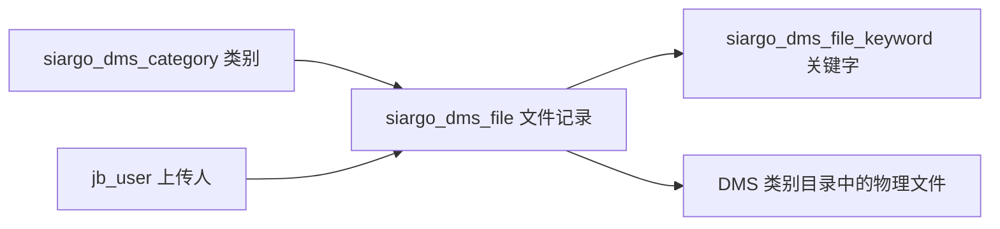

# 技术通知单与文件管理

> 核对基线：2026-09-30，v2.9.4，Git `18c1de8`。本文依据当前源码、模型映射和页面核实，不代表数据库现状核验或运行环境验收。
>
> [返回手册目录](README.md)

## 1. 业务定位

DMS 在业务页面中称为“技术通知单”：以类别组织文件，维护生效状态、生效日期、说明和检索关键字，提供查询与下载。它不包含在线正文编辑、文件审批签章或历史版本恢复工作流。

主入口为 `/admin/siargo/dms/file`，类别管理为 `/admin/siargo/dms/category`。两个 Controller 使用 `PermissionKey.SIARGO`，系统管理员按 `@UnCheckIfSystemAdmin` 处理。页面行为及后台接口均通过现有后台登录权限链。

## 2. 数据结构与状态

| 对象 | 关键字段与含义 |
|---|---|
| 类别 | `name`、`sort_rank`；类别列表聚合正常文件数量 |
| 文件归属与位置 | `category_id`、`file_name`、`file_ext`、`file_path`；显示名称与扩展名分列保存 |
| 文件业务属性 | `description`、`is_active`、`active_date`、`modify_date` |
| 上传信息 | `upload_time`、`uploader_id` |
| 文件记录状态 | 正常查询要求 `status=1`；不要用 `is_active` 替代记录状态 |
| 关键字 | 每条由 `file_id` 指向文件记录，`keyword` 保存检索词 |

**失效文件不是回收站。** `inactiveList/inactiveDatas` 的条件是 `is_active=0 AND status=1`，即记录仍正常，但业务上未生效。`toggleActive` 在 1 与 0 之间切换，同时更新修改时间；它不删除记录或物理文件。设置生效日期也不等于存在“到期自动启用/停用”的定时工作流。

## 3. 查询与类别管理

主界面先选类别，再显示该类别文件；未选择类别时 `datas` 返回空结果。`keywords` 同时匹配文件名和关键字，关键字命中采用 `EXISTS`，外层仍聚合该文件全部关键字，避免只显示命中的单个词。还可按 `isActive` 和 `activeDate` 月份过滤。

`globalSearch` 跨类别检索相同的文件名和关键字，并附带类别名称。主列表与全局搜索 Controller 当前固定以 `pageNumber=1`、`pageSize=Integer.MAX_VALUE` 取结果，虽复用分页 Service，不能据此承诺前端存在真正分批加载。失效文件列表则使用正常分页参数。

类别支持新增、编辑、删除、上移/下移、移动到指定类别之前或之后及初始化排序。正常文件数包括生效和失效文件；只要类别下仍有 `status=1` 文件，`DmsCategoryService.checkInUse` 就拒绝删除类别。

列表通过 Record 输出，SQL 中的 `fileName/categoryName/fileCount` 等别名在当前容器中实际为 `filename/categoryname/filecount`。模板必须依据真实序列化字段读取，不能因为 SQL 使用驼峰就改用驼峰 JSON。

## 4. 上传、同名覆盖和编辑

### 新增文件

1. 选定类别，填写说明、生效日期和关键字。
2. `file/uploadFile` 接收名为 `file` 的上传字段，文件先进入 DMS 独立临时目录，返回临时 URL。
3. 表单向 `file/save` 提交 `dmsFile.*`、`keywords` 和 `tempFilePath`；多个临时 URL 使用逗号分隔。
4. Service 先预检整批文件、类别和覆盖状态，再移动文件、在事务中保存文件记录与关键字；失败时尝试恢复移动前的位置。

正式目录按类别组织并保留原文件名。同一批重复选择同名文件会被拒绝；这与不同批次明确确认覆盖是两种情况。

当前业务页面只选择 PDF，单个不超过 100MB，新增最多 10 个、编辑最多 1 个，文件名除扩展名外不能包含点号。上传 action 的扩展名白名单仍包含 Office 文档与常见图片，范围比页面宽；不能把页面限制写成全部后端限制，也不能据此把技术通知单页面描述为任意格式文件选择器。

### 覆盖确认

`file/checkOverwrite` 接收 `categoryId`、`fileName`，只读检查目标记录和文件快照，返回 `requiresOverwrite`、`overwriteToken`、`targetId` 等信息。页面在实际上传前检查同名并询问，拒绝该次覆盖不会执行上传；最终保存携带 `overwriteTokens`，其 JSON 对象按文件名映射对应令牌。

没有确认或令牌已不匹配时，保存返回 `requiresOverwrite=true` 和 `conflicts`，前端应展示确认并重提；不能把它当成已经保存成功。同批全部覆盖确认完成前不会开始正式文件移动。确认期间目标发生变化，事务中的目标复核仍可能拒绝提交。

存在同名正常记录时，覆盖复用目标记录 ID，并重写元数据和关键字；不是另增一个可回溯的版本。历史上多条记录占用同一名称时，后端不会擅自选择覆盖对象。覆盖时保留旧文件用于失败补偿，提交后才清理备份。成功结果携带 `cleanupWarning` 时，表示主体已提交但清理阶段需要处理，不能重复覆盖来代替核对。

### 编辑文件

`file/update` 接收 `dmsFile.*`、`keywords`、可选 `tempFilePath` 和 `overwriteTokens`。不传新临时文件时维护现有记录；传入新文件则走替换与同名确认逻辑。类别、文件名和目标记录应与当前编辑数据一起核对，不要把前端缓存的旧覆盖令牌长期复用。

编辑记录 A 时，如果新上传文件命中已有记录 B 并确认覆盖，实际只更新 B，保留 A；不会删除或合并 A，也不保证最终更新的 ID 就是打开编辑页时的 ID。

编辑普通失败且文件恢复完整后，后端会尝试清理本次临时文件；返回 `tempFileDeleted=true` 时，页面清空上传状态，再次替换必须重新上传。仍需确认覆盖（`requiresOverwrite=true`）或 `fileRecoveryFailures` 非空时保留现场；临时清理失败则返回 `tempFileDeleted=false` 和 `cleanupWarning`。这些失败结果不能统一按“原临时文件仍可重试”处理。

业务文件路径、临时区与跨目录校验使用共用存储组件，配置及实现说明见[项目配置速查手册](08-项目配置速查手册.md)和[Service 层开发指南](03-Service层开发指南.md)。

## 5. 下载与删除边界

下载入口为 `file/download/{id}`，服务器先取得文件记录，再通过 DMS 存储边界解析 `file_path`，检查文件是否存在。调用方应传记录 ID，不应拼装任意磁盘路径下载。失效状态是业务状态，不能仅凭“失效”推定文件已从磁盘移除。

文件删除入口 `file/deleteByIds` 接收逗号分隔的 `ids`。它先收集文件路径，在数据库事务中调用删除及关键字清理，事务成功后才删除物理文件。当前没有配套的恢复/永久删除两阶段界面，因此不能把该删除承诺为可恢复回收站。类别删除保护和文件删除是不同链路，不要让类别排序或状态切换承担文件清理职责。

`deleteTempFile?filePath=...` 仅处理 DMS 临时文件。上传后取消表单、覆盖失败、数据库提交成功但清理失败，分别处于不同阶段；排查时同时核对业务记录、临时路径、正式文件和返回结果，不以“上传成功”替代最终保存结果。

## 6. 开发定位与核对场景

| 维护内容 | 代码位置 |
|---|---|
| 类别列表、排序、删除保护 | [DmsCategoryAdminController](../../src/main/java/cn/jbolt/admin/siargo/dms/category/DmsCategoryAdminController.java)、[DmsCategoryService](../../src/main/java/cn/jbolt/admin/siargo/dms/category/DmsCategoryService.java) |
| 文件入口和参数、下载、删除事务 | [DmsFileAdminController](../../src/main/java/cn/jbolt/admin/siargo/dms/file/DmsFileAdminController.java) |
| 查询、关键字、覆盖快照及事务保存 | [DmsFileService](../../src/main/java/cn/jbolt/admin/siargo/dms/file/DmsFileService.java) |
| 实际页面、表单和列表字段 | [DMS 页面](../../src/main/webapp/_view/admin/siargo/dms/) |
| 选择文件、确认后上传与提交重试 | [siargo.js](../../src/main/webapp/assets/js/siargo.js) 中的 `SiargoDmsFileForm` |

变更时重点核对：未选类别的空列表、跨类搜索保留全部关键字、生效与失效切换、同名取消不覆盖、确认后目标变化、整批文件失败补偿、类别内有失效文件仍阻止删除、数据库删除后物理清理。本文未执行上传、覆盖、下载或删除，不构成这些运行场景的验收记录。
