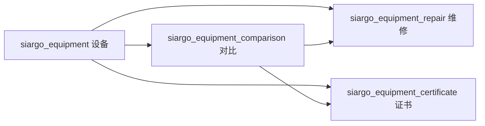

# 设备管理

> 核对基线：2026-09-30，v2.9.4，Git `18c1de8`。本文依据当前源码、模型映射和页面核实，不代表数据库现状核验或运行环境验收。
>
> [返回手册目录](README.md)

## 1. 业务范围与入口

设备模块维护计量器具台账，记录检校对比、编制审核、证书及维修情况。日常入口是 `/admin/siargo/equipment`：在列表查看设备状态和检校期限，选中设备进行批量编制、审核或状态调整，点击器具编号进入设备时间线。

| 入口 | 使用场景 |
|---|---|
| `/admin/siargo/equipment` | 台账、筛选、概览及批量操作 |
| `/admin/siargo/equipment/timeline?equipmentId=...` | 设备的对比、证书及关联维修历程 |
| `/admin/siargo/equipment/comparison` | 对比记录维护；时间线内也可新增、编辑、删除对比 |
| `/admin/siargo/equipment/repair` | 维修记录维护 |
| `/admin/siargo/equipment/certificate` | 证书上传、查询及记录维护 |

后台 Controller 使用 `PermissionKey.SIARGO` 和系统管理员豁免。列表的审核按钮由 `RoleService.hasRoleOrAbove(userId, 221)` 控制显示。现有批量审核动作本身未重复实施相同角色判断，因此不能将页面可见性描述为完整的后端动作授权；模块级权限和角色按钮显示是不同层次。

## 2. 实体、状态与关系

设备分类由字典 `siargo_equipment_category` 的 `sn` 关联。设备字段包括名称、型号、器具编号、出厂编号、制造商、检定方式、检校周期与单位、最近及下次检校日期、位置、责任人、购入日期和备注。

| 状态所在实体 | 字段和值 | 说明 |
|---|---|---|
| 设备 | `status`: 1 正常、2 维修中、3 已封存、4 报废、5 异常 | 使用状态，不能套用其他模块 `status=0` 的删除约定 |
| 对比 | `comparison_type`: 1 定期、2 临时、3 新表 | 时间线筛选维度 |
| 对比 | `result`: 1 合格、2 不合格 | 编制、审核及维修展示的主要判断依据 |
| 对比 | `audit_status`: 0 未审核、1 待审核、2 已审核 | 模型定义包含 0；当前新增直接进入 1 |
| 证书 | `status`: 1 有效、2 无效 | 新对比保存新证书时使该设备之前的有效证书失效 |
| 维修 | `repair_type`: 1 公司维修、2 寄出维修 | 维修方式 |
| 维修 | `repair_result`: 1 维修中、2 已完成、3 无法修复 | 与设备 `status`、对比 `result` 分别保存 |

对比记录保存 `creator_id/creator_time`、`auditor_id/auditor_time`。证书保存 `equipment_id`、可空 `comparison_id`、`image_url`、`certificate_date` 和 `remark`；维修的 `comparison_id` 可空，表示未绑定某次对比的主动维修。不能因为字段名称相近，把几组状态或日期直接互换。

## 3. 台账查询与统计口径

`equipment/datas` 支持 `keywords`、`category`、`status`、`inspectionMethod`、`inspectionCycle` 和 `filter`。关键字匹配器具编号、名称、型号、出厂编号；`inspectionCycle` 参数实际匹配周期单位“月/年”，不是周期数值。

快捷筛选以当前 SQL 为准：

- `expired`：下次检校日期不为空，且不晚于今天后 15 天，包含已过期与即将到期设备。
- `cert_expired`：存在有效证书，其证书日期加 9 个月不晚于当前时间。
- `audit`：最新对比记录为待审核；判断最新记录使用对比日期、编制时间和 ID。
- `repairing`：设备状态为 2；`sealed` 合并状态 3、4；`abnormal` 为 5。

列表关联最新对比、编制审核人员和有效证书信息。概览统计使用内存字段、锁和 30 分钟 TTL；分类列表缓存为 60 分钟。它们不是每次查询都重新计算，维护写操作时必须保留相应失效调用，并按真正事务提交边界检查时机。不要把统计数字与当前列表行数未一致直接认定为数据丢失。

## 4. 编制、对比和审核

### 单次对比

从设备时间线新增定期、临时或新表对比，提交 `equipmentComparison.*`，证书通过 `certificateImageUrls`、`certificateDate`、`certificateRemark` 一同传入。设备不存在、已封存或报废时，新增对比被拒绝。

Service 设置编制人、编制时间和 `audit_status=1`，准备证书文件后，在同一数据库事务中保存对比、联动设备状态及证书记录。对比合格使设备正常，不合格使设备进入维修中；此联动在保存对比时已经发生，并非必须等待审核。

新增定期对比会把最近检校日期改为对比日期，并按“对比日期 + 3 个月 - 1 天”设置下次日期；该分支当前不是根据设备配置的周期数值计算。编辑对比不会通过同一新增分支重新计算检校日期。

### 批量编制

列表选中设备后打开 `batchInspectionForm`，提交到 `batchInspection`。主要参数为设备 `ids`、`lastInspectionDate`、`nextInspectionDate` 和对比结果 `status`。

批量编制先更新选中设备的检校日期，再逐台新增定期对比和编制信息。选择合格结果时，设备当前必须正常，否则返回“状态异常，请先维修”。Controller 用手动事务把日期更新和整批对比保存包在一起，业务返回失败时回滚，不应把内部 Service 当成可无事务复用的单条写操作。

### 审核

审核保存当前审核人及时间，将 `audit_status` 改为 2，并按对比结果再次联动设备状态。已审核记录返回“请勿重复审核”。设备列表的 `equipment/batchAudit` 接收**设备 ID**，为每台查找待审核对比；`equipment/comparison/batchAudit` 接收的是**对比记录 ID**。二者不能交叉传参。

设备批量审核找不到待审核记录时失败；Controller 使用整批事务处理返回失败。它不是包含驳回、撤回、复审的多级工作流。

## 5. 证书、维修和时间线

证书图片先由 `equipment/certificate/uploadImages` 放入证书临时区。设备新增或对比保存时，将临时文件归入对应设备目录。编辑对比可保留该对比已有证书或提交新临时文件，不能拿其他设备的正式 URL 充当新证书。

新增对比带有新证书时，会把该设备现有有效证书置为无效，再保存本次证书。替换对比证书时重建该对比的记录，事务成功后清理不再引用的旧文件。证书普通更新保留原 `image_url`、`equipment_id` 和 `comparison_id`，文件替换由设备/对比业务入口承担。

维修记录可关联引发维修的对比，维护故障、措施、维修人、结果和完成日期。当前后端在**修改维修记录**时检查原关联对比：若已审核则禁止修改。维修保存不是自动把全部设备、对比、证书状态重新推导一遍的统一状态机。

时间线的真实数据结构是“对比主记录 + 聚合证书 + 关联维修”：

1. 按设备与可选对比类型分页查对比记录，聚合证书图片和日期，关联编制及审核人员。
2. 只针对本页不合格对比，批量查询其 `comparison_id` 对应的维修记录。
3. 把维修列表序列化到 `repairs_json`，由时间线页面解析展示。

因此它不是将全部对比和全部维修用 `UNION` 混排；未绑定对比的主动维修不能据此保证显示在时间线中。

## 6. 状态调整、删除与当前边界

`batchStatus` 接收设备 ID 和目标设备状态。切换正常或维修中前检查最新对比结果：不合格不能直接改正常，合格不能直接改维修中。当前这一分支随后使用 `result=status+1` 更新最新对比，与其他流程的 `1 合格/2 不合格` 定义不一致。维护者应按该分支现状定位数据，不应将它描述为已经统一的正确枚举映射；本文不修改该实现。

删除对比会清理关联证书记录，由 Controller 在事务成功后清理对应物理文件。设备删除调用框架删除与 `checkInUse` 入口，当前设备 Service 未实现完整的子表引用检查或统一级联清理；不能承诺删除设备自动安全清理全部对比、证书和维修。维修和证书也有各自删除入口，不等同于修改业务状态。

旧 `equipment/records` action 仍引用 `inspectionBatch/index.html`，当前页面目录中未找到该模板。现有设备列表通过编号进入的是 `timeline/index.html`，对比页面位于 `comparison/`。新增导航或维护示例应以实际存在的页面为准。

## 7. 开发定位与维护核对

| 内容 | 代码位置 |
|---|---|
| 台账、批量事务、时间线入口 | [EquipmentAdminController](../../src/main/java/cn/jbolt/admin/siargo/equipment/EquipmentAdminController.java) |
| 列表和概览口径、批量操作、时间线组装 | [EquipmentService](../../src/main/java/cn/jbolt/admin/siargo/equipment/EquipmentService.java) |
| 对比保存、审核、日期和设备联动 | [EquipmentComparisonService](../../src/main/java/cn/jbolt/admin/siargo/equipment/comparison/EquipmentComparisonService.java) |
| 证书准备、记录替换和文件清理 | [EquipmentCertificateService](../../src/main/java/cn/jbolt/admin/siargo/equipment/certificate/EquipmentCertificateService.java) |
| 维修审核门控 | [EquipmentRepairService](../../src/main/java/cn/jbolt/admin/siargo/equipment/repair/EquipmentRepairService.java) |
| 页面和表单 | [设备页面目录](../../src/main/webapp/_view/admin/siargo/equipment/) |

修改时重点核对：设备 ID 与对比 ID、三类对比的日期行为、证书保留/替换、合格与不合格联动、已审核维修编辑、批量中途失败、时间线维修展示和缓存失效。文件及事务机制见[Service 层开发指南](03-Service层开发指南.md)。本文未执行编制、审核、删除或文件替换，不构成运行验收。
