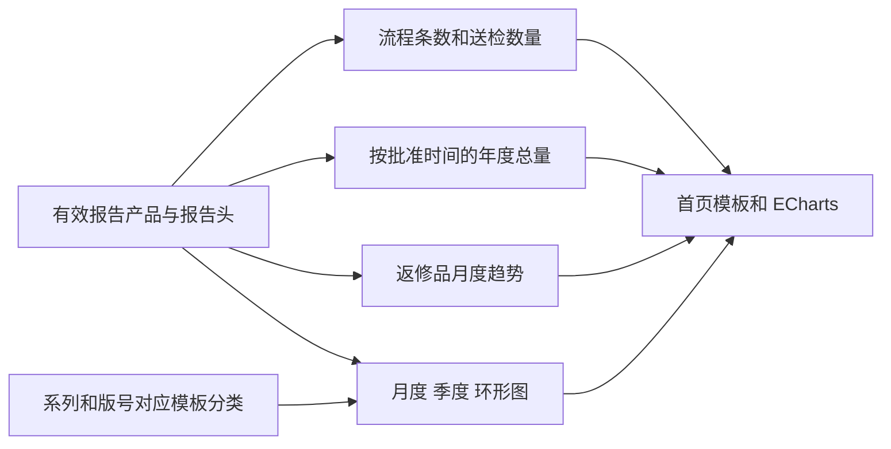

# 首页看板与报告统计

> 核对基线：2026-09-30 / v2.9.4 / `18c1de8`。本文依据当前源码及 SQL 核实，不代表数据库现状或运行验收已完成。

[返回文档目录](README.md)

## 入口与数据流

首页数据分析入口是 `/admin/dashboard`，由 `AdminIndexController.dashboard()` 装载数据，再通过 `_view/_admin/index/dashboard.html` 交给 `SiargoDashboard` 和 ECharts。入口使用权限键 `dashboard`，系统管理员豁免；这些指标没有自动按当前用户、检验员或客户再缩小数据范围。

本篇统一维护报告相关指标的统计粒度、日期、分类与缓存口径。业务流程见 [检验报告单业务](11-检验报告单业务.md)，目录关系见 [产品目录与参数](10-产品目录与参数.md)，月份归档筛选与输出协议见 [Excel 导入与 PDF 输出](12-Excel导入与PDF输出.md)。

## 先区分条数、送检只数和检验只数

当前所有流程“单量”和环形图统计都直接按符合条件的 `siargo_product` **产品记录行数**计算，没有按报告头 ID、报告编号或订单号去重。一个报告含两条有效产品时，可以计为两条。

`SUM(qsi)` 是送检只数，`SUM(qi)` 是检验只数；一条产品记录可能有多只产品。页面保留“单位(单)”“报告单来源 / 订单”“报告单”等展示字样，但这些字样没有改变 SQL 粒度；不能据此解释成订单数或去重报告数。

例如一份报告包含两个已完成产品，`qsi` 分别为 10、20，`qi` 分别为 9、18，且都在统计范围内：流程已完成数为 2，送检为 30 只，检验为 27 只；满足模板分类条件时，环形图也计 2。

## 列表流程与首页流程的差别

| 统计入口 | 数据来源与条件 | 日期范围 |
|---|---|---|
| 报告列表 `getFlowCounts()` | 直接对 `siargo_product`，`vd=1` | 全历史，包括全历史已完成；不接收列表当前搜索/日期/类型筛选 |
| 首页 `getDashboardFlowCounts()` | 产品关联现存报告头，`vd=1` | 在检状态 `1/6/2/3/4` 不限年份；完成状态 `5` 只计 `allq_time` 为本年度 |

两者均返回以下显式 `Map` 字段：

| 字段 | 所对应的产品状态/数值 |
|---|---|
| `all` | 满足本入口条件的产品记录总行数 |
| `noq`、`ltq`、`accq`、`funq`、`appq`、`allq` | 分别对应 `insp=1/6/2/3/4/5` 的记录行数 |
| `noq_qsi`、`ltq_qsi`、`accq_qsi`、`funq_qsi`、`appq_qsi`、`allq_qsi` | 同一环节内的 `SUM(qsi)`，不是 `SUM(qi)` |

首页“待处理”由前端相加五个在检环节行数，“放行”取 `allq`；堆叠条比例以五个在检环节总行数为分母，不包含已完成。各环节下的“送检”取对应 `_qsi`。

列表流程查询不关联报告头，而首页流程使用内连接；存在孤立产品等数据异常时，两者还有这一差别。首页已完成记录缺少批准时间时不计入本年度，上一年完成记录也不计入首页已完成，但仍可计入列表流程。

## 年度总量和图表口径

首页顶部 `totalQsi/totalQi` 来自 `getTotalQSI(0)/getTotalQI(0)`：有效、已完成、关联现存报告头，并按 `YEAR(allq_time)=YEAR(CURDATE())` 筛选后汇总 `qsi/qi`。参数 `0` 表示全部类型；Service 传入正类型值时按关联系列 `prod_type` 筛选。

这些“本年度送检/检验”是 **本年度批准放行产品的数量累计**，并非所有本年创建或当前在检产品的累计。无数据的数据库 SUM 可为空，Controller 将其显示为 0。

| 展示 | Service | 度量与时间 |
|---|---|---|
| 月度送检总量（含退修） | `getRepAllData()` | 本年度有效已完成产品，按批准月份和模板三分类 `SUM(qsi)`；不排除返修品 |
| 季度送检同比 | `getQuarterCompareData()` | 本年、上年有效已完成产品，按批准季度和模板三分类 `SUM(qsi)` |
| 退修总量趋势 | `getRepData()` | 本年、上年，报告头 `rep_type=2`，有效已完成产品按批准月份 `SUM(qsi)`；不要求能归入模板三分类 |
| 本年度来源环形图 | `getDonutData()` | 本年度有效已完成产品，按模板三分类 `COUNT(*)`；不是送检只数、报告头数或订单数 |

月/季度数组均补齐无数据期间为 0。季度同比在前端对相同分类和季度比较：相等显示“持平”，上年为 0 且本年非 0 显示“新增”，其他按相对上年变化率显示增长/降低；没有除以 0 计算出的无限百分比。

### 模板三分类的唯一维护定义

月度、季度和环形图使用产品的 `siargo_prod_model_id + pdfver`，关联 `siargo_pdf_template_prod` 与 `siargo_pdf_template`，按模板文件名归类。此处不使用产品类型字典作为三分类来源。

| `sn` | 名称 | 模板文件名 |
|---|---|---|
| `large_meter` | 大表 | `中低压模板.pdf`、`工业表模板.pdf` |
| `small_flow` | 小流量计 | `小流量计模板.pdf`、`控制器模板.pdf` |
| `sensor` | 传感器 | `传感器模板.pdf` |

SQL 先按系列和版号收敛到唯一类别：所有关联模板都能识别，且只落在一个类别中，才进入图表。同类别多个绑定只贡献一次关联，不重复累计产品；混入未识别模板、跨类别绑定或完全无绑定的产品不进入这三类。

此统计关联不按模板/系列启用状态过滤，因此单纯停用不会把历史分类消失；修改或解除关联仍可能改变后续读取的历史分类。当前没有独立冻结的历史分类快照。生成 PDF 要求唯一启用模板，统计分类要求唯一类别，两者是不同条件。

因此，环形图总数不保证等于首页已完成数；月度三分类送检合计不保证等于顶部全年送检总量。遇到差异先核对模板分类覆盖、批准日期和计量单位，不能先认定缓存错误。

## 数据协议与刷新

Controller 用模板变量传数据，并未为每张图单独开放一个图表 HTTP action。`SiargoDashboard.init` 当前使用：

| 变量/结构 | 内容 |
|---|---|
| `flowCounts` | 上文流程 Map |
| `repalldata` | `{types:[{sn,name}], months:[1..12], series:[{sn,name,data:[12项]}]}` |
| `quarterData` | `{curYear,lastYear,series:[{sn,name,current:[4项],previous:[4项]}]}` |
| `repfixdata` | `{curYear,lastYear,cur:[12项],last:[12项]}` |
| `donutData` | `[{sn,label,value}]`，固定输出三类，缺项为 0 |

以上是显式 Map/数组字段，不能改成按 SQL 别名推测的另一套大小写。年份显示和页面“更新时间”由浏览器当前时间生成；数据库年度筛选使用 `CURDATE()`，部分年度数组标签由 Java 当前年份提供，运行环境的时钟/时区应保持一致。

切换其他框架标签页后再回到数据分析，会整页刷新一次；当前没有定时轮询。刷新时间是前端初始化时间，不是数据库查询提交时间。页面“运行正常”也是固定展示文案，不是健康检查结果。

## 缓存与排查顺序

| 缓存 | 有效期与范围 |
|---|---|
| 列表流程 | 30 分钟 |
| 首页流程 | 独立 30 分钟缓存 |
| 年度送检/检验总计 | 30 分钟，按统计列和类型区分 |
| 报告列表分页 | 30 秒，只缓存空关键字、无日期范围、第一页的组合 |
| 月度、季度、返修、环形图查询 | 当前方法直接查询，没有上述本地结果缓存 |

这些 qarep 缓存是 Service 内 `volatile` 字段、锁和 TTL，不应因项目使用 Caffeine 就描述为全部使用 Caffeine 注解或统一分布式缓存。`clearFlowCountsCache()` 同时清列表流程、首页流程、年度总计及分页缓存；报告新增、编辑、审批、驳回、删除/恢复等相应成功路径调用清理，系列更新也会清理报告缓存。正式 PDF 发布只需清列表分页缓存。

直接在数据库中改业务数据不会自动走这些 Service 的清理调用。跨年时本地缓存也可能在有效期内保留上一轮结果，不能把页面刷新当成强制绕过缓存。

排查数据差异可依次核对：记录是否有效、是否仍关联报告头、使用行数还是 `qsi/qi`、批准时间是否属于目标期间、模板三分类是否完整，最后再查看缓存。不要用报告创建时间对账批准年度，也不要从页面中的“订单”文字反推出 `COUNT(DISTINCT order_id)`。

## 源码定位

- [AdminRoutes](../../src/main/java/cn/jbolt/index/AdminRoutes.java) 与 [AdminIndexController](../../src/main/java/cn/jbolt/index/AdminIndexController.java)：`/admin` 路由及 `dashboard()` 数据装载、权限。
- [QareportService](../../src/main/java/cn/jbolt/admin/siargo/qarep/QareportService.java)：`loadFlowCountsFromDb`、`loadDashboardFlowCountsFromDb`、`getTotalCount`、`getRepData`、`getRepAllData`、`getQuarterCompareData`、`getDonutData` 与缓存。
- [首页模板](../../src/main/webapp/_view/_admin/index/dashboard.html)：当前展示文字与数据变量。
- [siargo.js](../../src/main/webapp/assets/js/siargo.js)：`SiargoQarepCharts`、`SiargoDashboard` 的图表、同比和标签页刷新。

当注释中的“报告单级”与实际 SQL 冲突时，以执行 SQL 为事实来源。本次未查询实际统计值，也未浏览器核对图表渲染。
