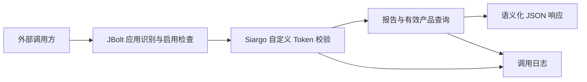

# 对外接口、应用中心与调用日志

> 核对基线：2026-09-30，v2.9.4，Git `18c1de8`。本文依据当前源码及随项目提供的 JBolt Core JAR 核实，不代表真实凭据调用、应用启停或运行环境验收。
>
> [返回手册目录](README.md)

## 1. 能力与调用链

Siargo 对外提供订单检验进度查询，供生产等系统读取报告单下的有效产品及各检验环节信息。它不创建订单，不写入检验结果，也不代替后台检验签署。



业务 Controller 继承 `JBoltApiBaseController`，路由 `/api/siargo/order` 单独注册，不经过后台用户登录路由。两个查询 action 标有 `@UnCheckJBoltApi` 和 `@OpenAPI`；这不表示无需应用认证。当前 JAR 的 `JBoltApiInterceptor` 仍解析 `jboltappid`、查找 Application、检查应用启用，再进入开放 API 处理。

## 2. 接入参数与签名

| 查询 | 请求方式与路径 | 参数 |
|---|---|---|
| 单订单 | `GET /api/siargo/order/status` | `orderId`、`token` |
| 批量订单 | `GET /api/siargo/order/batchStatus` | `orderIds`，逗号分隔；`token` |

调用必须提供应用中心分配的 `jboltappid`，当前开放 API 链可从同名请求参数或请求头读取；两处同时存在时优先请求参数。AppId 是应用标识，不是业务订单号；AppSecret 只用于调用方服务端生成签名，不应下发到业务浏览器。

自定义 Token 使用 UTF-8 字节进行 SHA-256，输出 64 位小写十六进制字符串：

```text
单订单 token = SHA256(AppSecret + orderId + yyyyMMdd)
批量 token   = SHA256(AppSecret + join(sort(orderIds), ",") + yyyyMMdd)
```

日期来自服务器 `LocalDate.now()`，校验接受当天和前一天，以覆盖跨日调用。这里是字符串拼接后 SHA-256，既不是 MD5，也不是 HMAC；不要自行替换算法后仍声称兼容。

批量接口先按逗号拆分并检查最多 100 个元素，再校验签名，随后修剪各订单号并忽略空项。签名工具会原地排序数组，签名阶段不会先 trim 或去重。调用方应发送规范、无空白的订单号，按相同原始值排序签名；结果不能假定保持输入顺序，也不能假定后端自动去重。

推荐联调顺序为：由管理员创建并启用调用应用 → 调用方持有其 AppId 与服务端密钥 → 生成当天 Token → 发出单订单查询 → 根据 `traceId` 核对业务日志。本文不提供真实密钥或生产请求示例。

## 3. 返回数据契约

以下为按 Controller 结构构造的说明示例，值均为占位数据，不是抓取的真实响应。

```json
{
  "status": "ok",
  "code": 200,
  "msg": "查询成功",
  "data": {
    "orderId": "ORDER-EXAMPLE",
    "found": true,
    "items": [
      {
        "model": "MODEL-EXAMPLE",
        "serialNo": "SN-EXAMPLE",
        "status": { "insp": 6, "label": "成品检漏检验待检", "hasLeakTest": true },
        "timeline": {
          "accuracy": { "time": "2026-09-30 09:00:00", "operator": "示例人员" },
          "leakTest": { "time": "", "operator": "" },
          "appearance": { "time": "", "operator": "" },
          "packaging": { "time": "", "operator": "" },
          "approval": { "time": "", "operator": "" }
        }
      }
    ],
    "traceId": "0123456789ab"
  }
}
```

产品来自 `siargo_qareport.order_id` 对应的 `siargo_product`，只取 `vd=1`。`model` 和 `serialNo` 分别由产品的 `model`、`number` 映射；`hasLeakTest` 根据产品 `lt_status` 判断。未签署环节的时间和人员输出空字符串。

时间线字段映射为：`accuracy → accq`、`leakTest → lt`、`appearance → funq`、`packaging → appq`、`approval → allq`。业务环节完整说明见[检验报告单业务](11-检验报告单业务.md)。

| `insp` | 当前 API 输出 `label` |
|---|---|
| 1 | 待检验 |
| 6 | 成品检漏检验待检 |
| 2 | 精度检验已完成 |
| 3 | 外观检验已完成 |
| 4 | 包装检验已完成 |
| 5 | 已完成检验 |
| 其他 | 未知 |

这些标签描述部分已完成环节，而后台流程标签常描述下一待办；不得仅把状态数字递增解释成审批顺序。API 使用 `Kv` 明确组装驼峰键，`serialNo/hasLeakTest/leakTest/traceId` 不受 Record 列键小写规则直接支配。

单订单没有查到有效产品时仍返回成功：

```json
{"status":"ok","code":200,"msg":"查询成功","data":{"orderId":"ORDER-EXAMPLE","found":false,"msg":"订单未创建","traceId":"0123456789ab"}}
```

这里的 `found=false` 表示本次查询未得到有效产品，不能进一步断言数据库一定完全没有订单或报告记录。批量成功时 `data` 为 `{"total":数量,"results":[每订单结果],"traceId":"..."}`；每项保留 `orderId`、`found`，有数据时带 `items`，无数据时带说明。`total` 是结果项数量，不是产品总数。

成功分支同时设置 `X-Trace-Id` 响应头；自定义失败分支当前不输出该头，也不把 `traceId` 放入失败体。不能承诺所有错误响应均可直接从客户端取到追踪号。

## 4. 错误与日志边界

业务自定义失败结构为 `{"status":"fail","code":数字,"msg":"说明"}`。其中 `code` 是 JSON 内业务码，不等同于 HTTP 状态码。

| 业务码 | 当前用途 |
|---|---|
| 1001 | 订单参数为空 |
| 1002 | Token 为空 |
| 1003 | Token 验证失败 |
| 1005 | 批量拆分数量超过 100 |
| 1006 | Controller 中未得到应用上下文 |

常量还定义 1004“订单未创建”和 1007“服务内部错误”，但目前查询不到订单走 `found=false` 成功分支；不能根据存在常量就认为所有异常均统一映射为 1007。JBolt 在进入业务 Controller 前拒绝请求时使用框架响应，不能保证与上述自定义结构完全相同。

业务日志保存 API 路径、固定记录的调用方法 `GET`、单/批订单参数、请求 IP、User-Agent、结果状态与码、说明、耗时、应用记录 ID、12 字符 `trace_id`。没有写入 Token 或 AppSecret。日志写失败不改变正常业务响应，进入 Controller 前被拦截的请求也不由这段业务记录器保证覆盖。因此“成功响应”和“必有一条完整调用日志”不能互相替代。

## 5. 应用中心现状与治理要求

应用中心入口 `/admin/app`，管理权限是 `PermissionKey.APPLICATION`，并使用 `@OnlySaasPlatform` 和系统管理员豁免。其管理权限与 `SIARGO` 业务页面权限分离。

当前应用中心可维护名称、类型、说明、AppId/AppSecret、启用状态、`need_check_sign` 和关联对象。新增应用默认停用，生成 AppId 与 AppSecret；内置应用不允许普通删除或状态切换，已关联对象的应用有删除约束。启停、密钥更换等操作包含系统日志记录。部分第三方对象关联分支仍是占位，不能把类型选项理解为全部集成已完成。

应用级运行校验已经存在：当前 `JBoltApiInterceptor` 调用应用缓存取得 Application，检查 `enable` 后才进入业务处理。但本项目尚未完整实现工作区要求的“每个服务编码登记、接口级启停、调用方授权策略、浏览器及内部接口统一运行控制”。后台业务登录权限链也不能自动等同于这套接口治理。

`need_check_sign` 是应用中心的框架签名配置项；本订单 API 自己执行 SHA-256 Token 校验，不能通过切换该选项推断自定义 Token 校验会关闭。应用缓存清除和状态变化的运行生效需要结合当前框架链核对，本文没有以真实请求验证即时失效时间。

后续新增或改造接口应依工作区规则纳入应用中心，在当次授权范围内明确所需登记、策略和后端运行控制；不能以应用资料 CRUD 代替完成证明，也不能把其他项目的 `ApplicationRuntimeGuard` 写成本项目已经存在的能力。此处只说明开发边界，不扩展为历史接口批量改造任务。

## 6. 调用日志后台

入口 `/admin/siargo/apicalllog` 使用 `PermissionKey.SIARGO`。页面提供明细列表、只读详情、统计和批量删除；不是编辑历史调用结果的工作台。

- `datas`：`keywords` 匹配 API 路径，`traceId` 精确匹配 `trace_id`，`responseStatus` 按 `ok/fail` 过滤，开始/结束日期覆盖当天 00:00:00 至 23:59:59。
- `detail/{id}`：展示一条日志；不存在则返回失败。
- `statsData`：返回 `callStats` 和 `dailyStats`。总体指标包括总量、成功/失败次数、平均耗时及成功率；每日趋势查询最近 30 天。
- `deleteByIds`：按逗号分隔 ID 批量删除，删除行为记录系统日志；没有此业务页面的恢复流程。

统计使用内存字段、独立锁和 30 分钟 TTL。成功写入调用日志时清除统计缓存；当前删除回调没有同样显式清除，删除后统计与列表可能暂时不同。统计查询未复用列表过滤条件，不能把卡片数字当成当前筛选结果的汇总。

## 7. 开发定位

| 内容 | 代码位置 |
|---|---|
| 请求上下文、校验、DTO 和日志调用 | [OrderStatusApiController](../../src/main/java/cn/jbolt/admin/siargo/api/OrderStatusApiController.java) |
| 签名算法与业务错误常量 | [SiargoApiTokenUtil](../../src/main/java/cn/jbolt/admin/siargo/api/SiargoApiTokenUtil.java)、[ApiErrorCode](../../src/main/java/cn/jbolt/admin/siargo/api/ApiErrorCode.java) |
| 有效产品查询 | [QareportService](../../src/main/java/cn/jbolt/admin/siargo/qarep/QareportService.java) 的 `queryOrderStatusByOrderId/batchQueryOrderStatus` |
| 应用管理入口与行为 | [AppDevCenterAdminRoutes](../../src/main/java/cn/jbolt/admin/appdevcenter/AppDevCenterAdminRoutes.java)、[ApplicationService](../../src/main/java/cn/jbolt/admin/appdevcenter/ApplicationService.java) |
| 日志查询、记录与统计 | [ApiCallLogAdminController](../../src/main/java/cn/jbolt/admin/siargo/apicalllog/ApiCallLogAdminController.java)、[ApiCallLogService](../../src/main/java/cn/jbolt/admin/siargo/apicalllog/ApiCallLogService.java) |

JBolt 拦截器和缓存实现位于项目 [jbolt_core.jar](../../lib/jbolt_core.jar)，框架机制说明见 [JBolt 原生机制](jbolt-native-mechanisms.md)。修改契约时重点核对单/批签名、100 条边界、跨日、有效产品过滤、`found=false`、时间线字段和追踪查询；不要使用真实凭据写入文档或提交记录。
